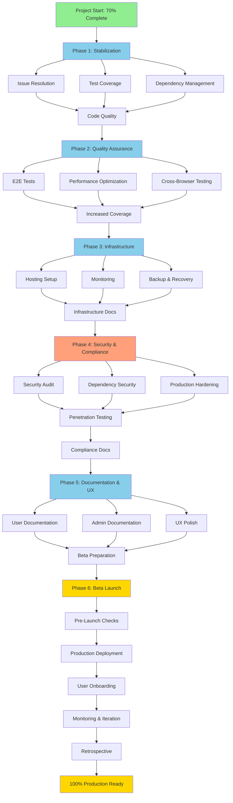

# Enterprise CashFlow - Phased Execution Plan to 100% Production Readiness

**Version:** 1.0
**Date:** 2025-11-10
**Current Status:** 70-75% Complete | Production Score: 65/100
**Target:** 100% Production Ready | Production Score: 90+/100
**Timeline:** 6 Phases over 8-10 weeks
**Methodology:** AI Agent Swarm + SPARC + TDD

---

## EXECUTIVE SUMMARY

This plan takes Enterprise CashFlow from **70-75% complete (65/100 production score)** to **100% production-ready (90+/100 score)** through 6 well-defined phases. The plan leverages AI agent coordination, preserves all existing code on main branch, and follows a systematic approach with built-in safety mechanisms.

### Current State Analysis
✅ **Strengths:**
- Core features implemented (Manual Entry, Excel Upload, PDF Processing, AI Analysis)
- 48 service files, 58 components, 22 test files
- CI/CD pipeline operational
- Financial calculation engine complete
- Multi-provider AI integration working

⚠️ **Gaps to Close:**
- Test coverage: 45-50% → Target: 75-85%
- E2E tests: 0% → Target: Critical paths covered
- Staging/Production deployment: Not configured → Target: Fully automated
- Monitoring: Not set up → Target: Sentry + Analytics operational
- Documentation: 60% → Target: 95%+ complete
- Security audit: Not done → Target: Comprehensive audit passed

### Success Metrics
- **Phase 1-2:** Foundation strengthened (Test coverage 60%+, issues resolved)
- **Phase 3-4:** Production infrastructure ready (Deployment automated, monitoring live)
- **Phase 5-6:** Launch ready (Security validated, beta users onboarded)

---

## PHASE STRUCTURE OVERVIEW

```
Phase 1: STABILIZATION         │ 2 weeks  │ Fix critical issues, boost test coverage
Phase 2: QUALITY ASSURANCE     │ 2 weeks  │ E2E tests, performance optimization
Phase 3: INFRASTRUCTURE        │ 2 weeks  │ Staging/prod environments, monitoring
Phase 4: SECURITY & COMPLIANCE │ 1.5 weeks│ Security audit, compliance checks
Phase 5: DOCUMENTATION & UX    │ 1 week   │ Complete docs, UX polish
Phase 6: BETA LAUNCH           │ 1.5 weeks│ Beta deployment, user onboarding
─────────────────────────────────────────────────────────────────────────
TOTAL TIMELINE: 8-10 weeks (with 2-week buffer)
```

---

## PHASE 1: STABILIZATION & FOUNDATION (Weeks 1-2)

**Objective:** Resolve known issues, increase test coverage to 60%+, establish solid foundation

**Duration:** 2 weeks (10 working days)

**Prerequisites:** None (starts immediately)

**Success Criteria:**
- ✅ All known bugs/issues resolved
- ✅ Test coverage reaches 60%+
- ✅ All existing tests passing (100% green)
- ✅ Code quality gates met (linting, formatting)
- ✅ Dependencies updated and audited

### Workstream 1.1: Issue Resolution (Days 1-5)
**Owner:** Backend/Core Team Agent

**Tasks:**
1. **Fix ExcelJS/XLSX Dual Library Issue**
   - **Problem:** Code uses ExcelJS (CDN-loaded) + XLSX (npm) inconsistently
   - **Action:**
     - Audit all usages of both libraries
     - Consolidate to XLSX (already in package.json) OR add ExcelJS to package.json
     - Update documentation to reflect architectural decision
     - Test all Excel-related workflows
   - **Deliverable:** Single library strategy documented and implemented
   - **Test:** Run Excel upload/export integration tests

2. **Complete AI Analysis "Detailed Audit" Feature**
   - **Problem:** Feature documented but commented out in code
   - **Action:**
     - Implement `DETAILED_AUDIT` analysis type in `aiAnalysisTypes.js`
     - Create comprehensive prompt template
     - Add UI toggle for detailed audit
     - Write tests for audit analysis
   - **Deliverable:** Detailed Audit fully functional
   - **Test:** Generate detailed audit report with test data

3. **Resolve Documentation-Code Sync Issues**
   - **Problem:** Docs claim features not implemented
   - **Action:**
     - Audit all functional requirements (FR-xxx) in docs
     - Mark unimplemented features clearly in docs
     - Update roadmap for planned features
     - Add "Status" badges to requirements docs
   - **Deliverable:** Docs accurately reflect current implementation
   - **Test:** Cross-reference checklist completed

4. **Fix Any TODO/FIXME Comments in Code**
   - **Status:** Only 3 found (low priority but should be addressed)
   - **Action:** Review and resolve or document for post-launch

**Rollback Plan:** Git branch `phase1/issue-resolution` with daily commits. Can revert individual fixes without affecting others.

### Workstream 1.2: Test Coverage Expansion (Days 3-10, parallel)
**Owner:** QA/Testing Team Agent

**Tasks:**
1. **Component Test Coverage** (Target: 70%+)
   - Priority components to test:
     - `App.jsx` (203 lines, 0 tests currently)
     - `ReportGeneratorApp.jsx` (20,099 lines, critical)
     - `ReportRenderer.jsx`
     - `AIPanel/AIAnalysisPanel.jsx`
     - Chart components (if not already tested)
   - Write 50-80 new component tests
   - Test user interactions, edge cases, error handling
   - Use React Testing Library + Jest

2. **Integration Test Expansion** (Target: 80%+)
   - Complete Excel parser integration tests
   - PDF parser integration tests
   - AI service integration tests (all providers)
   - Storage service integration tests
   - Export service integration tests

3. **Utility Function Tests** (Target: 95%+)
   - Financial calculation comprehensive tests
   - Validation function tests
   - Formatter tests
   - Data consistency validator tests

4. **Coverage Reporting**
   - Generate detailed coverage report
   - Identify remaining gaps
   - Create plan for Phase 2 coverage targets

**Deliverables:**
- 80-120 new tests added
- Coverage report showing 60%+ global, 95%+ on critical paths
- Test documentation updated

**Rollback Plan:** Tests are additive - no rollback needed. If tests fail, mark as `.skip` and document.

### Workstream 1.3: Dependency Management (Days 1-3)
**Owner:** DevOps Agent

**Tasks:**
1. **Audit Dependencies**
   - Run `npm audit` and address vulnerabilities
   - Update outdated packages (non-breaking)
   - Document any blocking vulnerabilities

2. **Create .env.example File**
   - Document all required environment variables
   - Add descriptions and example values
   - Include in repository

3. **Lock File Verification**
   - Verify package-lock.json integrity
   - Test `npm ci` in clean environment

**Deliverables:**
- Zero critical vulnerabilities
- .env.example file created
- Dependency documentation updated

**Rollback Plan:** Keep `package.json` and `package-lock.json` in git. Revert if updates cause issues.

### Workstream 1.4: Code Quality Gates (Days 5-10)
**Owner:** Code Quality Agent

**Tasks:**
1. **Linting Cleanup**
   - Fix all ESLint errors
   - Address ESLint warnings (where reasonable)
   - Update .eslintrc with project-specific rules

2. **Code Formatting**
   - Run Prettier on entire codebase
   - Ensure consistent formatting
   - Add pre-commit hooks (optional)

3. **Type Safety**
   - Review TypeScript definitions in `src/types/`
   - Add JSDoc comments to complex functions
   - Consider gradual TypeScript migration (Phase 2)

**Deliverables:**
- ESLint passes with 0 errors
- Code formatted consistently
- Type definitions complete for public APIs

**Rollback Plan:** Format-only changes are safe. Can revert formatting if it causes issues.

### Phase 1 Coordination Protocol

**Daily Sync Points:**
- **Morning:** Workstream status update (5 min)
- **Evening:** Blockers and next-day planning (5 min)

**Handoff Protocol:**
- Issue resolution completes → Testing team validates fixes
- Tests written → Code review by core team
- Dependencies updated → Full test suite run

**Conflict Resolution:**
- Conflicting changes: Merge main → feature branch daily
- Priority conflicts: Core features > Nice-to-haves
- Resource conflicts: Parallelize where possible

**Phase 1 Exit Criteria:**
- [ ] All P0/P1 issues resolved
- [ ] Test coverage ≥ 60%
- [ ] All tests passing (green CI)
- [ ] Dependencies up to date
- [ ] Code quality gates met
- [ ] .env.example created
- [ ] Documentation synchronized

**Risk Mitigation:**
- **Risk:** Test writing takes longer than expected
  - **Mitigation:** Focus on critical paths first, defer nice-to-have tests to Phase 2
- **Risk:** Dependency updates break functionality
  - **Mitigation:** Update non-critical packages first, test thoroughly before updating core packages
- **Risk:** Issue fixes introduce new bugs
  - **Mitigation:** Comprehensive testing after each fix, code review required

---

## PHASE 2: QUALITY ASSURANCE & PERFORMANCE (Weeks 3-4)

**Objective:** Implement E2E testing, optimize performance, achieve 75%+ test coverage

**Duration:** 2 weeks (10 working days)

**Prerequisites:** Phase 1 complete (all tests passing, issues resolved)

**Success Criteria:**
- ✅ E2E test framework operational (Cypress/Playwright)
- ✅ 5-10 critical user journeys tested E2E
- ✅ Performance benchmarks met (page load < 3s, calculations < 100ms)
- ✅ Memory leaks identified and fixed
- ✅ Test coverage reaches 75%+
- ✅ Cross-browser compatibility validated

### Workstream 2.1: E2E Test Framework (Days 1-5)
**Owner:** QA Lead Agent

**Tasks:**
1. **Framework Selection & Setup** (Day 1)
   - Choose Cypress (recommended) or Playwright
   - Install and configure:
     ```bash
     npm install --save-dev cypress @testing-library/cypress
     ```
   - Configure `cypress.config.js`
   - Set up test data factories
   - Create page object models

2. **Critical User Journey Tests** (Days 2-5)
   Write E2E tests for:

   **Journey 1: Manual Entry Complete Workflow**
   - Open app → Navigate to manual entry
   - Fill in 3-period financial data
   - Validate calculations in real-time
   - Generate reports
   - Export to Excel/PDF
   - Expected duration: 4-6 minutes

   **Journey 2: Excel Upload Workflow**
   - Upload Excel file (valid template)
   - Validate data parsing
   - Review extracted data
   - Generate reports
   - Export results
   - Expected duration: 2-3 minutes

   **Journey 3: PDF AI Extraction Workflow**
   - Upload PDF financial statement
   - Select AI provider (Gemini)
   - Wait for extraction
   - Review and correct extracted data
   - Generate analysis
   - Expected duration: 5-7 minutes

   **Journey 4: AI Analysis Complete Workflow**
   - Load financial data (any method)
   - Select analysis type (Executive Summary)
   - Choose AI provider
   - Generate analysis
   - Review insights
   - Export report
   - Expected duration: 3-5 minutes

   **Journey 5: Multi-Period Report Generation**
   - Enter/upload data for 6 periods
   - Generate all report types
   - Validate chart rendering
   - Export comprehensive report
   - Expected duration: 5-8 minutes

3. **Error Scenario Tests** (Days 4-5)
   - Invalid Excel file upload
   - Network timeout during AI call
   - Invalid PDF format
   - Calculation errors with edge case data
   - Browser tab close/recovery

**Deliverables:**
- Cypress/Playwright fully configured
- 5 critical journey tests passing
- 5-10 error scenario tests
- E2E test documentation
- CI integration (optional: run on PR)

**Rollback Plan:** E2E tests are additive. If tests are flaky, mark as `.skip` and document issues.

### Workstream 2.2: Performance Optimization (Days 1-10, parallel)
**Owner:** Performance Engineer Agent

**Tasks:**
1. **Performance Benchmarking** (Days 1-3)
   - Measure baseline performance:
     - Page load time (target: < 3s)
     - Time to interactive (target: < 4s)
     - Financial calculations (target: < 100ms for 12 periods)
     - Chart rendering (target: < 500ms)
     - Excel export (target: < 2s for 6 periods)
   - Use Lighthouse, Chrome DevTools
   - Document bottlenecks

2. **Bundle Size Optimization** (Days 4-6)
   - Analyze bundle with `npm run analyze`
   - Implement code splitting for large components:
     - Lazy load AI panel
     - Lazy load chart components
     - Lazy load export functionality
   - Optimize imports (use named imports, avoid `import *`)
   - Target: Bundle size < 500KB gzipped

3. **Runtime Performance** (Days 7-9)
   - Optimize React rendering:
     - Add React.memo to pure components
     - Use useMemo/useCallback for expensive computations
     - Implement virtualization for large lists (if applicable)
   - Optimize financial calculations:
     - Move to Web Worker if needed
     - Cache calculation results
     - Debounce real-time validation
   - Profile with React DevTools Profiler

4. **Memory Leak Prevention** (Day 10)
   - Audit useEffect cleanup functions
   - Check for event listener leaks
   - Verify Web Worker cleanup
   - Test with Chrome DevTools Memory profiler

**Deliverables:**
- Performance benchmark report (before/after)
- Bundle size < 500KB gzipped (currently unchecked)
- All performance targets met
- Memory leak audit complete

**Rollback Plan:** Performance optimizations on feature branch. If optimization breaks functionality, revert that optimization only.

### Workstream 2.3: Cross-Browser & Device Testing (Days 5-8)
**Owner:** QA Testing Agent

**Tasks:**
1. **Browser Compatibility Matrix**
   Test on:
   - Chrome (latest, -1, -2 versions)
   - Firefox (latest, -1)
   - Safari (latest, -1)
   - Edge (latest)

   Document any issues found

2. **Responsive Design Validation**
   - Desktop: 1920x1080, 1366x768, 1280x720
   - Tablet: iPad (768x1024), iPad Pro (1024x1366)
   - Large tablets: 1200x800
   - Document layout issues

3. **Accessibility Testing**
   - Run jest-axe on all components
   - Test keyboard navigation
   - Test screen reader compatibility (basic)
   - Ensure WCAG 2.1 Level AA compliance (critical paths)

**Deliverables:**
- Browser compatibility report
- Responsive design test results
- Accessibility audit report
- List of issues with severity ratings

**Rollback Plan:** Testing is non-destructive. Document issues for remediation.

### Workstream 2.4: Increase Test Coverage (Days 3-10, ongoing)
**Owner:** QA Agent

**Tasks:**
- Continue writing tests for under-covered areas
- Focus on:
  - Service layer (AI, Storage, Export)
  - Complex components (ReportGeneratorApp, ReportRenderer)
  - Edge cases and error paths
- Target: 75%+ global coverage

**Deliverables:**
- 40-60 additional tests
- Coverage report showing 75%+
- Coverage badge in README

**Rollback Plan:** Tests are additive, no rollback needed.

### Phase 2 Coordination Protocol

**Daily Sync Points:**
- **Morning standup:** Each workstream reports progress and blockers (10 min)
- **Midday check-in:** E2E team + Performance team sync on overlapping concerns (5 min)
- **End-of-day:** Review test results, plan next day (10 min)

**Handoff Protocol:**
- E2E tests written → Performance team validates no perf regressions
- Performance optimizations → QA validates no functional regressions
- Cross-browser issues found → Dev team prioritizes fixes

**Conflict Resolution:**
- Performance vs. functionality: Functionality wins, optimize differently
- Test flakiness: Investigate root cause, don't ignore
- Browser-specific bugs: Document, fix critical (Chrome/Safari), defer minor (older browsers)

**Phase 2 Exit Criteria:**
- [ ] Cypress/Playwright operational
- [ ] 5+ critical E2E tests passing
- [ ] Performance benchmarks met
- [ ] Bundle size < 500KB gzipped
- [ ] Test coverage ≥ 75%
- [ ] Cross-browser testing complete
- [ ] No memory leaks detected

**Risk Mitigation:**
- **Risk:** E2E tests are flaky
  - **Mitigation:** Use explicit waits, stable selectors, retry logic, isolation
- **Risk:** Performance optimizations break features
  - **Mitigation:** Comprehensive testing after each optimization, incremental changes
- **Risk:** Browser-specific bugs delay phase
  - **Mitigation:** Prioritize Chrome/Safari (80% of users), defer minor browsers

---

## PHASE 3: INFRASTRUCTURE & DEPLOYMENT (Weeks 5-6)

**Objective:** Set up staging/production environments, implement monitoring, automate deployment

**Duration:** 2 weeks (10 working days)

**Prerequisites:** Phase 2 complete (E2E tests passing, performance validated)

**Success Criteria:**
- ✅ Staging environment deployed and accessible
- ✅ Production environment configured (not yet live)
- ✅ Monitoring operational (Sentry + Analytics)
- ✅ Deployment pipeline automated (CI/CD to staging)
- ✅ Backup/recovery procedures documented
- ✅ Rollback mechanism tested

### Workstream 3.1: Hosting & Deployment Setup (Days 1-5)
**Owner:** DevOps Lead Agent

**Tasks:**
1. **Platform Selection** (Day 1)
   - **Recommended:** Vercel (best for React apps, auto-scaling, easy setup)
   - **Alternatives:** Netlify, AWS Amplify, Cloud Run + Cloud Storage
   - **Decision factors:** Cost, scaling, ease of use, team expertise
   - Document decision with rationale

2. **Staging Environment Setup** (Days 2-3)
   - Create Vercel project (or chosen platform)
   - Connect GitHub repository
   - Configure environment variables:
     ```
     REACT_APP_SENTRY_DSN=<staging-sentry-dsn>
     REACT_APP_ENCRYPTION_KEY=<generate-strong-key>
     REACT_APP_ENVIRONMENT=staging
     REACT_APP_API_BASE_URL=<if-applicable>
     REACT_APP_GEMINI_API_KEY=<staging-key>
     REACT_APP_OPENAI_API_KEY=<staging-key>
     REACT_APP_CLAUDE_API_KEY=<staging-key>
     ```
   - Set up custom domain: `staging.enterprisecashflow.com` (optional)
   - Deploy staging from `main` branch
   - Verify deployment successful

3. **Production Environment Setup** (Days 4-5)
   - Create production Vercel project
   - Configure production environment variables
   - Set up custom domain: `app.enterprisecashflow.com`
   - **DO NOT DEPLOY YET** (wait for Phase 6)
   - Document deployment process

4. **Automated Deployment Pipeline** (Day 5)
   - Configure GitHub Actions for auto-deploy:
     - Push to `main` → Auto-deploy to staging
     - Manual trigger for production deployment
   - Add deployment status badges to README
   - Test rollback mechanism

**Deliverables:**
- Staging environment live and accessible
- Production environment configured (not deployed)
- Deployment pipeline automated
- Deployment documentation complete

**Rollback Plan:** Keep previous deployment available. Vercel supports instant rollback to previous deployment.

### Workstream 3.2: Monitoring & Observability (Days 1-7, parallel)
**Owner:** DevOps + Backend Agent

**Tasks:**
1. **Sentry Setup** (Days 1-3)
   - Create Sentry organization/project
   - Install Sentry SDK:
     ```bash
     # Already installed: @sentry/react
     ```
   - Configure Sentry in `src/index.js`:
     ```javascript
     import * as Sentry from "@sentry/react";

     Sentry.init({
       dsn: process.env.REACT_APP_SENTRY_DSN,
       environment: process.env.REACT_APP_ENVIRONMENT,
       tracesSampleRate: 1.0,
       integrations: [new Sentry.BrowserTracing()],
     });
     ```
   - Test error capture
   - Configure alerts:
     - Error threshold: > 10 errors/hour
     - Performance degradation: p95 > 3s
     - Unhandled exceptions: immediate alert

2. **Application Performance Monitoring** (Days 4-5)
   - Configure Sentry performance monitoring
   - Add custom performance marks:
     - Financial calculation duration
     - Chart rendering duration
     - AI analysis duration
     - Export generation duration
   - Set up performance dashboard

3. **Analytics Setup (Optional)** (Days 6-7)
   - Choose: Google Analytics, Mixpanel, or Plausible (privacy-focused)
   - Install tracking code
   - Configure events to track:
     - Page views
     - Feature usage (manual entry, Excel upload, PDF upload, AI analysis)
     - Export actions
     - Errors encountered
   - Set up analytics dashboard

4. **Logging Infrastructure** (Day 7)
   - Enhance Winston logger configuration
   - Add structured logging
   - Configure log levels by environment
   - Ensure no sensitive data in logs

**Deliverables:**
- Sentry operational with error tracking
- Performance monitoring live
- Analytics configured (optional)
- Logging infrastructure documented
- Monitoring dashboard created

**Rollback Plan:** Monitoring is non-destructive. Can disable if it impacts performance.

### Workstream 3.3: Backup & Recovery (Days 3-6)
**Owner:** DevOps Agent

**Tasks:**
1. **Data Backup Strategy** (Days 3-4)
   - Document data storage architecture:
     - User data: LocalStorage + IndexedDB (client-side)
     - No server-side database (currently)
   - Implement export functionality:
     - Auto-export user data to browser downloads
     - "Export All Data" feature for backup
   - Document user data recovery process

2. **Configuration Backup** (Day 5)
   - Store all configuration in git
   - Document environment variables (secure storage)
   - Create configuration checklist

3. **Disaster Recovery Plan** (Day 6)
   - Document recovery procedures:
     - Vercel outage: Switch to Netlify (pre-configured alternative)
     - Data corruption: User can re-upload from export
     - Complete failure: Rollback to previous deployment
   - Test rollback procedure
   - Document RTO (Recovery Time Objective): < 1 hour
   - Document RPO (Recovery Point Objective): < 1 hour (user export frequency)

**Deliverables:**
- Backup strategy documented
- Disaster recovery plan complete
- Rollback tested successfully
- Configuration backup automated

**Rollback Plan:** Backup procedures are additive, no rollback needed.

### Workstream 3.4: Infrastructure Documentation (Days 8-10)
**Owner:** Technical Writer Agent + DevOps

**Tasks:**
1. **Deployment Runbook**
   - Step-by-step deployment instructions
   - Environment variable configuration guide
   - Troubleshooting common deployment issues

2. **Operations Manual**
   - Monitoring setup and usage
   - Alert response procedures
   - Performance optimization guide
   - Scaling considerations

3. **Infrastructure Architecture Diagram**
   - Create Mermaid diagram of infrastructure:
     - Frontend hosting (Vercel)
     - CDN (Vercel CDN)
     - Monitoring (Sentry)
     - Analytics (optional)
     - External APIs (Gemini, OpenAI, Claude, Ollama)

**Deliverables:**
- Deployment runbook complete
- Operations manual complete
- Infrastructure diagram created
- All docs in `/docs/infrastructure/`

**Rollback Plan:** Documentation is non-destructive, no rollback needed.

### Phase 3 Coordination Protocol

**Daily Sync Points:**
- **Morning:** Infrastructure team sync (15 min)
- **Afternoon:** Test deployment on staging, review monitoring
- **Evening:** Review day's progress, plan next day (10 min)

**Handoff Protocol:**
- Staging deployed → QA team tests on staging
- Monitoring configured → Ops team verifies alerts
- Documentation written → Tech lead reviews

**Conflict Resolution:**
- Platform choice: DevOps lead decides after team input
- Environment configuration: Document all decisions, use secure secret storage
- Monitoring overhead: If performance impact > 5%, optimize or reduce sampling

**Phase 3 Exit Criteria:**
- [ ] Staging environment live and tested
- [ ] Production environment configured
- [ ] Sentry monitoring operational
- [ ] Deployment pipeline automated
- [ ] Backup/recovery procedures tested
- [ ] Infrastructure documentation complete
- [ ] No critical deployment blockers

**Risk Mitigation:**
- **Risk:** Hosting platform issues
  - **Mitigation:** Have backup platform (Netlify) configured, can switch in < 1 hour
- **Risk:** Environment variable leaks
  - **Mitigation:** Use Vercel's encrypted environment variables, never commit secrets to git
- **Risk:** Monitoring overhead impacts performance
  - **Mitigation:** Use sampling (1-10% of requests), monitor performance impact

---

## PHASE 4: SECURITY & COMPLIANCE (Weeks 7-8.5)

**Objective:** Comprehensive security audit, fix vulnerabilities, ensure compliance with best practices

**Duration:** 1.5 weeks (7-8 working days)

**Prerequisites:** Phase 3 complete (staging deployed, monitoring operational)

**Success Criteria:**
- ✅ Security audit complete with no P0 vulnerabilities
- ✅ OWASP Top 10 vulnerabilities addressed
- ✅ Dependency vulnerabilities resolved
- ✅ Security headers configured
- ✅ Data encryption validated
- ✅ API key management secure
- ✅ Penetration testing passed (or external audit if required)

### Workstream 4.1: Security Audit (Days 1-4)
**Owner:** Security Specialist Agent

**Tasks:**
1. **OWASP Top 10 Review** (Days 1-2)
   Review each vulnerability category:

   **A01: Broken Access Control**
   - Review: Client-side app, no authentication currently
   - Action: Document that user data is local-only
   - Future: If user accounts added, implement proper access control

   **A02: Cryptographic Failures**
   - Review: Check data encryption (LocalStorage, IndexedDB)
   - Action: Verify REACT_APP_ENCRYPTION_KEY usage
   - Test: Verify encrypted data cannot be read in plain text

   **A03: Injection**
   - Review: SQL injection (N/A - no database)
   - Review: XSS (Cross-Site Scripting) vulnerabilities
   - Action: Audit all user inputs, verify DOMPurify usage
   - Test: Attempt XSS attacks on all input fields

   **A04: Insecure Design**
   - Review: Architecture for security flaws
   - Action: Document security design decisions
   - Verify: No sensitive operations in client-side code

   **A05: Security Misconfiguration**
   - Review: Environment configurations
   - Action: Verify secure defaults, no debug info in production
   - Test: Check for exposed configuration files

   **A06: Vulnerable Components**
   - Review: npm audit results
   - Action: Update/patch vulnerable dependencies
   - Test: `npm audit --audit-level=high` passes

   **A07: Identification and Authentication Failures**
   - Review: No authentication currently (client-side only)
   - Action: Document security model (local data only)
   - Future: If user accounts added, implement secure authentication

   **A08: Software and Data Integrity Failures**
   - Review: Verify integrity of CDN-loaded libraries (ExcelJS, PDF.js)
   - Action: Use Subresource Integrity (SRI) hashes
   - Test: Verify SRI hashes for all CDN resources

   **A09: Security Logging and Monitoring Failures**
   - Review: Sentry captures errors and security events
   - Action: Add security-specific logging
   - Test: Verify security events are logged to Sentry

   **A10: Server-Side Request Forgery (SSRF)**
   - Review: N/A - no server-side component
   - Action: Document in security model

2. **Input Validation & Sanitization** (Day 3)
   - Audit all user input points:
     - Manual data entry forms
     - Excel file upload
     - PDF file upload
     - AI prompt inputs
   - Verify validation using Joi/Zod schemas
   - Verify HTML sanitization with DOMPurify
   - Test with malicious inputs

3. **API Key Security** (Day 4)
   - Review API key management in `ApiKeyConfiguration` component
   - Verify keys stored encrypted in LocalStorage
   - Test key exposure in network requests
   - Document key rotation procedures

**Deliverables:**
- OWASP Top 10 audit report
- List of vulnerabilities with severity
- Remediation plan for each vulnerability
- Security testing results

**Rollback Plan:** Security findings are documented, fixes applied incrementally. Each fix tested before moving to next.

### Workstream 4.2: Dependency Security (Days 1-3, parallel)
**Owner:** DevOps Agent

**Tasks:**
1. **Vulnerability Scanning** (Day 1)
   ```bash
   npm audit --audit-level=moderate
   npm audit fix --dry-run
   ```
   - Document all vulnerabilities
   - Prioritize by severity (Critical → High → Moderate)

2. **Dependency Updates** (Days 2-3)
   - Update packages with vulnerabilities
   - Test after each update
   - Document breaking changes
   - Update lockfile

3. **Automated Scanning** (Day 3)
   - Add Dependabot or Snyk to GitHub repo
   - Configure automated vulnerability alerts
   - Set up automated PR for security updates

**Deliverables:**
- Zero critical/high vulnerabilities
- Automated scanning configured
- Vulnerability response process documented

**Rollback Plan:** Keep previous package-lock.json, revert if updates break functionality.

### Workstream 4.3: Production Hardening (Days 3-6)
**Owner:** DevOps + Security Agent

**Tasks:**
1. **Security Headers** (Day 3)
   Configure in Vercel (`vercel.json`):
   ```json
   {
     "headers": [
       {
         "source": "/(.*)",
         "headers": [
           { "key": "X-Content-Type-Options", "value": "nosniff" },
           { "key": "X-Frame-Options", "value": "DENY" },
           { "key": "X-XSS-Protection", "value": "1; mode=block" },
           { "key": "Referrer-Policy", "value": "strict-origin-when-cross-origin" },
           { "key": "Permissions-Policy", "value": "camera=(), microphone=(), geolocation=()" },
           {
             "key": "Content-Security-Policy",
             "value": "default-src 'self'; script-src 'self' 'unsafe-inline' 'unsafe-eval' https://cdn.jsdelivr.net https://cdnjs.cloudflare.com; style-src 'self' 'unsafe-inline'; img-src 'self' data: https:; font-src 'self' data:; connect-src 'self' https://api.openai.com https://api.anthropic.com https://generativelanguage.googleapis.com;"
           }
         ]
       }
     ]
   }
   ```
   Test with https://securityheaders.com

2. **HTTPS Enforcement** (Day 4)
   - Verify HTTPS enforced on all environments
   - Configure HSTS (Strict-Transport-Security)
   - Test HTTP → HTTPS redirect

3. **Error Handling** (Day 5)
   - Audit error messages for information disclosure
   - Ensure no stack traces in production
   - Verify Sentry captures errors without exposing to user

4. **Rate Limiting** (Day 6)
   - Implement client-side rate limiting for AI API calls
   - Add exponential backoff for failed requests
   - Document rate limits for each AI provider

**Deliverables:**
- Security headers configured and tested
- HTTPS enforced
- Error handling secure
- Rate limiting implemented
- Security hardening checklist complete

**Rollback Plan:** Changes made in configuration files (vercel.json), easy to revert.

### Workstream 4.4: Penetration Testing (Days 5-7)
**Owner:** Security Testing Agent

**Tasks:**
1. **Automated Security Testing** (Day 5)
   - Run OWASP ZAP against staging
   - Run npm audit
   - Run Lighthouse security audit
   - Document findings

2. **Manual Security Testing** (Days 6-7)
   - Test common attack vectors:
     - XSS (stored, reflected, DOM-based)
     - CSV injection via Excel export
     - Path traversal (file uploads)
     - CSRF (not applicable for client-side app)
     - Clickjacking
   - Attempt to break input validation
   - Test error handling edge cases
   - Document all findings

3. **External Audit (Optional)** (Outside timeline)
   - If budget allows, hire external security firm
   - Provide access to staging environment
   - Review findings and remediate

**Deliverables:**
- Penetration testing report
- List of vulnerabilities found
- Remediation status for each
- Security test suite for regression testing

**Rollback Plan:** Testing is non-destructive. Document issues, remediate incrementally.

### Workstream 4.5: Compliance Documentation (Days 6-8)
**Owner:** Compliance Agent

**Tasks:**
1. **Privacy Policy** (Day 6)
   - Document data collection practices
   - Explain data storage (client-side only)
   - Describe data retention
   - Explain user rights (data export, deletion)

2. **Security Policy** (Day 7)
   - Document security measures
   - Incident response procedures
   - Vulnerability disclosure policy
   - Contact information for security issues

3. **Terms of Service** (Day 7)
   - Define usage terms
   - Liability disclaimers
   - Intellectual property
   - Beta program terms

4. **Cookie Policy** (Day 8)
   - Document cookie usage (if any)
   - Explain analytics tracking (if implemented)
   - Provide opt-out mechanisms

**Deliverables:**
- Privacy Policy published
- Security Policy published
- Terms of Service published
- Cookie Policy (if applicable)
- All legal docs reviewed (if possible, by lawyer)

**Rollback Plan:** Legal documents are additive, can update/refine anytime.

### Phase 4 Coordination Protocol

**Daily Sync Points:**
- **Morning:** Security team sync (15 min)
- **Afternoon:** Review findings, prioritize remediations
- **Evening:** Status update, plan next day (10 min)

**Handoff Protocol:**
- Vulnerabilities found → Dev team remediates
- Fixes implemented → Security team validates
- Documentation written → Legal team reviews (if available)

**Conflict Resolution:**
- Security vs. functionality: Security wins unless business-critical functionality
- Severity disagreements: Use CVSS scoring, external reference
- Timeline pressure: Defer low-severity issues to post-launch

**Phase 4 Exit Criteria:**
- [ ] Zero P0 (critical) vulnerabilities
- [ ] All P1 (high) vulnerabilities remediated or mitigated
- [ ] P2 (medium) vulnerabilities documented with mitigation plan
- [ ] Security headers configured
- [ ] Penetration testing passed
- [ ] Compliance documentation complete
- [ ] Security audit report published

**Risk Mitigation:**
- **Risk:** Critical vulnerability found late
  - **Mitigation:** Daily scanning, prioritize critical findings immediately
- **Risk:** Fixes break functionality
  - **Mitigation:** Comprehensive testing after each security fix
- **Risk:** External audit delayed
  - **Mitigation:** Internal audit sufficient for beta, external audit for GA

---

## PHASE 5: DOCUMENTATION & UX POLISH (Week 9)

**Objective:** Complete user-facing documentation, polish UX, prepare for beta launch

**Duration:** 1 week (5 working days)

**Prerequisites:** Phase 4 complete (security audit passed)

**Success Criteria:**
- ✅ User documentation 95%+ complete
- ✅ Admin/operations documentation complete
- ✅ Video tutorials created (optional but recommended)
- ✅ UX polish complete (no major usability issues)
- ✅ Onboarding flow smooth
- ✅ Beta feedback mechanisms in place

### Workstream 5.1: User Documentation (Days 1-5)
**Owner:** Technical Writer Agent + UX Agent

**Tasks:**
1. **Getting Started Guide** (Day 1)
   - Welcome message
   - Quick start (5 minutes to first report)
   - Feature overview
   - Navigation guide
   - FAQs

2. **Feature Documentation** (Days 2-3)
   **Manual Data Entry Guide:**
   - How to enter financial data
   - Field descriptions
   - Validation rules
   - Multi-period navigation
   - Tips and best practices

   **Excel Upload Guide:**
   - Template download and usage
   - Header format requirements
   - Data validation rules
   - Common errors and solutions
   - Best practices

   **PDF Upload Guide:**
   - Supported document formats
   - AI provider selection
   - Extraction process
   - Data review and correction
   - Tips for best results

   **AI Analysis Guide:**
   - Available analysis types
   - AI provider comparison
   - How to interpret results
   - Customization options
   - Best practices for prompts

   **Export Guide:**
   - Export formats (Excel, PDF)
   - Export options
   - Batch export
   - Data backup recommendations

3. **Troubleshooting Guide** (Day 4)
   - Common issues and solutions
   - Error messages explained
   - Browser compatibility issues
   - Performance optimization tips
   - When to contact support

4. **Video Tutorials** (Day 5, optional)
   - Screen recordings of key workflows
   - 2-3 minute videos for each major feature
   - Publish to YouTube or embed in app
   - Transcripts for accessibility

**Deliverables:**
- Complete user guide in `/docs/user-guide/`
- Getting started guide published
- Feature documentation complete
- Troubleshooting guide complete
- Video tutorials (optional)

**Rollback Plan:** Documentation is additive, can iterate based on feedback.

### Workstream 5.2: Admin Documentation (Days 1-3, parallel)
**Owner:** DevOps Agent + Technical Writer

**Tasks:**
1. **Admin Guide** (Days 1-2)
   - Environment setup
   - Configuration management
   - Monitoring and alerts
   - Performance monitoring
   - Backup procedures
   - Incident response

2. **API Documentation** (Day 3, if applicable)
   - AI provider API integration
   - External service dependencies
   - API rate limits
   - Error handling
   - Authentication (if applicable)

3. **Operations Runbook** (Day 3)
   - Daily operations checklist
   - Weekly maintenance tasks
   - Monthly review procedures
   - Alert response playbooks
   - Escalation procedures

**Deliverables:**
- Admin guide complete
- API documentation (if applicable)
- Operations runbook published
- All docs in `/docs/admin/`

**Rollback Plan:** Documentation is additive, no rollback needed.

### Workstream 5.3: UX Polish (Days 1-5, parallel)
**Owner:** UX/UI Agent + Frontend Developer Agent

**Tasks:**
1. **UX Audit** (Day 1)
   - Review all user flows
   - Identify friction points
   - Document usability issues
   - Prioritize improvements

2. **Onboarding Improvements** (Days 2-3)
   - Add welcome screen (first-time users)
   - Add tooltips for complex features
   - Add contextual help buttons
   - Create interactive tutorial (optional)

3. **Error Message Improvements** (Day 3)
   - Review all error messages
   - Make errors actionable ("What to do next")
   - Add error recovery suggestions
   - Improve error styling

4. **Visual Polish** (Days 4-5)
   - Consistent spacing and alignment
   - Loading states for async operations
   - Empty states with helpful messages
   - Success/confirmation feedback
   - Smooth transitions and animations
   - Accessibility improvements (contrast, focus indicators)

5. **Performance Perception** (Day 5)
   - Add loading spinners
   - Add progress indicators for long operations
   - Add skeleton screens
   - Implement optimistic UI updates

**Deliverables:**
- UX audit report
- Onboarding flow improved
- Error messages improved
- Visual polish complete
- No major usability issues

**Rollback Plan:** UX changes on feature branch. Can revert if issues found.

### Workstream 5.4: Beta Preparation (Days 3-5)
**Owner:** Product Manager Agent + Marketing Agent

**Tasks:**
1. **Beta Feedback Mechanisms** (Day 3)
   - Create feedback form (Google Forms, Typeform, or in-app)
   - Add "Feedback" button in app
   - Create beta user survey
   - Set up feedback email: beta-feedback@enterprisecashflow.com

2. **Beta User Recruitment** (Days 4-5)
   - Create beta landing page
   - Design beta invitation email
   - Identify beta user candidates (50-100 users):
     - Internal team members (10)
     - Professional network (20-30)
     - Beta signup form (30-50)
   - Prepare beta welcome kit:
     - Welcome email
     - Getting started guide
     - Feature highlights
     - How to provide feedback
     - Support contact information

3. **Beta Program Documentation** (Day 5)
   - Beta program goals
   - Success metrics
   - Timeline
   - User expectations
   - Incentives for beta users
   - Known issues/limitations

**Deliverables:**
- Feedback mechanisms in place
- Beta landing page live
- Beta invitation email ready
- Beta user list prepared
- Beta program documented

**Rollback Plan:** Beta preparation is additive, no rollback needed.

### Phase 5 Coordination Protocol

**Daily Sync Points:**
- **Morning:** All teams sync (15 min)
- **Afternoon:** UX reviews docs, docs team reviews UX
- **Evening:** Review day's progress, plan next day (10 min)

**Handoff Protocol:**
- Docs written → UX team reviews for clarity
- UX changes → QA tests for regressions
- Beta materials → Marketing reviews

**Conflict Resolution:**
- Documentation completeness vs. timeline: Focus on critical docs, defer nice-to-haves
- UX changes vs. stability: Prioritize stability, defer non-critical UX changes
- Video tutorials vs. time: Optional, can create post-launch

**Phase 5 Exit Criteria:**
- [ ] User documentation 95%+ complete
- [ ] Admin documentation complete
- [ ] Troubleshooting guide complete
- [ ] UX polish complete (no major issues)
- [ ] Onboarding flow smooth
- [ ] Beta feedback mechanisms in place
- [ ] Beta user list ready
- [ ] Beta invitation email ready

**Risk Mitigation:**
- **Risk:** Documentation takes longer than expected
  - **Mitigation:** Prioritize getting started guide and key features, defer advanced topics
- **Risk:** UX changes introduce bugs
  - **Mitigation:** Comprehensive testing, incremental changes
- **Risk:** Not enough beta users recruited
  - **Mitigation:** Lower bar to 30 users minimum, extend recruitment post-launch

---

## PHASE 6: BETA LAUNCH & ITERATION (Weeks 10-11.5)

**Objective:** Launch beta to selected users, monitor, collect feedback, iterate

**Duration:** 1.5 weeks (7-8 working days)

**Prerequisites:** Phase 5 complete (docs complete, UX polished, beta prepared)

**Success Criteria:**
- ✅ Beta launched successfully
- ✅ 30-50+ beta users onboarded
- ✅ No P0 (critical) bugs in first 3 days
- ✅ < 5 P1 (high) bugs in first week
- ✅ Monitoring shows stable performance
- ✅ Positive user feedback (4+/5 average)
- ✅ 60%+ user retention after 7 days

### Workstream 6.1: Pre-Launch Checks (Days 1-2)
**Owner:** Product Manager + QA Lead + DevOps Lead

**Tasks:**
1. **Final Pre-Launch Checklist** (Day 1)
   ```markdown
   ## Beta Launch Checklist

   ### Technical Readiness
   - [ ] All P0/P1 bugs fixed
   - [ ] Test suite passing (100% green)
   - [ ] Staging environment validated
   - [ ] Production environment configured
   - [ ] Monitoring operational (Sentry)
   - [ ] Analytics configured (optional)
   - [ ] Performance benchmarks met
   - [ ] Security audit passed
   - [ ] Deployment pipeline tested
   - [ ] Rollback procedure tested

   ### Content Readiness
   - [ ] User documentation complete
   - [ ] Admin documentation complete
   - [ ] Beta welcome email ready
   - [ ] Feedback mechanisms in place
   - [ ] Support channels configured

   ### Team Readiness
   - [ ] Support team briefed
   - [ ] Escalation procedures documented
   - [ ] On-call schedule set (first week)
   - [ ] Incident response plan ready

   ### Legal/Compliance
   - [ ] Privacy Policy published
   - [ ] Terms of Service published
   - [ ] Beta program terms clear
   - [ ] Cookie consent (if applicable)
   ```

2. **Go/No-Go Decision** (Day 2 morning)
   - Review checklist with team
   - Review any outstanding issues
   - Make launch decision
   - If NO-GO: Document blockers, create mitigation plan, set new launch date
   - If GO: Proceed to deployment

**Deliverables:**
- Pre-launch checklist completed
- Go/No-Go decision made and documented
- Team briefed and ready

**Rollback Plan:** If any critical issue found, delay launch. No shame in postponing for quality.

### Workstream 6.2: Production Deployment (Day 2)
**Owner:** DevOps Lead Agent

**Tasks:**
1. **Production Deployment** (Day 2 afternoon)
   ```bash
   # Final checks
   npm run test        # All tests pass
   npm run build       # Build succeeds
   npm run lint        # No errors

   # Deploy to production
   # (Vercel: git push to main triggers deploy, or manual trigger in Vercel dashboard)

   # Verify deployment
   curl -I https://app.enterprisecashflow.com  # Check HTTPS
   # Open app in browser, test key features
   ```

2. **Post-Deployment Validation** (Day 2 evening)
   - Test all critical user journeys on production:
     - Manual entry workflow
     - Excel upload workflow
     - PDF upload workflow
     - AI analysis workflow
     - Export functionality
   - Verify monitoring capturing events
   - Check performance metrics
   - Verify error tracking working

3. **Rollback Readiness** (Day 2)
   - Keep previous deployment ready
   - Monitor closely for first 2 hours
   - Be ready to rollback if critical issues

**Deliverables:**
- Production deployed successfully
- All features validated on production
- Monitoring confirms stability
- Rollback procedure ready

**Rollback Plan:** If critical issues found within 2 hours, immediately rollback to previous deployment. Document issues, fix, and redeploy next day.

### Workstream 6.3: Beta User Onboarding (Days 3-5)
**Owner:** Product Manager + Customer Success Agent

**Tasks:**
1. **Initial Wave** (Day 3)
   - Send invitations to 10 internal users
   - Monitor closely for issues
   - Collect immediate feedback
   - Fix any critical issues before wider rollout

2. **Wave 2** (Day 4)
   - If Wave 1 successful, invite 20 professional network users
   - Send welcome email with:
     - Getting started guide link
     - Video tutorials (if available)
     - Feature highlights
     - Feedback form link
     - Support contact
   - Monitor usage and feedback

3. **Wave 3** (Day 5)
   - If Wave 2 successful, invite remaining beta signup users (30-50 total)
   - Continue monitoring
   - Respond to feedback quickly

4. **User Support** (Days 3-5)
   - Monitor support channels:
     - Email: beta-support@enterprisecashflow.com
     - In-app feedback
     - GitHub issues (if public)
   - Respond to questions within 4 hours
   - Triage bugs by severity
   - Document common issues

**Deliverables:**
- 30-50 beta users onboarded
- Welcome emails sent
- Users actively using the app
- Feedback coming in
- Support channels monitored

**Rollback Plan:** If critical bugs found, pause onboarding. Fix issues before resuming.

### Workstream 6.4: Monitoring & Iteration (Days 3-8, ongoing)
**Owner:** Product Manager + Dev Team + QA Team

**Tasks:**
1. **Daily Monitoring** (Days 3-8)
   - Review Sentry errors:
     - Critical errors: Fix within 4 hours
     - High priority: Fix within 24 hours
     - Medium/low priority: Document for next sprint
   - Review performance metrics:
     - Page load time
     - Calculation performance
     - API latency
     - Error rates
   - Review user feedback:
     - Categorize feedback (bugs, features, UX)
     - Prioritize issues
     - Respond to users

2. **Bug Triage & Fixes** (Days 3-8)
   - Daily bug triage meeting (30 min)
   - Prioritize bugs:
     - P0 (Critical - app unusable): Fix immediately, hotfix deploy
     - P1 (High - major feature broken): Fix within 24 hours
     - P2 (Medium - minor feature broken): Fix within 3 days
     - P3 (Low - cosmetic): Document for later
   - Deploy hotfixes as needed
   - Communicate fixes to users

3. **Feature Requests** (Days 3-8)
   - Collect feature requests
   - Categorize:
     - Quick wins (< 2 hours): Implement if valuable
     - Short-term (< 1 week): Plan for next phase
     - Long-term (> 1 week): Roadmap for v2.1
   - Respond to users explaining timeline

4. **Usage Analytics** (Days 5-8)
   - Analyze feature usage:
     - Which features most used?
     - Which workflows common?
     - Where do users drop off?
   - Identify optimization opportunities
   - Plan UX improvements

**Deliverables:**
- Daily monitoring reports
- Bug fixes deployed
- Feature requests documented
- Usage analytics report
- User feedback summary

**Rollback Plan:** For hotfixes, deploy to staging first, test, then production. Keep previous version ready for rollback.

### Workstream 6.5: Beta Retrospective & Planning (Days 7-8)
**Owner:** Product Manager + All Team Leads

**Tasks:**
1. **Beta Metrics Review** (Day 7)
   - User onboarding: How many invited? How many active?
   - Retention: How many returned after first use?
   - Feature usage: Which features popular?
   - Bugs: How many P0/P1/P2 bugs found?
   - Feedback: What's the sentiment? NPS score?
   - Performance: Meeting benchmarks?

2. **Lessons Learned** (Day 7)
   - What went well?
   - What didn't go well?
   - What surprised us?
   - What would we do differently?

3. **Post-Beta Roadmap** (Day 8)
   - Plan for remainder of beta (1-2 months):
     - Bug fixes to prioritize
     - Features to add
     - UX improvements needed
     - Performance optimizations
   - Plan for GA (General Availability) launch:
     - What's needed to go from beta to GA?
     - Marketing and launch plan
     - Pricing strategy (if applicable)
     - Scaling considerations

4. **Beta Report** (Day 8)
   - Create comprehensive beta launch report:
     - Timeline and milestones
     - Metrics achieved
     - User feedback summary
     - Bugs found and fixed
     - Lessons learned
     - Recommendations for next phase

**Deliverables:**
- Beta metrics report
- Lessons learned document
- Post-beta roadmap
- Beta launch report published

**Rollback Plan:** Retrospective is informational, no rollback needed.

### Phase 6 Coordination Protocol

**Daily Sync Points:**
- **Morning:** All hands meeting (15 min) - status, blockers, priorities
- **Midday:** Quick bug triage (10 min)
- **Afternoon:** User feedback review (15 min)
- **Evening:** Day summary, plan for next day (10 min)

**Handoff Protocol:**
- Bugs found → Dev team triages and assigns
- Fixes implemented → QA validates on staging
- Hotfixes ready → DevOps deploys to production
- User feedback → Product team categorizes and responds

**Conflict Resolution:**
- Bug priority disagreements: Product manager has final say
- Resource conflicts: P0 bugs take priority over everything
- Timeline pressure: Quality over speed - don't ship broken fixes

**Phase 6 Exit Criteria:**
- [ ] Beta launched successfully
- [ ] 30+ active beta users
- [ ] < 5 P0/P1 bugs found (or all fixed)
- [ ] Monitoring stable (error rate < 1%)
- [ ] Performance meeting benchmarks
- [ ] Positive user feedback (4+/5)
- [ ] 60%+ retention after 7 days
- [ ] Post-beta roadmap defined

**Risk Mitigation:**
- **Risk:** Critical bug found on day 1
  - **Mitigation:** Immediate hotfix, rollback if needed, pause onboarding
- **Risk:** Not enough beta users
  - **Mitigation:** Extend recruitment, lower minimum to 20 users
- **Risk:** Negative user feedback
  - **Mitigation:** Engage with users, understand pain points, prioritize fixes
- **Risk:** Performance issues under load
  - **Mitigation:** Implement caching, optimize bottlenecks, scale infrastructure

---

## PARALLEL WORKSTREAMS SUMMARY

Across all phases, some work can be done in parallel to accelerate timeline:

### Phase 1-2 Parallelization:
- **Test Coverage** (Workstream 1.2) can run parallel to **Issue Resolution** (Workstream 1.1)
- **E2E Tests** (Workstream 2.1) can run parallel to **Performance Optimization** (Workstream 2.2)
- **Cross-Browser Testing** (Workstream 2.3) can run parallel to **Test Coverage** (Workstream 2.4)

### Phase 3-4 Parallelization:
- **Monitoring Setup** (Workstream 3.2) can run parallel to **Hosting Setup** (Workstream 3.1)
- **Security Audit** (Workstream 4.1) can run parallel to **Dependency Security** (Workstream 4.2)
- **Penetration Testing** (Workstream 4.4) can run parallel to **Compliance Docs** (Workstream 4.5)

### Phase 5-6 Parallelization:
- **User Documentation** (Workstream 5.1) can run parallel to **Admin Documentation** (Workstream 5.2)
- **UX Polish** (Workstream 5.3) can run parallel to **Beta Preparation** (Workstream 5.4)

**Maximum Parallelization:** With AI agent swarm, can run 3-4 workstreams simultaneously per phase.

---

## DEPENDENCY GRAPH



### Critical Path Items
**Must complete in order:**
1. Phase 1 Issue Resolution → Phase 2 (can't test properly with known bugs)
2. Phase 2 E2E Tests → Phase 3 (need tests passing before deploying)
3. Phase 3 Hosting Setup → Phase 4 (need environment for security testing)
4. Phase 4 Security Audit → Phase 5 (don't polish a insecure app)
5. Phase 5 Documentation → Phase 6 (need docs before user onboarding)
6. Phase 6 Deployment → User Onboarding (can't onboard without deployment)

### Blocking Dependencies
- **Phase 2 depends on Phase 1:** Can't run E2E tests reliably with known bugs
- **Phase 3 depends on Phase 2:** Don't deploy untested code
- **Phase 4 depends on Phase 3:** Security testing needs deployed environment
- **Phase 5 can start partially after Phase 3:** Documentation can begin before security audit complete
- **Phase 6 depends on all previous phases:** Launch only when ready

### Optional Dependencies
- Video tutorials (Phase 5) are optional - can create post-launch
- External security audit (Phase 4) is optional for beta - recommended for GA
- Analytics (Phase 3) is optional - nice to have but not blocking

---

## COORDINATION PATTERNS

### Multi-Agent Coordination Using Claude-Flow

**Agent Roles:**
- **Coordinator Agent:** Overall project management, daily sync facilitation
- **Backend Agent:** Service layer, business logic, API integration
- **Frontend Agent:** UI components, UX implementation
- **QA Agent:** Testing, quality assurance, test coverage
- **DevOps Agent:** Infrastructure, deployment, monitoring
- **Security Agent:** Security audit, vulnerability remediation
- **Documentation Agent:** User docs, admin docs, API docs
- **Product Agent:** Requirements, user feedback, prioritization

### Daily Sync Protocol

**Morning Standup (15 minutes, async or sync):**
```bash
npx claude-flow task create coordination "Daily Standup" --priority 9

Each agent reports:
1. Yesterday's accomplishments
2. Today's plan
3. Blockers (if any)
4. Help needed (if any)
```

**Format:**
```markdown
## Agent: [Name]
- **Yesterday:** [What was completed]
- **Today:** [What will be worked on]
- **Blockers:** [Any issues blocking progress]
- **Help Needed:** [Any assistance required]
```

**Evening Summary (10 minutes, async):**
```bash
npx claude-flow task create coordination "Evening Summary" --priority 8

Each agent reports:
1. Tasks completed
2. Tasks in progress
3. Risks identified
4. Tomorrow's priorities
```

### Handoff Protocol

**When handing off work between agents:**

1. **Create Handoff Document:**
   ```markdown
   ## Handoff: [From Agent] → [To Agent]
   **Date:** YYYY-MM-DD
   **Task:** [Task description]

   ### Context:
   [Relevant background information]

   ### Completed:
   - [List of completed items]

   ### Pending:
   - [List of items to be completed]

   ### Files Changed:
   - [List of files modified/added]

   ### Next Steps:
   1. [Clear instructions for next agent]
   2. [...]

   ### Testing Done:
   - [Tests run and results]

   ### Known Issues:
   - [Any issues discovered]
   ```

2. **Tag Handoff in Git:**
   ```bash
   git tag handoff/[from-agent]-to-[to-agent]-YYYYMMDD
   git push --tags
   ```

3. **Notify Next Agent:**
   ```bash
   npx claude-flow agent message [to-agent-id] "Handoff ready: [task description]"
   ```

### Conflict Resolution

**Priority Conflicts:**
1. Security > Functionality > Performance > UX > Documentation
2. P0 (Critical) bugs > All other work
3. Blocker issues escalated to Coordinator Agent immediately

**Technical Conflicts:**
1. Discussion in dedicated channel/document
2. Decision by most knowledgeable agent (defer to expertise)
3. If no consensus, Coordinator Agent decides
4. Document decision and rationale

**Resource Conflicts:**
1. Work in parallel where possible (separate files/features)
2. Merge main → feature branch daily to avoid merge conflicts
3. Communicate before making changes to shared files
4. Code review for all shared file changes

**Timeline Conflicts:**
1. Reassess priorities - can something be deferred?
2. Add resources (more agents) if budget allows
3. Cut scope (defer non-critical features to post-launch)
4. Extend timeline with clear justification

### Progress Tracking

**Use Claude-Flow Task Management:**
```bash
# Create phase tasks
npx claude-flow task create phase1 "Phase 1: Stabilization" --priority 10

# Create workstream tasks under phase
npx claude-flow task create workstream "Issue Resolution" --priority 9 --deps phase1

# Create individual tasks under workstream
npx claude-flow task create task "Fix ExcelJS/XLSX issue" --priority 8 --deps workstream

# Update task status
npx claude-flow task status [task-id]

# View all tasks
npx claude-flow task list --verbose
```

**Track Key Metrics:**
- Tasks completed vs. planned (daily)
- Test coverage % (weekly)
- Open bugs by severity (daily)
- Deployment health (daily during Phase 6)
- User satisfaction (weekly during Phase 6)

### Quality Gates Between Phases

**Phase Gate Review:**
Before proceeding to next phase, Coordinator Agent runs gate review:

```markdown
## Phase [X] Gate Review

### Exit Criteria Status:
- [ ] Criterion 1: [Status - Met/Not Met]
- [ ] Criterion 2: [Status - Met/Not Met]
- ...

### Outstanding Issues:
- [List any unresolved issues]
- [Mitigation plan for each]

### Metrics:
- Test Coverage: [X]%
- Open Bugs: P0=[X] P1=[X] P2=[X] P3=[X]
- [Other relevant metrics]

### Go/No-Go Decision:
- [ ] GO - All exit criteria met, proceed to next phase
- [ ] NO-GO - Critical issues blocking, address before proceeding

### Next Phase Preparation:
- [Items to prepare for next phase]

### Approvals:
- Coordinator Agent: [Approved/Not Approved]
- Tech Lead: [Approved/Not Approved] (if applicable)
```

**If NO-GO:**
1. Document blockers
2. Create mitigation plan
3. Assign owners to blockers
4. Set new gate review date (2-3 days)
5. Continue working on unblocked items

### Communication Channels

**Async Communication (Recommended for distributed agents):**
- GitHub Issues: For bugs and feature requests
- GitHub Discussions: For technical discussions
- Pull Request comments: For code review
- Markdown documents in `/coordination/`: For handoffs, status updates
- Claude-Flow task system: For task tracking and status

**Sync Communication (Optional):**
- Daily standup: Video/voice call (15 min)
- Weekly planning: Video/voice call (30 min)
- Critical issue war room: Ad-hoc video call

**Documentation:**
- All decisions documented in `/docs/decisions/` (ADRs - Architecture Decision Records)
- All handoffs documented in `/coordination/handoffs/`
- All retrospectives documented in `/coordination/retrospectives/`

### Work Distribution Strategy

**Load Balancing:**
```bash
# Check agent workload
npx claude-flow agent list

# Assign tasks based on capacity
npx claude-flow task create [type] [description] --assign [agent-id-with-capacity]
```

**Specialization:**
- Assign tasks to agents based on expertise
- Backend Agent: Services, APIs, business logic
- Frontend Agent: UI components, styling
- QA Agent: Tests, quality checks
- DevOps Agent: Infrastructure, deployment
- Security Agent: Security-related tasks
- Documentation Agent: All docs

**Pair Programming (Optional):**
- For complex tasks, two agents can work together
- One agent writes code, other reviews in real-time
- Reduces errors, improves knowledge sharing

---

## ITERATION & ADAPTATION

### How to Handle Discovered Work

**When new work is discovered during execution:**

1. **Assess Impact:**
   - Is it a blocker for current phase?
   - Can it be deferred to later phase?
   - Does it affect timeline?

2. **Prioritize:**
   - **P0 (Critical):** Blocks launch, must do now
   - **P1 (High):** Important for beta, should do now
   - **P2 (Medium):** Nice to have for beta, can defer
   - **P3 (Low):** Post-beta, add to backlog

3. **Update Plan:**
   - Add to relevant phase if P0/P1
   - Add to backlog if P2/P3
   - Document in `/coordination/discovered-work.md`
   - Update timeline if necessary

4. **Communicate:**
   - Notify Coordinator Agent
   - Discuss in daily standup
   - Get consensus on priority

**Example:**
```markdown
## Discovered Work: [Date]

### Issue: [Description]
- **Discovered by:** [Agent]
- **Phase:** [Current phase]
- **Severity:** P[0-3]
- **Estimated effort:** [Hours/Days]
- **Impact if not done:** [Description]
- **Recommendation:** [Do now / Defer to Phase X / Backlog]
- **Decision:** [Made by Coordinator Agent]
- **Action:** [Add to Phase X / Backlog Item #XXX]
```

### When to Re-assess Timeline

**Triggers for timeline re-assessment:**
1. **Major blocker discovered:** Requires > 1 week to resolve
2. **Phase slips by > 3 days:** Behind schedule
3. **Scope creep:** > 20% more work than planned
4. **Resource changes:** Agent unavailable, new agent added
5. **External dependency delay:** Waiting on third party

**Re-assessment Process:**
1. **Pause and Assess:**
   - Gather all agents
   - Review current status vs. plan
   - Identify root causes of delay

2. **Options:**
   - **Option A: Extend timeline:** Add buffer to remaining phases
   - **Option B: Cut scope:** Defer non-critical items to post-beta
   - **Option C: Add resources:** Assign more agents (if available)
   - **Option D: Parallel more work:** Increase parallelization

3. **Make Decision:**
   - Coordinator Agent decides with input from team
   - Document decision and rationale
   - Communicate to stakeholders

4. **Update Plan:**
   - Revise timeline
   - Update phase definitions
   - Republish plan

**Example Timeline Adjustment:**
```markdown
## Timeline Re-assessment: [Date]

### Reason:
[Why re-assessment needed]

### Current Status:
- Planned completion: Week X, Day Y
- Actual progress: [Behind/Ahead] by Z days
- Root causes: [List causes]

### Options Considered:
1. [Option A: Description] - Pros: [...] Cons: [...]
2. [Option B: Description] - Pros: [...] Cons: [...]

### Decision:
[Chosen option and rationale]

### Updated Timeline:
- Phase X: Now ends Week Y (was Week Z)
- Phase X+1: Now ends Week Y+1 (was Week Z+1)
- Total project: Now 11 weeks (was 10 weeks)

### Communication:
- Stakeholders notified: [Date]
- Team aligned: [Date]
```

### Criteria for Scope Adjustments

**When to cut scope:**
1. Timeline slipping by > 1 week
2. Critical bugs consuming unexpected time
3. External dependencies causing delays
4. Resource constraints (agent unavailable)

**What can be cut (Priority order - last to first):**
1. **P3 (Low priority):**
   - Video tutorials → Post-beta
   - Advanced analytics → Post-beta
   - Nice-to-have UX polish → Post-beta

2. **P2 (Medium priority):**
   - Full cross-browser testing → Test Chrome/Safari only
   - Comprehensive admin docs → Basic docs only
   - External security audit → Internal audit only

3. **P1 (High priority):**
   - Only if absolutely necessary
   - Requires stakeholder approval
   - Document risk of cutting

4. **P0 (Critical - DO NOT CUT):**
   - Core features (manual entry, Excel upload, AI analysis)
   - Security fundamentals
   - Monitoring
   - Deployment infrastructure

**Scope Adjustment Process:**
```markdown
## Scope Adjustment: [Date]

### Reason:
[Why scope adjustment needed]

### Items to Defer:
1. [Item]: [Original phase] → [New target: Post-beta/v2.1]
   - Rationale: [Why safe to defer]
   - Impact: [What's the impact of deferring]

2. [...]

### Items Remaining:
- [List critical items still in scope]

### Risk Assessment:
- Risks of deferring: [Describe]
- Mitigation: [How to mitigate risks]

### Approval:
- Coordinator Agent: [Approved]
- Stakeholders: [Approved] (if applicable)
```

### Continuous Improvement

**Weekly Retrospectives (Optional but recommended):**
```markdown
## Weekly Retrospective: Week [X]

### What Went Well:
- [Things that worked well this week]

### What Didn't Go Well:
- [Things that didn't work well]

### What We Learned:
- [Lessons learned]

### Action Items:
- [Process improvements to implement]
- [Owner: Agent responsible]
- [Due: When to implement]
```

**Process Adjustments:**
- If daily standups taking too long → Make them async
- If merge conflicts frequent → Increase merge frequency
- If handoffs unclear → Improve handoff template
- If testing slow → Parallelize test execution
- If deployments risky → Add more safeguards

---

## REALISTIC TIMELINE WITH BUFFERS

### Aggressive Timeline (Best Case): 8 Weeks
- Assumes no major blockers
- Assumes parallel execution maximized
- Assumes experienced team
- Assumes no scope creep

### Realistic Timeline (Expected Case): 10 Weeks
- Includes buffer for minor issues (20% buffer)
- Accounts for some sequential work
- Accounts for discovered work
- **This is the recommended baseline**

### Conservative Timeline (Worst Case): 12 Weeks
- Includes buffer for major blockers (50% buffer)
- Accounts for scope creep
- Accounts for team learning curve
- Accounts for external dependencies

**Recommended Approach:**
- Plan for **10 weeks** (realistic)
- Track against **8 weeks** (aggressive) to stay motivated
- Have **12 weeks** (conservative) as absolute max

### Buffer Allocation by Phase

| Phase | Base Duration | Buffer | Total Duration |
|-------|---------------|--------|----------------|
| Phase 1 | 2 weeks | +2 days | 2.5 weeks |
| Phase 2 | 2 weeks | +2 days | 2.5 weeks |
| Phase 3 | 2 weeks | +2 days | 2.5 weeks |
| Phase 4 | 1.5 weeks | +1 day | 2 weeks |
| Phase 5 | 1 week | +1 day | 1.5 weeks |
| Phase 6 | 1.5 weeks | +1 day | 2 weeks |
| **Total** | **10 weeks** | **+2 weeks** | **12 weeks max** |

**Buffer Usage Rules:**
1. **Don't pre-allocate buffer:** Only use if needed
2. **Track buffer usage:** Know how much buffer remains
3. **If buffer exhausted:** Re-assess timeline and scope

---

## RISK MITIGATION STRATEGIES

### Risk Register

| Risk | Likelihood | Impact | Mitigation | Contingency |
|------|-----------|--------|------------|-------------|
| **Critical bug found late** | Medium | High | Comprehensive testing each phase | Emergency hotfix process, rollback plan |
| **Security vulnerability** | Medium | Critical | Security audit in Phase 4 | Pause launch, fix immediately, re-audit |
| **Performance issues under load** | Low | High | Performance testing Phase 2 | Optimize, add caching, scale infrastructure |
| **Hosting platform outage** | Low | High | Multi-platform setup | Switch to backup platform (Netlify) |
| **AI API rate limiting** | Medium | Medium | Implement client-side rate limiting | Queue requests, display wait times |
| **Test suite taking too long** | Medium | Low | Parallelize test execution | Reduce test suite, focus on critical paths |
| **Documentation incomplete** | Medium | Medium | Dedicate Phase 5 to docs | Launch with essential docs, complete post-launch |
| **Not enough beta users** | Medium | Medium | Multiple recruitment channels | Lower minimum to 20 users |
| **Negative user feedback** | Low | High | Thorough testing pre-launch | Engage users, prioritize fixes, communicate openly |
| **Timeline slips** | High | Medium | 20% buffer, weekly tracking | Cut scope, extend timeline, add resources |
| **Scope creep** | High | Medium | Strict prioritization, gate reviews | Push non-critical to post-beta |
| **Merge conflicts** | Medium | Low | Merge main daily, small PRs | Resolve conflicts promptly, improve communication |
| **Agent unavailable** | Low | Medium | Document all work, knowledge sharing | Reassign tasks, onboard new agent |
| **External dependency delay** | Low | Medium | Identify dependencies early | Work on parallel items, escalate if needed |

### Risk Monitoring

**Weekly Risk Review:**
1. Review risk register
2. Update likelihood/impact based on current state
3. Add new risks discovered
4. Update mitigation strategies
5. Escalate high-likelihood + high-impact risks

**Risk Response:**
- **Avoid:** Change plan to avoid risk
- **Mitigate:** Take action to reduce likelihood or impact
- **Transfer:** Outsource risky work (e.g., external security audit)
- **Accept:** Acknowledge risk, have contingency plan

---

## SUCCESS METRICS & KPIs

### Phase-Level Metrics

**Phase 1: Stabilization**
- Test coverage: Target 60%+, Stretch 70%+
- Known issues resolved: 100% of P0/P1
- Tests passing: 100% green
- Dependencies: Zero critical vulnerabilities

**Phase 2: Quality Assurance**
- E2E tests: 5+ critical journeys covered
- Performance: All benchmarks met (page load < 3s, calc < 100ms)
- Test coverage: Target 75%+, Stretch 80%+
- Cross-browser: Chrome + Safari validated

**Phase 3: Infrastructure**
- Staging uptime: 99%+
- Monitoring: Error tracking operational
- Deployment: Automated, < 5 min deploy time
- Rollback: Tested and < 2 min rollback time

**Phase 4: Security**
- P0 vulnerabilities: 0
- P1 vulnerabilities: 0 or mitigated with plan
- Security headers: All configured and tested
- Penetration testing: Passed

**Phase 5: Documentation & UX**
- User docs: 95%+ complete
- Admin docs: 100% complete
- Major usability issues: 0
- Onboarding flow: < 5 minutes to first report

**Phase 6: Beta Launch**
- Beta users onboarded: 30+ (target), 50+ (stretch)
- Uptime: 99%+
- Error rate: < 1%
- User satisfaction: 4+ out of 5
- Retention (7 days): 60%+

### Production Readiness Scorecard

**Final Score = Weighted Average of Categories**

| Category | Weight | Criteria | Score (0-100) |
|----------|--------|----------|---------------|
| **Functionality** | 20% | Core features work, no P0/P1 bugs | [90-100 target] |
| **Testing** | 15% | Coverage 75%+, all tests pass | [85-95 target] |
| **Performance** | 10% | Benchmarks met, no memory leaks | [85-95 target] |
| **Security** | 15% | Audit passed, no critical vulnerabilities | [95-100 target] |
| **Infrastructure** | 10% | Deployed, monitored, rollback tested | [90-100 target] |
| **Documentation** | 10% | User + admin docs complete | [90-100 target] |
| **UX/Usability** | 10% | Smooth onboarding, no major issues | [85-95 target] |
| **Reliability** | 10% | Uptime 99%+, error rate < 1% | [90-100 target] |

**Scoring Guide:**
- **90-100:** Production ready, launch with confidence
- **80-89:** Beta ready, address issues post-launch
- **70-79:** Not ready, defer launch, address critical gaps
- **< 70:** Significant work needed, do not launch

**Current Score:** 65/100
**Target Score:** 90+/100

**Projected Score After Phases:**
- After Phase 1: ~70/100
- After Phase 2: ~75/100
- After Phase 3: ~82/100
- After Phase 4: ~88/100
- After Phase 5: ~92/100
- After Phase 6: ~95/100 (production ready)

---

## ROLLBACK & SAFETY STRATEGIES

### Git Strategy

**Branching:**
```
main (protected)
└── phase1/stabilization
    ├── phase1/issue-resolution
    ├── phase1/test-coverage
    └── phase1/dependencies
└── phase2/quality-assurance
    ├── phase2/e2e-tests
    └── phase2/performance
└── [etc.]
```

**Branch Protection Rules (on main):**
- Require pull request reviews
- Require status checks to pass (CI/CD)
- No force pushes
- No deletions

**Merge Strategy:**
- Feature branches → Phase branch → Main
- Squash commits on merge to keep history clean
- Tag each merge to main with phase name

**Tags:**
```bash
# Tag at end of each phase
git tag -a v2.0.0-phase1 -m "Phase 1: Stabilization complete"
git tag -a v2.0.0-phase2 -m "Phase 2: Quality Assurance complete"
# etc.

# Tag before beta launch
git tag -a v2.0.0-beta.1 -m "Beta Launch - Wave 1"
```

### Deployment Rollback

**Vercel Rollback (Instant):**
```
# In Vercel Dashboard:
1. Go to Deployments
2. Select previous deployment
3. Click "Promote to Production"
# Takes < 1 minute
```

**Git Rollback (If needed):**
```bash
# Rollback to previous tag
git checkout v2.0.0-phase5
git push -f origin main  # ONLY in emergency

# Or revert merge commit
git revert -m 1 <merge-commit-hash>
git push origin main
```

**Database Rollback (N/A):**
- Currently no server-side database
- User data in LocalStorage (client-side)
- No rollback needed for data

### Incident Response

**Severity Levels:**
- **P0 (Critical):** App unusable, affects all users, launch blocker
- **P1 (High):** Major feature broken, affects most users
- **P2 (Medium):** Minor feature broken, affects some users
- **P3 (Low):** Cosmetic issue, no functional impact

**Response Times:**
- **P0:** Immediate response, fix within 4 hours or rollback
- **P1:** Response within 2 hours, fix within 24 hours
- **P2:** Response within 8 hours, fix within 3 days
- **P3:** Response within 24 hours, fix when convenient

**Incident Response Process:**
1. **Detect:** Via monitoring (Sentry), user reports, or manual testing
2. **Assess:** Determine severity (P0-P3)
3. **Escalate:** Notify relevant agents
4. **Mitigate:** Implement temporary fix or rollback
5. **Fix:** Develop permanent solution
6. **Test:** Validate fix on staging
7. **Deploy:** Deploy fix to production
8. **Monitor:** Verify fix resolved issue
9. **Postmortem:** Document incident, root cause, lessons learned

**P0 Incident Playbook:**
```markdown
## P0 Incident Response

### 1. Immediate Actions (0-15 min):
- [ ] Confirm incident (reproduce if possible)
- [ ] Assess impact (how many users affected?)
- [ ] Notify team (all hands on deck)
- [ ] Decision: Rollback or fix forward?

### 2. Rollback (if chosen):
- [ ] Execute rollback procedure
- [ ] Verify rollback successful
- [ ] Monitor for 15 minutes
- [ ] Notify users of temporary service restoration
- [ ] Proceed to root cause analysis

### 3. Fix Forward (if chosen):
- [ ] Identify root cause
- [ ] Develop fix
- [ ] Test fix on staging
- [ ] Deploy fix to production
- [ ] Verify fix successful
- [ ] Monitor for 30 minutes

### 4. Post-Incident:
- [ ] Update incident log
- [ ] Notify users incident resolved
- [ ] Schedule postmortem meeting
- [ ] Document lessons learned
- [ ] Implement preventive measures
```

### Backup Strategy

**Code Backups:**
- Git repository on GitHub (remote)
- Local clones on all agents
- Tagged releases

**Configuration Backups:**
- Environment variables stored in secure vault (Vercel, 1Password, etc.)
- Configuration files in git
- Documentation of all settings

**User Data Backups:**
- User responsibility (client-side storage)
- Export feature available for users
- Recommend users export data regularly

**Deployment Backups:**
- Previous deployments kept on Vercel (automatic)
- Can rollback to any previous deployment

---

## TOOLS & RESOURCES

### Development Tools
- **Code Editor:** VS Code (recommended)
- **Version Control:** Git + GitHub
- **Package Manager:** npm
- **Testing:** Jest, React Testing Library, Cypress
- **Linting:** ESLint + Prettier
- **Type Checking:** TypeScript (gradual migration)

### Infrastructure Tools
- **Hosting:** Vercel (recommended) or Netlify
- **Monitoring:** Sentry (error tracking, performance)
- **Analytics:** Google Analytics, Plausible, or Mixpanel (optional)
- **CI/CD:** GitHub Actions (already configured)

### Collaboration Tools
- **Task Management:** GitHub Issues + Projects, or Claude-Flow task system
- **Documentation:** Markdown files in repo
- **Communication:** GitHub Discussions, Slack/Discord (optional)
- **Code Review:** GitHub Pull Requests

### Testing Tools
- **Unit/Integration:** Jest + React Testing Library
- **E2E:** Cypress (recommended) or Playwright
- **Performance:** Lighthouse, Chrome DevTools
- **Security:** OWASP ZAP, npm audit, Snyk
- **Accessibility:** jest-axe, Lighthouse

### Monitoring & Analytics
- **Error Tracking:** Sentry
- **Performance Monitoring:** Sentry Performance
- **Uptime Monitoring:** UptimeRobot (optional)
- **Analytics:** Google Analytics / Plausible

### Documentation Tools
- **Docs Site:** GitHub Pages, Docusaurus, or VitePress (optional)
- **Diagrams:** Mermaid (in Markdown), draw.io, Figma
- **Screen Recording:** Loom, OBS Studio (for video tutorials)
- **Screenshots:** Annotate screenshots with annotations

---

## APPENDIX: TEMPLATES & CHECKLISTS

### Daily Standup Template

```markdown
## Daily Standup - [Date]

### Agent: [Name]

**Yesterday:**
- [Completed task 1]
- [Completed task 2]

**Today:**
- [Planned task 1]
- [Planned task 2]

**Blockers:**
- [Blocker 1] - Need help from [Agent]
- [Blocker 2] - Waiting on [dependency]

**Help Needed:**
- [Specific help request]

**Risks/Concerns:**
- [Any risks identified]
```

### Handoff Document Template

```markdown
## Handoff: [From Agent] → [To Agent]

**Date:** YYYY-MM-DD
**Phase:** [Phase X]
**Workstream:** [Workstream name]

### Context:
[Brief description of the work and why it's being handed off]

### Work Completed:
- [Completed item 1]
- [Completed item 2]

### Work Pending:
- [Pending item 1] - Estimate: [X hours]
- [Pending item 2] - Estimate: [X hours]

### Files Changed:
- `path/to/file1.js` - [Description of changes]
- `path/to/file2.jsx` - [Description of changes]

### Next Steps for Receiving Agent:
1. [Clear step 1]
2. [Clear step 2]

### Testing Completed:
- [Test 1] - PASSED
- [Test 2] - PASSED

### Known Issues:
- [Issue 1] - [Description and impact]

### Dependencies:
- [Dependency 1] - [Description]

### Questions for Receiving Agent:
- [Question 1]

### Contact:
If you have questions, reach out to [From Agent] via [method]
```

### Phase Gate Review Template

```markdown
## Phase [X] Gate Review - [Phase Name]

**Review Date:** YYYY-MM-DD
**Reviewer:** [Coordinator Agent]
**Phase Duration:** [X weeks] (Planned) | [Y weeks] (Actual)

### Exit Criteria Status:

| Criterion | Target | Actual | Status |
|-----------|--------|--------|--------|
| [Criterion 1] | [Target value] | [Actual value] | ✅ Met / ❌ Not Met |
| [Criterion 2] | [Target value] | [Actual value] | ✅ Met / ❌ Not Met |

### Metrics Summary:

| Metric | Target | Actual | Status |
|--------|--------|--------|--------|
| Test Coverage | 60%+ | 65% | ✅ Met |
| Open P0 Bugs | 0 | 0 | ✅ Met |
| Open P1 Bugs | 0-2 | 1 | ✅ Met |

### Outstanding Issues:

| Issue | Severity | Description | Owner | Target Resolution |
|-------|----------|-------------|-------|-------------------|
| [Issue 1] | P2 | [Description] | [Agent] | Phase [X+1] |

### Risks Identified:
- **[Risk 1]:** [Description] - Likelihood: [H/M/L], Impact: [H/M/L]
  - Mitigation: [Plan]

### Lessons Learned:
- **What went well:** [Description]
- **What didn't go well:** [Description]
- **Process improvements:** [Recommendations]

### Go/No-Go Decision:

**Decision:** ✅ GO / ❌ NO-GO

**Rationale:** [Explanation]

**Conditions (if GO):**
- [Condition 1]
- [Condition 2]

**Blockers (if NO-GO):**
- [Blocker 1] - [Resolution plan] - Due: [Date]

### Next Phase Preparation:

**Phase [X+1]: [Name]**
- **Prerequisites:** [Status]
- **Resource allocation:** [Details]
- **Kickoff date:** [Date]

### Approvals:

- [ ] Coordinator Agent: [Name] - [Date]
- [ ] Tech Lead: [Name] - [Date] (if applicable)
- [ ] Stakeholders: [Names] - [Date] (if applicable)
```

### Bug Report Template

```markdown
## Bug Report

**Title:** [Brief description]

**Severity:** P[0-3]

**Environment:**
- **Branch:** [e.g., main, staging]
- **Deployment:** [e.g., staging.enterprisecashflow.com]
- **Browser:** [e.g., Chrome 119]
- **OS:** [e.g., macOS 14]

**Description:**
[Detailed description of the bug]

**Steps to Reproduce:**
1. [Step 1]
2. [Step 2]
3. [Step 3]

**Expected Behavior:**
[What should happen]

**Actual Behavior:**
[What actually happens]

**Screenshots/Logs:**
[Attach screenshots, error logs, console output]

**Impact:**
- **Users Affected:** [All / Some / Few]
- **Features Affected:** [List features]
- **Workaround Available:** [Yes/No - Description if yes]

**Possible Root Cause:**
[If known]

**Assigned To:** [Agent]

**Priority Rationale:**
[Why this severity level?]
```

### Feature Request Template

```markdown
## Feature Request

**Title:** [Brief description]

**Requested By:** [User/Agent]

**Use Case:**
[Describe the user need this addresses]

**Proposed Solution:**
[Description of how the feature would work]

**Alternative Solutions:**
[Other ways to address this need]

**Priority:** P[0-3]

**Effort Estimate:** [Hours/Days]

**Target Release:** [v2.1 / v2.2 / Future]

**Acceptance Criteria:**
- [ ] [Criterion 1]
- [ ] [Criterion 2]

**Dependencies:**
- [Dependency 1]

**Risks:**
- [Risk 1]

**Value/Impact:**
- **User Value:** [High/Medium/Low]
- **Business Value:** [High/Medium/Low]
- **Effort:** [High/Medium/Low]

**Decision:**
- [ ] Approve for [Release]
- [ ] Defer to [Release]
- [ ] Reject - Reason: [Explanation]
```

### Deployment Checklist

```markdown
## Deployment Checklist - [Environment]

**Date:** YYYY-MM-DD
**Version:** v[X.Y.Z]
**Environment:** [Staging / Production]
**Deployer:** [Agent Name]

### Pre-Deployment

**Code Quality:**
- [ ] All tests passing (npm test)
- [ ] Linting passed (npm run lint)
- [ ] Type checking passed (npm run typecheck)
- [ ] Build succeeded (npm run build)
- [ ] Code reviewed and approved

**Configuration:**
- [ ] Environment variables set
- [ ] Secrets configured
- [ ] Feature flags set correctly
- [ ] API keys valid

**Communication:**
- [ ] Team notified of deployment window
- [ ] Users notified (if production)
- [ ] On-call schedule set

**Backups:**
- [ ] Previous deployment tagged
- [ ] Configuration backed up
- [ ] Rollback procedure confirmed

### Deployment

**Execution:**
- [ ] Deploy triggered
- [ ] Deployment successful
- [ ] Health check passed
- [ ] Basic smoke tests passed

**Verification:**
- [ ] Homepage loads
- [ ] Manual entry workflow works
- [ ] Excel upload works
- [ ] PDF upload works
- [ ] AI analysis works
- [ ] Export works

**Monitoring:**
- [ ] Sentry receiving events
- [ ] No error spikes in last 15 minutes
- [ ] Performance metrics normal
- [ ] No alerts triggered

### Post-Deployment

**Validation:**
- [ ] Full feature smoke test completed
- [ ] No user reports of issues in first hour
- [ ] Metrics stable

**Communication:**
- [ ] Team notified deployment complete
- [ ] Users notified (if production)
- [ ] Deployment documented

**Documentation:**
- [ ] Deployment notes added to changelog
- [ ] Any issues documented
- [ ] Lessons learned captured

### Rollback (if needed)

**Trigger:**
- [ ] P0 bug discovered
- [ ] Critical performance issue
- [ ] Major feature broken

**Execution:**
- [ ] Rollback initiated
- [ ] Previous version deployed
- [ ] Rollback verified
- [ ] Team notified
- [ ] Users notified

**Post-Rollback:**
- [ ] Root cause identified
- [ ] Fix plan created
- [ ] Re-deployment scheduled
```

---

## CONCLUSION

This phased execution plan provides a comprehensive roadmap from **70-75% complete (65/100 score)** to **100% production ready (90+/100 score)** over **8-10 weeks** (with 12-week buffer).

### Key Success Factors:

1. **Systematic Approach:** 6 well-defined phases with clear objectives and exit criteria
2. **Parallel Execution:** Multiple workstreams running concurrently to optimize timeline
3. **Quality Gates:** Phase gate reviews ensure quality before proceeding
4. **Risk Mitigation:** Comprehensive strategies for known risks
5. **Flexibility:** Built-in buffers and adaptation mechanisms
6. **Safety:** Rollback strategies and incident response procedures
7. **Coordination:** Clear communication protocols and handoff procedures
8. **Agent Swarm:** Leverages AI agent coordination for efficient execution

### Critical Path:
Phase 1 (Stabilization) → Phase 2 (QA) → Phase 3 (Infrastructure) → Phase 4 (Security) → Phase 5 (Docs/UX) → Phase 6 (Beta Launch)

### Next Steps:
1. **Review this plan** with all stakeholders and agents
2. **Assign agents** to initial workstreams (Phase 1)
3. **Set up coordination infrastructure** (task tracking, communication channels)
4. **Kick off Phase 1** with morning standup
5. **Execute systematically**, phase by phase

### Commitment:
- **Preserve existing code:** All work on branches, main branch protected
- **No regressions:** Comprehensive testing before merges
- **Transparent communication:** Daily updates, clear handoffs
- **Quality over speed:** Will not sacrifice quality to meet timeline

**Let's build Enterprise CashFlow to 100% production readiness!** 🚀

---

**Document Control:**
- **Version:** 1.0
- **Date:** 2025-11-10
- **Author:** Technical Program Management Agent
- **Reviewers:** [To be assigned]
- **Approval:** [To be obtained]
- **Next Review:** After Phase 1 completion
