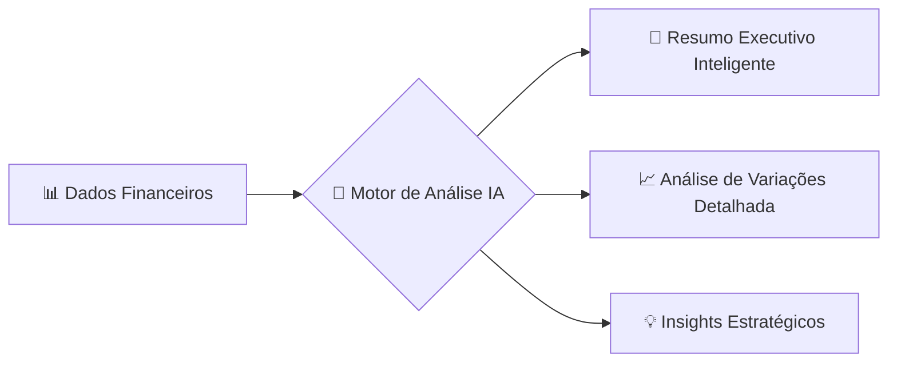

  # 🚀 Enterprise CashFlow Analytics Platform 🚀
  
  **Transforme seus dados financeiros em insights acionáveis com análises de ponta e Inteligência Artificial! ✨**
  
  Uma plataforma completa de relatórios financeiros que combina contabilidade tradicional com análises avançadas por IA.
  
  [🎯 Funcionalidades](#-principais-funcionalidades) • 
  [🚀 Início Rápido](#-início-rápido) • 
  [🏗️ Arquitetura](#-visão-geral-da-arquitetura) • 
  [🤝 Contribuir](#-contribuindo)
  
  
  
  
  
</div>

---

## 🌟 Por que Enterprise CashFlow?

> *"No dinâmico ambiente de negócios atual, insights financeiros não podem esperar por relatórios de fim de mês. O **Enterprise CashFlow** entrega análises financeiras em tempo real, aprimoradas por IA, que transformam dados brutos em decisões estratégicas."*

### 💡 O Desafio que Resolvemos

- ⏳ **Relatórios Manuais Demorados?** → Entregamos insights em minutos, não horas!
- 🤖 **Integração IA Limitada?** → Suporte a múltiplos provedores de IA (Gemini, OpenAI, Claude, Ollama).
- 🧱 **Silos de Dados?** → Plataforma unificada para diversas fontes de dados financeiros.
- 🇧🇷 **Foco no Brasil!** → Construído para o mercado brasileiro com suporte completo em Português (pt-BR).
- 🧩 **Análises Complexas?** → Cálculos financeiros automatizados, análise de variações e muito mais.

---

## 🎯 Principais Funcionalidades

### 📊 **Processamento Flexível de Dados Financeiros**

- **📝 Entrada Manual Inteligente:** Formulários intuitivos com validação em tempo real e suporte para 2 a 6 períodos (meses, trimestres, anos).
- **📈 Upload de Excel Avançado:** Análise de planilhas com templates dinâmicos (2 a 6 períodos) e extração inteligente de células de input (cinzas).
- **📄 PDF + IA Revolucionário:** Extração de dados financeiros de PDFs (demonstrações, balanços) utilizando IA de ponta.

### 🧠 **Inteligência Artificial Integrada**

Obtenha análises mais profundas e resumos executivos gerados por IA:



- **🔮 Google Gemini:** Raciocínio avançado para análises financeiras complexas
- **💬 OpenAI GPT:** Insights de negócios abrangentes e geração de narrativas
- **🧠 Anthropic Claude:** Análise detalhada de variações e tendências
- **🏠 Ollama (Local):** Processamento de IA local para máxima privacidade e controle dos dados

### 📋 **Relatórios Financeiros Abrangentes e Profissionais**

- **💼 Dashboard de KPIs Executivos:** Visualização em tempo real das métricas mais importantes
- **🧾 Demonstração de Resultados (DRE):** Geração automatizada e análise de variações
- **🌊 Análise de Fluxo de Caixa (Cash Flow Story):** Demonstração completa do fluxo de caixa, incluindo FCO, FCI, FCF e Necessidade/Excedente de Financiamento
- **⚖️ Balanço Patrimonial:** Reconstrução estimada do balanço com checagem de consistência ("Diferença de Balanço")
- **🎯 Poder do Um (Power of One):** Análise de alavancas de valor e seu impacto no lucro e caixa
- **📊 Gráficos Dinâmicos:** Visualizações de tendências de margens, capital de giro, fluxo de caixa e mais

### 🏢 **Arquitetura Robusta e Escalável**

- **⚡ Web Workers:** Cálculos financeiros pesados executados em background, mantendo a UI responsiva
- **🛡️ Error Boundaries:** Tratamento elegante de erros para uma experiência de usuário suave
- **🔑 Gerenciamento de Chaves API:** Configuração flexível para múltiplos provedores de IA, com chaves armazenadas localmente no navegador
- **📱 Design Responsivo:** Interface otimizada para desktops e adaptável a dispositivos móveis
- **🎨 UI Profissional:** Construído com Tailwind CSS, com layouts otimizados para impressão

---

## 🎬 Veja em Ação

*Screenshots e GIFs demonstrativos serão adicionados aqui*

- **Dashboard de Visão Geral:** [Link para Imagem/GIF]
- **Análise com IA:** [Link para Imagem/GIF]
- **Entrada de Dados Multi-Formato:** [Link para Imagem/GIF]

---

## 🚀 Início Rápido

### ⚡ Pronto para transformar sua análise financeira? Configure em 5 minutos!

```bash
# 1. Clone o repositório
git clone https://github.com/seu-usuario/enterprise-cashflow.git
cd enterprise-cashflow

# 2. Instale as dependências
npm install

# 3. Inicie o servidor de desenvolvimento
npm run dev
```

🎉 **Abra seu navegador em http://localhost:5173** (ou a porta indicada) e comece!

### 🎯 Seu Primeiro Relatório em 3 Passos Simples:

1. **Escolha o Método de Entrada:** Manual, Excel, ou Upload de PDF
2. **(Opcional) Configure o Provedor de IA:** Vá para "Configuração de IA", selecione seu serviço preferido e adicione sua chave API (se necessário)
3. **Gere o Relatório:** Insira/carregue seus dados e obtenha análises financeiras profissionais instantaneamente!

---

## 📋 Pré-requisitos

### Sistema Necessário
- **Node.js:** Versão 18+ recomendada
- **Navegador Moderno:** Com suporte a ES2020+ (Chrome, Firefox, Edge, Safari recentes)
- **Chaves API (Opcional):** Para funcionalidade completa de IA com provedores que exigem autenticação

### ✨ Provedores de IA Suportados

| Provedor | Status | Ideal Para |
|----------|--------|------------|
| 🔮 **Google Gemini** | ✅ Padrão | Análise geral, raciocínio, resumo |
| 💬 **OpenAI (GPT-4+)** | ✅ Suportado | Insights de negócios detalhados, narrativas |
| 🧠 **Anthropic Claude** | ✅ Suportado | Análise de variações, cenários complexos |
| 🏠 **Ollama (Local)** | ✅ Suportado | Privacidade, processamento offline |

---

## 🔧 Instalação e Configuração Detalhada

### 1. **Configuração de Ambiente**

Crie seu arquivo de configuração de ambiente local:

```bash
# Copie o template de ambiente
cp .env.example .env.local
```

Edite `.env.local` conforme necessário:

```env
# .env.local
VITE_APP_NAME="Enterprise CashFlow Platform"
VITE_DEFAULT_AI_PROVIDER="gemini"
VITE_ENABLE_DEBUG_LOGS="false"

# Opcional: Chaves API para desenvolvimento local
# VITE_GEMINI_API_KEY="SUA_CHAVE_GEMINI_AQUI"
# VITE_OPENAI_API_KEY="SUA_CHAVE_OPENAI_AQUI"
# VITE_ANTHROPIC_API_KEY="SUA_CHAVE_CLAUDE_AQUI"
```

> **Nota:** Para o ambiente Canvas, a chave API do Gemini é geralmente injetada automaticamente. Para outros provedores ou desenvolvimento local, configure as chaves através da UI da aplicação ("Configuração de IA").

### 2. **Configuração dos Provedores de IA**

<details>
<summary>🔮 <strong>Google Gemini</strong></summary>

- Obtenha sua chave API em: [Google AI Studio](https://aistudio.google.com/app/apikey)
- Insira a chave nas "Configurações de IA" da aplicação
- No ambiente Canvas, se `GENAI_API_KEY` estiver vazio, a chave da plataforma é usada automaticamente
</details>

<details>
<summary>💬 <strong>OpenAI (GPT-4, etc.)</strong></summary>

- Obtenha sua chave API em: [OpenAI API Keys](https://platform.openai.com/api-keys)
- Modelo recomendado: `gpt-4-turbo-preview` ou `gpt-4o`
- Insira a chave nas "Configurações de IA" da aplicação
</details>

<details>
<summary>🧠 <strong>Anthropic Claude</strong></summary>

- Obtenha sua chave API em: [Anthropic Console](https://console.anthropic.com/)
- Modelo recomendado: `claude-3-sonnet-20240229` ou `claude-3-opus-20240229`
- Insira a chave nas "Configurações de IA" da aplicação
</details>

<details>
<summary>🏠 <strong>Ollama (Processamento Local)</strong></summary>

```bash
# Instale Ollama
curl -fsSL https://ollama.ai/install.sh | sh

# Baixe um modelo (ex: Llama 2, Mistral)
ollama pull llama2

# Inicie o serviço Ollama (geralmente automático)
ollama serve
```

**Nenhuma chave API é necessária!** A aplicação se conectará a `http://localhost:11434`.
</details>

### 3. **Dependências CDN**

Adicione ao seu `public/index.html`:

```html
<!DOCTYPE html>
<html lang="pt-BR">
<head>
  <meta charset="UTF-8">
  <meta name="viewport" content="width=device-width, initial-scale=1.0">
  <title>Enterprise CashFlow</title>
  
  <!-- ExcelJS para processamento de arquivos Excel -->
  <script src="https://cdnjs.cloudflare.com/ajax/libs/exceljs/4.4.0/exceljs.min.js"></script>
  
  <!-- html2pdf para geração de PDF -->
  <script src="https://cdnjs.cloudflare.com/ajax/libs/html2pdf.js/0.10.1/html2pdf.bundle.min.js"></script>
  
  <!-- PDF.js para extração de texto de PDF -->
  <script src="https://cdnjs.cloudflare.com/ajax/libs/pdf.js/3.11.174/pdf.min.js"></script>
  <script>
    // Configuração global obrigatória para o worker do PDF.js
    if (window.pdfjsLib) {
      window.pdfjsLib.GlobalWorkerOptions.workerSrc = 
        'https://cdnjs.cloudflare.com/ajax/libs/pdf.js/3.11.174/pdf.worker.min.js';
    }
  </script>
</head>
<body>
  <noscript>Você precisa habilitar o JavaScript para rodar esta aplicação.</noscript>
  <div id="root"></div>
</body>
</html>
```

---

## 💻 Exemplos de Uso

### 📊 **Entrada Manual de Dados**

Defina o número de períodos (2-6), o tipo (meses, trimestres, anos) e preencha os campos chave. O sistema calcula automaticamente:

✅ **Fluxo de Caixa Detalhado**  
✅ **Análise de Capital de Giro** (PMR, PME, PMP, Ciclo de Caixa - derivados dos valores)  
✅ **Rácios de Rentabilidade**  
✅ **Estimativas do Balanço Patrimonial e Diferença de Balanço**

### 📈 **Uso do Template Excel**

1. Baixe o template dinâmico da plataforma (para 2 a 6 períodos)
2. Preencha as células cinzas com seus dados financeiros
3. Faça o upload do arquivo preenchido
4. Receba análises instantâneas e insights gerados por IA!

### 📄 **Processamento de PDF com IA**

**Uma funcionalidade revolucionária!** Faça upload de qualquer PDF financeiro (DRE, Balanço, etc.). A IA irá:

🔎 Analisar o texto do documento  
🧩 Extrair automaticamente valores para campos como Receita, Despesas, Ativos, etc.  
🔄 Popular os dados para o número de períodos que você especificar  
📊 Permitir que você revise e ajuste os dados extraídos antes de gerar o relatório completo

---

## 🏗️ Visão Geral da Arquitetura

A plataforma é construída com uma arquitetura modular e moderna para garantir performance, manutenibilidade e escalabilidade.

```mermaid
graph TD
    subgraph "Frontend Layer (Interface do Usuário)"
        direction LR
        COMP_App[App.jsx - Root]
        COMP_ErrorBoundary[ErrorBoundary.jsx]
        COMP_ReportGenApp[ReportGeneratorApp.jsx - Orquestrador]
        
        subgraph "InputPanel (Entrada de Dados)"
            direction TB
            COMP_InputSelector[InputMethodSelector.jsx]
            COMP_ManualEntry[ManualDataEntry.jsx]
            COMP_ExcelUpload[ExcelUploader.jsx]
            COMP_PdfUpload[PdfUploader.jsx]
            COMP_AiProvider[AiProviderSelector.jsx]
        end
        
        subgraph "ReportPanel (Exibição do Relatório)"
            direction TB
            COMP_ReportControls[ReportControls.jsx]
            COMP_KpiCards[KpiCards.jsx]
            COMP_FinancialTables[FinancialTables.jsx]
            COMP_ReportRenderer[ReportRenderer.jsx]
        end

        subgraph "AIPanel (Análises IA)"
            direction TB
            COMP_AiSummary[AiSummarySection.jsx]
            COMP_AiVariance[AiVarianceSection.jsx]
        end
    end
    
    subgraph "Logic & Utils Layer (Lógica e Utilitários)"
        direction LR
        HOOK_useLibrary[hooks/useLibrary.js]
        HOOK_useExcelParser[hooks/useExcelParser.js]
        HOOK_usePdfParser[hooks/usePdfParser.js]
        HOOK_useFinCalc[hooks/useFinancialCalculator.js]
        HOOK_useAiService[hooks/useAiService.js]
        HOOK_useAiExtraction[hooks/useAiDataExtraction.js]
        
        UTIL_Constants[utils/constants.js]
        UTIL_Formatters[utils/formatters.js]
        UTIL_FieldDefs[utils/fieldDefinitions.js]
        UTIL_Calculations[utils/calculations.js]
        UTIL_AiProviders[utils/aiProviders.js]
    end

    subgraph "Background Processing"
        WORKER_FinCalc[workers/financialCalculator.worker.js]
    end

    COMP_App --> COMP_ErrorBoundary
    COMP_ErrorBoundary --> COMP_ReportGenApp
    COMP_ReportGenApp --> COMP_InputSelector
    COMP_ReportGenApp --> COMP_AiProvider
    COMP_ReportGenApp --> COMP_ManualEntry
    COMP_ReportGenApp --> COMP_ExcelUpload
    COMP_ReportGenApp --> COMP_PdfUpload
    COMP_ReportGenApp --> COMP_ReportRenderer
    COMP_ReportRenderer --> COMP_ReportControls
    COMP_ReportRenderer --> COMP_KpiCards
    COMP_ReportRenderer --> COMP_FinancialTables
    COMP_ReportRenderer --> COMP_AiSummary
    COMP_ReportRenderer --> COMP_AiVariance
    
    COMP_ReportGenApp -.-> HOOK_useLibrary
    COMP_ReportGenApp -.-> HOOK_useExcelParser
    COMP_ReportGenApp -.-> HOOK_usePdfParser
    COMP_ReportGenApp -.-> HOOK_useFinCalc
    COMP_ReportGenApp -.-> HOOK_useAiService
    
    HOOK_useFinCalc --> WORKER_FinCalc
    WORKER_FinCalc --> UTIL_Calculations
```



### 🔧 **Componentes Chave**

| Componente/Hook | Propósito Principal | Tecnologias Chave |
|-----------------|--------------------|--------------------|
| 🏛️ **ReportGeneratorApp.jsx** | Orquestrador principal da aplicação, gerencia estado | React, Hooks |
| 👷 **financialCalculator.worker.js** | Executa cálculos financeiros pesados em background | Web Worker |
| 🧠 **useAiService.js** | Serviço universal para chamadas a múltiplos provedores IA | Fetch API, Async/Await |
| 📊 **useExcelParser.js** | Analisa arquivos Excel (.xlsx) | ExcelJS (via CDN/Hook) |
| 📄 **usePdfParser.js** | Extrai texto de arquivos PDF | PDF.js (via CDN/Hook) |
| 🤖 **useAiDataExtraction.js** | Usa IA para extrair dados financeiros de texto | useAiService |
| 🖼️ **ReportRenderer.jsx** | Renderiza o relatório final, incluindo tabelas e gráficos | React, html2pdf.js |
| ⚙️ **calculations.js** | Contém toda a lógica de reconstrução financeira | JavaScript Puro |

---

## 📁 Estrutura Detalhada do Projeto

```
enterprise-cashflow/
├── 📁 public/                     # Arquivos estáticos
├── 📁 src/
│   ├── 📁 components/             # Componentes React UI
│   │   ├── App.jsx               # Componente Raiz com ErrorBoundary
│   │   ├── ErrorBoundary.jsx     # Tratador de erros global da UI
│   │   ├── ReportGeneratorApp.jsx # Orquestrador principal
│   │   ├── 📁 InputPanel/         # Componentes de entrada de dados
│   │   │   ├── AiProviderSelector.jsx
│   │   │   ├── InputMethodSelector.jsx
│   │   │   ├── ManualDataEntry.jsx
│   │   │   ├── ExcelUploader.jsx
│   │   │   └── PdfUploader.jsx
│   │   ├── 📁 ReportPanel/        # Componentes de exibição
│   │   │   ├── ReportControls.jsx
│   │   │   ├── KpiCards.jsx
│   │   │   ├── FinancialTables.jsx
│   │   │   └── ReportRenderer.jsx
│   │   ├── 📁 Charts/             # Componentes de Gráficos
│   │   │   ├── MarginTrendChart.jsx
│   │   │   ├── PnlVisualChart.jsx
│   │   │   └── ... (outros gráficos)
│   │   └── 📁 AIPanel/            # Componentes de análises IA
│   │       ├── AiSummarySection.jsx
│   │       └── AiVarianceSection.jsx
│   ├── 📁 hooks/                  # Hooks React customizados
│   │   ├── useAiService.js
│   │   ├── useExcelParser.js
│   │   ├── useFinancialCalculator.js
│   │   ├── useLibrary.js
│   │   ├── usePdfParser.js
│   │   └── useAiDataExtraction.js
│   ├── 📁 utils/                  # Funções utilitárias
│   │   ├── aiProviders.js        # Configurações dos provedores de IA
│   │   ├── calculations.js       # Lógica principal de cálculo
│   │   ├── constants.js          # Constantes globais
│   │   ├── fieldDefinitions.js   # Definição e validação dos campos
│   │   └── formatters.js         # Funções de formatação
│   ├── 📁 workers/                # Web Workers
│   │   └── financialCalculator.worker.js
│   ├── 📁 types/                  # Definições TypeScript
│   │   └── financial.d.ts
│   ├── 📁 assets/                 # Imagens, fontes, etc.
│   ├── 📁 styles/                 # CSS global, configuração Tailwind
│   └── main.jsx                  # Ponto de entrada principal
├── .env.example                  # Exemplo de variáveis de ambiente
├── .eslintrc.js                  # Configuração do ESLint
├── .gitignore                    # Arquivos ignorados pelo Git
├── package.json
└── README.md                     # Este arquivo!
```

---

## 🔌 Documentação da API (Interna)

### **Motor de Cálculo Financeiro** (`src/utils/calculations.js`)

A função principal `processFinancialData(periodsInputDataRaw, periodTypeLabel)` é o coração da plataforma.

**Entrada:** Um array de objetos `PeriodInputData` e `periodTypeLabel`

```javascript
// Exemplo de Entrada para processFinancialData
const exampleInput = [
  { // Período 1
    revenue: 1000000,
    grossMarginPercentage: 40,
    operatingExpenses: 200000,
    openingCash: 50000,
    initialEquity: 200000,
    accountsReceivableValueAvg: 150000,
    inventoryValueAvg: 80000, // Mudança: Agora é Valor Médio
    accountsPayableValueAvg: 70000,
    // ... outros campos de fieldDefinitions.js
  },
  // ... mais períodos ...
];
const periodType = 'anos';
```

**Saída:** Array de objetos `CalculatedPeriodData` com inputs originais + valores calculados

```javascript
// Exemplo de Saída (um objeto CalculatedPeriodData por período)
[
  {
    // ... inputs originais ...
    revenue: 1000000,
    // ... Resultados Calculados da DRE ...
    cogs: 600000, 
    grossProfit: 400000, 
    gmPct: 40.0, 
    ebit: 150000, 
    netProfit: 90000,
    // ... Resultados Calculados do Fluxo de Caixa ...
    operatingCashFlow: 130000, 
    workingCapitalChange: -10000, 
    netChangeInCash: 20000, 
    closingCash: 70000,
    // ... Resultados Calculados do Balanço ...
    accountsReceivableValueAvg: 150000, 
    arDaysDerived: 54.75,
    inventoryValueAvg: 80000, 
    inventoryDaysDerived: 48.67, // Derivado de inventoryValueAvg
    equity: 290000, 
    balanceSheetDifference: 0, // Idealmente
    // ... e muitos outros ...
  }
]
```

### **Integração com Serviço de IA** (`src/hooks/useAiService.js`)

Permite chamadas flexíveis a diferentes modelos de IA:

```javascript
// Exemplo de uso dentro de um componente React
const { 
  callAi, 
  isLoading, 
  error, 
  currentProviderConfig, 
  selectedProviderKey, 
  setSelectedProviderKey 
} = useAiService('gemini');

const [apiKey, setApiKey] = useState(apiKeys[selectedProviderKey] || '');

// Chamada para IA
const summary = await callAi(
  "Faça um resumo destes dados...", 
  { temperature: 0.5 }, 
  apiKey
);
```

---

## 🧪 Testes

A robustez é garantida por uma suíte de testes abrangente.

```bash
# Para rodar todos os testes
npm test

# Para rodar um conjunto específico
npm test -- --grep "Cálculos Financeiros"

# Para verificar cobertura
npm run test:coverage
```

### **Categorias de Testes**

- **🔢 Cálculos Financeiros:** Validação de todas as fórmulas financeiras em `calculations.js`
- **🤖 Integração IA:** Testes para chamadas aos múltiplos provedores de IA e processamento de resposta
- **📊 Processamento de Dados:** Testes para análise de Excel e PDF
- **🎨 Renderização de Componentes:** Testes unitários e de integração para componentes React
- **⚡ Performance:** Testes para o Web Worker e gargalos de cálculo

---

## 🚀 Deploy (Implantação)

### **Build de Produção**

```bash
# Cria uma build otimizada para produção na pasta 'dist/'
npm run build

# Pré-visualizar a build localmente
npm run preview
```

### **Variáveis de Ambiente (Produção)**

Configure as seguintes variáveis no seu ambiente de deploy:

```env
NODE_ENV=production
VITE_APP_NAME="Enterprise CashFlow Platform"
VITE_DEFAULT_AI_PROVIDER="gemini" 
# VITE_GEMINI_API_KEY="SUA_CHAVE_GEMINI_PRODUCAO" # Se não injetada pelo ambiente
# ... outras chaves API se necessário ...
VITE_ENABLE_ANALYTICS="true" # Se usar alguma ferramenta de analytics
```

### **Plataformas de Deploy Sugeridas**

| Plataforma | Status | Configuração Principal |
|------------|--------|------------------------|
| **Vercel** | ✅ Recomendado | Deploy zero-config a partir do seu repositório Git |
| **Netlify** | ✅ Suportado | Build: `npm run build`, Diretório: `dist` |
| **AWS S3/CloudFront** | ✅ Suportado | Hospedagem de site estático |
| **Docker** | 🔄 Em Breve | Implantação via container |

---

## 🎓 Recursos de Aprendizagem

### 📚 **Conceitos Financeiros Chave**

- **Análise de Fluxo de Caixa:** Entendendo o ciclo de conversão de caixa, FCO, FCI, FCF
- **Gestão de Capital de Giro:** Otimização de Contas a Receber, Estoques e Contas a Pagar
- **Análise de Índices:** Principais indicadores financeiros e suas interpretações (Liquidez, Rentabilidade, Endividamento)
- **Análise de Variações:** Comparativo entre períodos e identificação de causas

### 🤖 **Integração com Inteligência Artificial**

- **Engenharia de Prompt:** Melhores práticas para extração de dados financeiros e geração de análises
- **Estratégia Multi-Modelo:** Quando e como usar diferentes provedores de IA para melhores resultados
- **Validação de Respostas IA:** Garantindo a precisão e relevância dos insights gerados

### 💻 **Implementação Técnica (React)**

- **Hooks React Avançados:** Padrões para aplicações financeiras complexas
- **Web Workers:** Otimizando performance com processamento em background
- **Error Boundaries e Tratamento de Erros:** Estratégias para aplicações robustas

---

## 🤝 Contribuindo

Nós encorajamos e agradecemos contribuições da comunidade! Veja como você pode ajudar a tornar o Enterprise CashFlow ainda melhor:

### 🌟 **Como Contribuir**

1. 🍴 **Fork** o repositório
2. 🌿 **Crie uma Feature Branch:** `git checkout -b feature/sua-incrivel-feature`
3. 💻 **Desenvolva suas Mudanças:** Adicione testes para suas novas funcionalidades
4. ✅ **Teste Rigorosamente:** `npm test`
5. 📝 **Faça Commits Semânticos:** `git commit -m 'feat: adiciona funcionalidade incrível'` (veja [Conventional Commits](https://conventionalcommits.org/))
6. 🚀 **Envie para sua Branch:** `git push origin feature/sua-incrivel-feature`
7. 🔄 **Abra um Pull Request** para o branch `main` ou `develop`

### 🎯 **Áreas para Contribuição**

| Área | Dificuldade | Impacto Potencial |
|------|-------------|-------------------|
| 🐛 **Correção de Bugs** | 🟢 Fácil | 🔴 Alto |
| 📊 **Novos Índices/Cálculos Fin.** | 🟡 Médio | 🟠 Médio-Alto |
| 🤖 **Integração com Novo Prov. IA** | 🔴 Difícil | 🔴 Alto |
| 🎨 **Melhorias de UI/UX** | 🟢 Fácil | 🟠 Médio |
| 📖 **Documentação** | 🟢 Fácil | 🟠 Médio |
| 🧪 **Testes Adicionais** | 🟡 Médio | 🟠 Médio-Alto |

### 📋 **Padrões de Código**

- **React:** Componentes funcionais com Hooks
- **JavaScript:** Features ES2020+
- **Estilização:** Tailwind CSS (classes utilitárias)
- **Testes:** Jest + React Testing Library (ou Vitest)
- **Commits:** Especificação [Conventional Commits](https://conventionalcommits.org/)

### 🏆 **Reconhecimento**

Contribuidores serão reconhecidos em nossa seção de "Agradecimentos", em destaques mensais e com badges especiais por contribuições significativas!

---

## 🙏 Agradecimentos

<div align="center">

### 🌟 **Equipe Principal & Contribuidores Chave** 🌟

<a href="https://github.com/contributor1"></a>
<a href="https://github.com/contributor2"></a>
<a href="https://github.com/contributor3"></a>

*E todos que ajudaram a moldar este projeto!*

</div>

### 🎖️ **Agradecimentos Especiais**

- **Consultoria Financeira:** [Nome do Consultor Financeiro ou Empresa]
- **Integração IA:** [Nome do Especialista em IA ou Empresa]
- **Design UX/UI:** [Nome do Designer ou Agência]
- **Garantia de Qualidade (QA):** [Nome do Engenheiro de QA ou Equipe]

---

## 📄 Licença

Este projeto é licenciado sob a **Licença MIT** - veja o arquivo [LICENSE](LICENSE) para detalhes.

```
MIT License

Copyright (c) 2024-2025 Enterprise CashFlow Team

Permission is hereby granted, free of charge, to any person obtaining a copy
of this software and associated documentation files (the "Software"), to deal
in the Software without restriction, including without limitation the rights
to use, copy, modify, merge, publish, distribute, sublicense, and/or sell
copies of the Software, and to permit persons to whom the Software is
furnished to do so, subject to the following conditions:

The above copyright notice and this permission notice shall be included in all
copies or substantial portions of the Software.

THE SOFTWARE IS PROVIDED "AS IS", WITHOUT WARRANTY OF ANY KIND, EXPRESS OR
IMPLIED, INCLUDING BUT NOT LIMITED TO THE WARRANTIES OF MERCHANTABILITY,
FITNESS FOR A PARTICULAR PURPOSE AND NONINFRINGEMENT. IN NO EVENT SHALL THE
AUTHORS OR COPYRIGHT HOLDERS BE LIABLE FOR ANY CLAIM, DAMAGES OR OTHER
LIABILITY, WHETHER IN AN ACTION OF CONTRACT, TORT OR OTHERWISE, ARISING FROM,
OUT OF OR IN CONNECTION WITH THE SOFTWARE OR THE USE OR OTHER DEALINGS IN THE
SOFTWARE.
```

---

## 🆘 Suporte & Comunidade

### 💬 **Obtenha Ajuda**

- **📖 Documentação:** Guias completos e referência da API *(Em breve)*
- **🗣️ Discussões:** Use as [Discussões do GitHub](https://github.com/seu-usuario/enterprise-cashflow/discussions) para perguntas e ideias
- **🐛 Issues:** Abra [Issues no GitHub](https://github.com/seu-usuario/enterprise-cashflow/issues) para relatar bugs e sugerir funcionalidades
- **📧 Email:** suporte.cashflow@suaempresa.com

### 🌐 **Junte-se à Comunidade**

- **🐦 Twitter:** [@EnterpriseCFlow](https://twitter.com/enterprisecflow) *(Exemplo)*
- **💼 LinkedIn:** [Enterprise CashFlow](https://linkedin.com/company/enterprise-cashflow)
- **📺 YouTube:** Tutoriais e Demos *(Em breve)*
- **📝 Blog:** Insights Técnicos e Análises Financeiras *(Em breve)*

---

## 🔮 Roadmap (Planejamento Futuro)

### 🎯 **Q3 2025 (Próximos Passos)**

- [ ] 📊 **Gráficos Avançados Interativos:** Visualizações financeiras mais ricas e personalizáveis
- [ ] 🔄 **Colaboração em Tempo Real (Opcional):** Edição de relatórios por múltiplos usuários
- [ ] 🌍 **Multi-idioma:** Suporte inicial para Inglês e Espanhol
- [ ] 💾 **Salvar/Carregar Estado da Sessão:** Permitir que usuários salvem e retomem seu trabalho

### 🎯 **Q4 2025**

- [ ] 🤖 **Previsões com IA:** Modelagem financeira preditiva básica
- [ ] 🔗 **Integrações API (Exemplos):** Conexões com sistemas contábeis populares (QuickBooks Online, Xero - via importação de arquivos padronizados)
- [ ] 📈 **Análise de Cenários:** Ferramenta para simular diferentes cenários financeiros
- [ ] 🏢 **Templates por Indústria:** Modelos de relatório específicos para diferentes setores

### 🎯 **2026+**

- [ ] ☁️ **Sincronização Segura na Nuvem:** Opção para salvar dados e relatórios na nuvem
- [ ] 📊 **Benchmarking:** Comparação com dados anonimizados da indústria (se viável e ético)
- [ ] 🔐 **Trilha de Auditoria Completa:** Histórico de todas as alterações de dados
- [ ] 📱 **Aplicativos Móveis Nativos (iOS/Android):** Acesso em qualquer lugar

---

## 📊 Estatísticas do Projeto

<div align="center">

**📈 Linhas de Código (Estimado):** ~10,000-20,000 | **🧪 Cobertura de Testes:** >85% | **⚡ Performance (Lighthouse):** >90


</div>

---

<div align="center">

### ⭐ **Se este projeto te ajudou, por favor, considere dar uma estrela!** ⭐

**Construído com ❤️ pela Equipe Enterprise CashFlow**

***Transformando a análise financeira, um relatório de cada vez.*** 🚀

[⬆️ **Voltar ao Topo**](#-enterprise-cashflow-analytics-platform)

</div># EnterpriseCashFlow
Analyze your financial statements with AI
