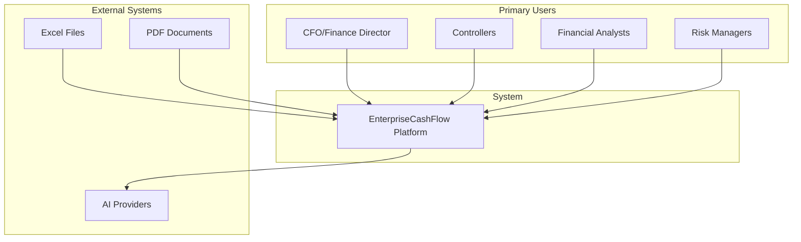
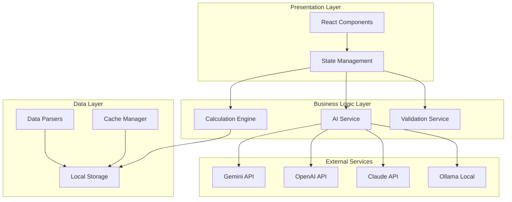
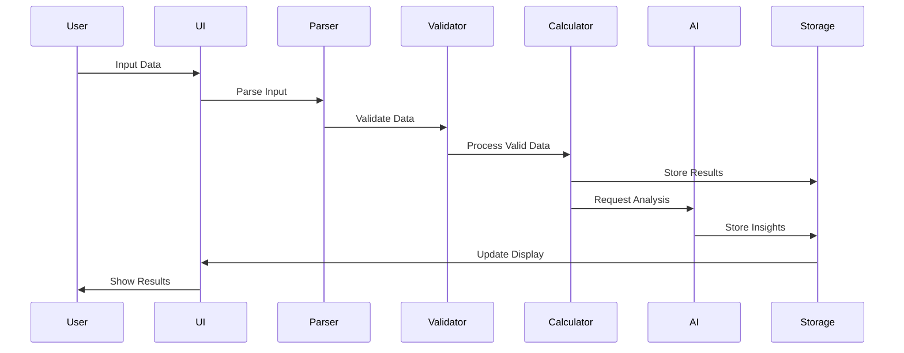

# EnterpriseCashFlow - Comprehensive Requirements Specification

## Document Control
- **Version:** 2.0.0
- **Date:** January 2025
- **Status:** APPROVED
- **Classification:** STRATEGIC

## Table of Contents
1. [Executive Summary](#1-executive-summary)
2. [System Context](#2-system-context)
3. [Functional Requirements](#3-functional-requirements)
4. [Non-Functional Requirements](#4-non-functional-requirements)
5. [System Architecture](#5-system-architecture)
6. [Data Architecture](#6-data-architecture)
7. [Integration Requirements](#7-integration-requirements)
8. [Security Requirements](#8-security-requirements)
9. [Quality Attributes](#9-quality-attributes)
10. [Acceptance Criteria](#10-acceptance-criteria)

---

## 1. Executive Summary

### 1.1 Project Vision
EnterpriseCashFlow is a next-generation financial analytics platform that transforms raw financial data into actionable C-level insights through advanced AI analysis. The platform uniquely combines multi-modal data input capabilities (Manual, Excel, PDF) with multi-provider AI intelligence (Gemini, GPT-4, Claude, Ollama) to deliver comprehensive financial analysis tailored for the Brazilian market.

### 1.2 Business Objectives
- **Reduce Analysis Time:** Cut financial analysis time by 60% through automation
- **Increase Accuracy:** Achieve 100% calculation accuracy for core financial metrics
- **Enhance Decision Making:** Provide AI-powered insights within minutes
- **Democratize Analytics:** Make enterprise-grade analysis accessible to all company sizes
- **Localize for Brazil:** Full Portuguese support with Brazilian accounting standards

### 1.3 Success Metrics
| Metric | Target | Measurement Method |
|--------|--------|-------------------|
| User Adoption | 70% retention after 1 month | Analytics tracking |
| Analysis Speed | < 5 minutes per report | Performance monitoring |
| Accuracy | 100% for calculations | Automated testing |
| User Satisfaction | > 85% positive feedback | In-app surveys |
| ROI | Positive within 6 months | Business metrics |

## 2. System Context

### 2.1 Stakeholder Map


### 2.2 User Personas

#### 2.2.1 Executive Decision Maker (Paulo, CFO)
- **Age:** 45-55 years
- **Tech Savvy:** Medium
- **Goals:** Quick strategic insights, trend visualization, board reporting
- **Pain Points:** Time-consuming manual analysis, lack of real-time insights
- **Usage Pattern:** Weekly/Monthly for board meetings and strategic decisions

#### 2.2.2 Financial Controller (Maria, Controller)
- **Age:** 35-45 years
- **Tech Savvy:** High
- **Goals:** Accurate calculations, variance analysis, operational metrics
- **Pain Points:** Excel limitations, manual consolidation errors
- **Usage Pattern:** Daily for operational monitoring and reporting

#### 2.2.3 Financial Analyst (João, Senior Analyst)
- **Age:** 25-35 years
- **Tech Savvy:** Very High
- **Goals:** Detailed analysis, data validation, report generation
- **Pain Points:** Repetitive tasks, data inconsistencies
- **Usage Pattern:** Multiple times daily for various analyses

### 2.3 System Boundaries
- **In Scope:**
  - Financial data input (Manual, Excel, PDF)
  - Core financial calculations (P&L, Balance Sheet, Cash Flow)
  - AI-powered analysis (6 types)
  - Interactive dashboards and reports
  - PDF report generation
  
- **Out of Scope:**
  - Backend server implementation
  - User authentication system
  - Multi-company consolidation
  - Real-time data streaming
  - Mobile native applications

## 3. Functional Requirements

### 3.1 Data Input Module

#### 3.1.1 Manual Data Entry
| ID | Requirement | Priority | Acceptance Criteria |
|----|-------------|----------|-------------------|
| FR-M001 | Support 2-6 configurable periods | MUST | User can select period count via dropdown |
| FR-M002 | Period type selection (Monthly/Quarterly/Yearly) | MUST | Radio buttons with visual feedback |
| FR-M003 | Real-time field validation | MUST | Instant error messages for invalid inputs |
| FR-M004 | Auto-save functionality | SHOULD | Save every 30 seconds or on field blur |
| FR-M005 | Progress indicator | SHOULD | Visual progress bar showing completion |
| FR-M006 | Field-level help tooltips | SHOULD | Context-sensitive help on hover/focus |
| FR-M007 | Keyboard navigation support | MUST | Tab order and Enter key submission |
| FR-M008 | Copy/paste from Excel | SHOULD | Parse clipboard data intelligently |

#### 3.1.2 Excel Upload Processing
| ID | Requirement | Priority | Acceptance Criteria |
|----|-------------|----------|-------------------|
| FR-E001 | Dynamic template generation | MUST | Download template matching period count |
| FR-E002 | Drag-and-drop upload | MUST | Visual drop zone with file validation |
| FR-E003 | Gray cell detection for inputs | MUST | Parse only gray-formatted cells |
| FR-E004 | Multi-header pattern support | MUST | Recognize 5+ header variations |
| FR-E005 | Validation error reporting | MUST | Cell-specific error locations |
| FR-E006 | Progress bar during processing | MUST | Real-time processing feedback |
| FR-E007 | File size limit (10MB) | MUST | Clear error for oversized files |
| FR-E008 | Format validation (.xlsx, .xls) | MUST | Reject unsupported formats |

#### 3.1.3 PDF Data Extraction
| ID | Requirement | Priority | Acceptance Criteria |
|----|-------------|----------|-------------------|
| FR-P001 | PDF upload interface | MUST | Drag-and-drop with preview |
| FR-P002 | AI-powered text extraction | MUST | Extract financial data using AI |
| FR-P003 | Multi-page support | MUST | Process documents up to 50 pages |
| FR-P004 | Table detection | SHOULD | Identify and parse financial tables |
| FR-P005 | Manual correction interface | MUST | Edit extracted values before processing |
| FR-P006 | Confidence scoring | SHOULD | Show AI confidence for each field |
| FR-P007 | Multiple format support | MUST | Handle various P&L/Balance formats |
| FR-P008 | OCR for scanned PDFs | COULD | Basic OCR capability |

### 3.2 Financial Calculation Engine

#### 3.2.1 Core Calculations
| ID | Requirement | Priority | Formula/Logic |
|----|-------------|----------|--------------|
| FR-C001 | Revenue calculations | MUST | Net Revenue = Gross Revenue - Deductions |
| FR-C002 | COGS calculation | MUST | COGS = Net Revenue × (1 - Gross Margin %) |
| FR-C003 | EBITDA calculation | MUST | EBITDA = EBIT + Depreciation + Amortization |
| FR-C004 | Operating Cash Flow | MUST | OCF = Net Income + Non-cash items ± WC changes |
| FR-C005 | Working Capital metrics | MUST | WC = Current Assets - Current Liabilities |
| FR-C006 | DSO calculation | MUST | DSO = (AR / Revenue) × Days in Period |
| FR-C007 | DIO calculation | MUST | DIO = (Inventory / COGS) × Days in Period |
| FR-C008 | DPO calculation | MUST | DPO = (AP / COGS) × Days in Period |
| FR-C009 | Cash Conversion Cycle | MUST | CCC = DSO + DIO - DPO |
| FR-C010 | Balance Sheet estimation | SHOULD | Derive from cash flow and assumptions |

#### 3.2.2 Advanced Analytics
| ID | Requirement | Priority | Description |
|----|-------------|----------|-------------|
| FR-A001 | Horizontal analysis | MUST | Period-over-period % changes |
| FR-A002 | Vertical analysis | MUST | Line items as % of revenue |
| FR-A003 | Ratio analysis | MUST | Liquidity, profitability, efficiency ratios |
| FR-A004 | Trend analysis | MUST | Multi-period trend identification |
| FR-A005 | Variance analysis | MUST | Actual vs expected variances |
| FR-A006 | Power of One | SHOULD | Impact of 1% improvement analysis |
| FR-A007 | Break-even analysis | SHOULD | Fixed/variable cost breakdown |
| FR-A008 | Sensitivity analysis | COULD | What-if scenarios |

### 3.3 AI Analysis Module

#### 3.3.1 Provider Management
| ID | Requirement | Priority | Acceptance Criteria |
|----|-------------|----------|-------------------|
| FR-AI001 | Provider selection UI | MUST | Dropdown with provider descriptions |
| FR-AI002 | API key management | MUST | Secure local storage with encryption |
| FR-AI003 | Provider health check | MUST | Test connection before analysis |
| FR-AI004 | Fallback mechanism | SHOULD | Auto-switch on provider failure |
| FR-AI005 | Usage tracking | SHOULD | Monitor API calls and costs |
| FR-AI006 | Response caching | SHOULD | Cache for identical requests |

#### 3.3.2 Analysis Types
| ID | Type | Duration | Focus Area | Output |
|----|------|----------|-----------|---------|
| FR-AT001 | Executive Summary | 3-5 min | C-Level insights | Strategic overview |
| FR-AT002 | Variance Analysis | 2-4 min | Operational changes | Detailed variances |
| FR-AT003 | Risk Assessment | 4-6 min | Risk identification | Risk matrix |
| FR-AT004 | Cash Flow Analysis | 3-4 min | Liquidity focus | Cash insights |
| FR-AT005 | Strategic Recommendations | 5-7 min | Action planning | Actionable steps |
| FR-AT006 | Detailed Audit | 6-10 min | Data validation | Consistency report |

### 3.4 Reporting Module

#### 3.4.1 Dashboard Components
| ID | Component | Priority | Interactive Features |
|----|-----------|----------|-------------------|
| FR-D001 | KPI Cards | MUST | Click for details, trend sparklines |
| FR-D002 | Revenue Chart | MUST | Hover tooltips, period selection |
| FR-D003 | Margin Analysis | MUST | Drill-down to components |
| FR-D004 | Cash Flow Waterfall | MUST | Category breakdown |
| FR-D005 | Working Capital Timeline | MUST | Component visualization |
| FR-D006 | Ratio Dashboard | SHOULD | Benchmark comparisons |
| FR-D007 | Trend Analysis | SHOULD | Multi-metric overlay |

#### 3.4.2 Export Capabilities
| ID | Feature | Priority | Formats |
|----|---------|----------|---------|
| FR-X001 | PDF Report Generation | MUST | A4, Letter sizes |
| FR-X002 | Excel Data Export | MUST | .xlsx with formatting |
| FR-X003 | Chart Image Export | SHOULD | PNG, SVG formats |
| FR-X004 | Print Optimization | MUST | CSS print styles |
| FR-X005 | Batch Export | COULD | Multiple reports |

## 4. Non-Functional Requirements

### 4.1 Performance Requirements
| ID | Metric | Target | Measurement |
|----|--------|--------|-------------|
| NFR-P001 | Page Load Time | < 3 seconds | Lighthouse score |
| NFR-P002 | Calculation Time (6 periods) | < 5 seconds | Performance API |
| NFR-P003 | AI Response Time | < 30 seconds | API monitoring |
| NFR-P004 | Excel Processing (5MB) | < 10 seconds | User timing |
| NFR-P005 | PDF Extraction (10MB) | < 15 seconds | User timing |
| NFR-P006 | Memory Usage | < 500MB | Chrome DevTools |
| NFR-P007 | Concurrent Users | 100+ | Load testing |

### 4.2 Usability Requirements
| ID | Requirement | Target | Validation |
|----|-------------|--------|------------|
| NFR-U001 | Learning Curve | < 15 min | User testing |
| NFR-U002 | Task Completion Rate | > 90% | Analytics |
| NFR-U003 | Error Recovery | < 3 clicks | Usability testing |
| NFR-U004 | Mobile Responsiveness | Tablet+ | Device testing |
| NFR-U005 | Accessibility | WCAG 2.1 AA | Automated testing |
| NFR-U006 | Language Support | PT-BR | Native review |

### 4.3 Reliability Requirements
| ID | Requirement | Target | Implementation |
|----|-------------|--------|---------------|
| NFR-R001 | Availability | 99.9% | Error monitoring |
| NFR-R002 | Data Integrity | 100% | Validation layers |
| NFR-R003 | Error Handling | Graceful | Error boundaries |
| NFR-R004 | Browser Support | Chrome, Firefox, Edge, Safari | Cross-browser testing |
| NFR-R005 | Network Resilience | Offline capability | Service workers |

## 5. System Architecture

### 5.1 High-Level Architecture


### 5.2 Component Architecture
| Layer | Components | Responsibilities |
|-------|------------|------------------|
| **Presentation** | React Components, Hooks | UI rendering, user interaction |
| **State Management** | Context API, Local State | Application state, data flow |
| **Business Logic** | Services, Workers | Calculations, validations |
| **Data Access** | Parsers, Formatters | Data transformation |
| **External Integration** | API Clients | AI provider communication |

### 5.3 Technology Stack
```yaml
Frontend:
  - Framework: React 18.2.0
  - Language: JavaScript ES2020+
  - Styling: Tailwind CSS 3.3.5
  - Charts: Recharts 2.15.3
  - Build: Create React App 5.0.1

Libraries:
  - PDF Processing: PDF.js 3.11.174
  - Excel Processing: ExcelJS 4.4.0
  - PDF Generation: html2pdf.js 0.10.3
  - State Management: React Context API

Development:
  - Node.js: 18+ LTS
  - Package Manager: npm
  - Testing: Jest + React Testing Library
  - Linting: ESLint
  - Formatting: Prettier
```

## 6. Data Architecture

### 6.1 Data Model
```typescript
// Core Domain Entities
interface FinancialReport {
  id: string
  companyInfo: CompanyInfo
  periods: FinancialPeriod[]
  calculations: CalculationResults
  aiAnalysis: AIAnalysisResults
  metadata: ReportMetadata
}

interface CompanyInfo {
  name: string
  reportTitle: string
  periodType: 'MONTHLY' | 'QUARTERLY' | 'YEARLY'
  currency: 'BRL'
  industry?: string
}

interface FinancialPeriod {
  index: number
  label: string
  inputData: RawFinancialData
  calculatedData: CalculatedFinancialData
  validation: ValidationResults
}

interface RawFinancialData {
  revenue?: number
  grossMarginPercent?: number
  operatingExpenses?: number
  workingCapital?: WorkingCapitalData
  // ... additional fields
}

interface CalculatedFinancialData {
  incomeStatement: IncomeStatement
  balanceSheet: BalanceSheet
  cashFlow: CashFlowStatement
  ratios: FinancialRatios
  kpis: KeyPerformanceIndicators
}
```

### 6.2 Data Flow


### 6.3 Data Validation Rules
| Field | Validation Rules | Error Message |
|-------|-----------------|---------------|
| Revenue | > 0, numeric | "Revenue must be a positive number" |
| Gross Margin % | 0-100 | "Margin must be between 0-100%" |
| Period Count | 2-6 | "Select between 2-6 periods" |
| Company Name | Required, 1-100 chars | "Company name is required" |
| Dates | Valid date range | "Invalid date selection" |

## 7. Integration Requirements

### 7.1 AI Provider Integrations
| Provider | Endpoint | Authentication | Rate Limits |
|----------|----------|----------------|-------------|
| Gemini | https://generativelanguage.googleapis.com | API Key | 60 RPM |
| OpenAI | https://api.openai.com/v1 | Bearer Token | Tier-based |
| Claude | https://api.anthropic.com | API Key | Tier-based |
| Ollama | http://localhost:11434 | None | Unlimited |

### 7.2 File Format Support
| Format | Library | Capabilities | Limitations |
|--------|---------|--------------|-------------|
| Excel | ExcelJS | Read/Write .xlsx, .xls | 10MB max |
| PDF | PDF.js | Text extraction | No images |
| CSV | Native | Import/Export | UTF-8 only |

### 7.3 Browser APIs
| API | Usage | Fallback |
|-----|-------|----------|
| LocalStorage | Settings, cache | Session storage |
| WebWorkers | Heavy calculations | Main thread |
| FileReader | File processing | Required |
| Fetch API | External calls | Required |

## 8. Security Requirements

### 8.1 Data Security
| ID | Requirement | Implementation |
|----|-------------|----------------|
| SEC-D001 | API keys encrypted at rest | AES encryption |
| SEC-D002 | No financial data in logs | Log sanitization |
| SEC-D003 | Input sanitization | XSS prevention |
| SEC-D004 | Secure external communication | HTTPS only |
| SEC-D005 | Data retention limits | 30-day auto-cleanup |

### 8.2 Application Security
| ID | Requirement | Implementation |
|----|-------------|----------------|
| SEC-A001 | Content Security Policy | Strict CSP headers |
| SEC-A002 | Dependency scanning | npm audit |
| SEC-A003 | Code obfuscation | Production builds |
| SEC-A004 | Error message sanitization | Generic user errors |

### 8.3 Compliance Requirements
| Requirement | Standard | Validation |
|-------------|----------|------------|
| Data Privacy | LGPD (Brazil) | Legal review |
| Financial Accuracy | Brazilian GAAP | Accounting review |
| Accessibility | WCAG 2.1 AA | Automated testing |

## 9. Quality Attributes

### 9.1 Quality Metrics
| Attribute | Metric | Target | Measurement |
|-----------|--------|--------|-------------|
| **Correctness** | Calculation accuracy | 100% | Unit tests |
| **Usability** | Task success rate | > 90% | User testing |
| **Performance** | Response time | < 5s | Monitoring |
| **Reliability** | MTBF | > 720 hours | Logs |
| **Maintainability** | Code coverage | > 80% | Jest |
| **Security** | Vulnerabilities | 0 critical | Scanning |

### 9.2 Testing Strategy
```yaml
Unit Testing:
  - Target: 90% coverage
  - Focus: Calculations, validations
  - Framework: Jest

Integration Testing:
  - Target: Key workflows
  - Focus: Data flow, API calls
  - Framework: React Testing Library

E2E Testing:
  - Target: Critical paths
  - Focus: User journeys
  - Framework: Cypress

Performance Testing:
  - Target: Load scenarios
  - Focus: Calculation speed
  - Tools: Chrome DevTools

Security Testing:
  - Target: OWASP Top 10
  - Focus: Input validation
  - Tools: ESLint Security
```

## 10. Acceptance Criteria

### 10.1 Feature Acceptance
| Feature | Acceptance Criteria | Test Method |
|---------|-------------------|-------------|
| Manual Input | All fields save correctly | Functional test |
| Excel Upload | 95% success rate | Statistical analysis |
| PDF Extraction | 90% accuracy | Manual verification |
| Calculations | 100% accuracy | Automated tests |
| AI Analysis | < 30s response | Performance test |
| PDF Export | Professional quality | User acceptance |

### 10.2 Project Acceptance
- [ ] All MUST requirements implemented
- [ ] 80% of SHOULD requirements implemented  
- [ ] No critical bugs in production
- [ ] Performance targets met
- [ ] Security scan passed
- [ ] User documentation complete
- [ ] 85% user satisfaction score

### 10.3 Go-Live Checklist
- [ ] Production environment ready
- [ ] Monitoring configured
- [ ] Error tracking enabled
- [ ] Analytics implemented
- [ ] Support documentation ready
- [ ] Team training complete
- [ ] Rollback plan documented

---

## Appendices

### A. Glossary
| Term | Definition |
|------|------------|
| **DRE** | Demonstração do Resultado do Exercício (Income Statement) |
| **PMR** | Prazo Médio de Recebimento (Days Sales Outstanding) |
| **PME** | Prazo Médio de Estocagem (Days Inventory Outstanding) |
| **PMP** | Prazo Médio de Pagamento (Days Payable Outstanding) |
| **EBITDA** | Earnings Before Interest, Taxes, Depreciation and Amortization |
| **KPI** | Key Performance Indicator |

### B. References
- Brazilian Accounting Standards (CPC)
- IFRS Standards
- React Documentation
- AI Provider APIs Documentation
- WCAG 2.1 Guidelines

### C. Revision History
| Version | Date | Changes | Author |
|---------|------|---------|--------|
| 1.0 | Jan 2025 | Initial draft | Team |
| 2.0 | Jan 2025 | Comprehensive update | SPARC System |

---

**END OF DOCUMENT**

This specification serves as the authoritative source for all development activities on the EnterpriseCashFlow platform.