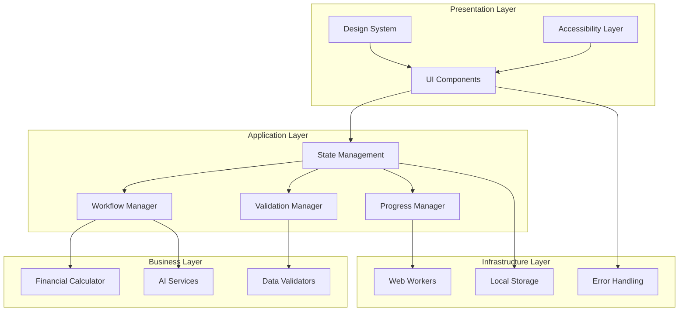
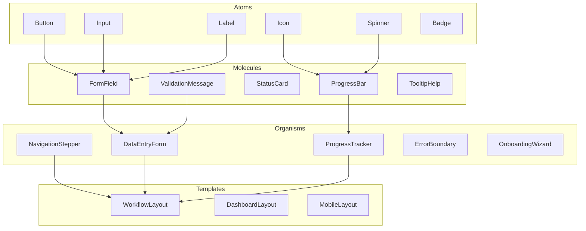
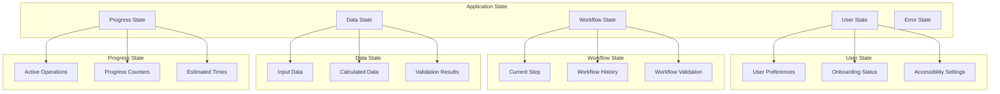
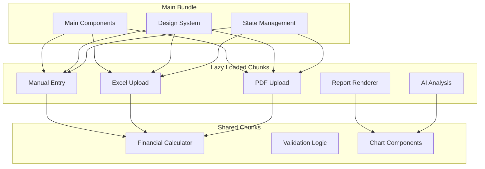
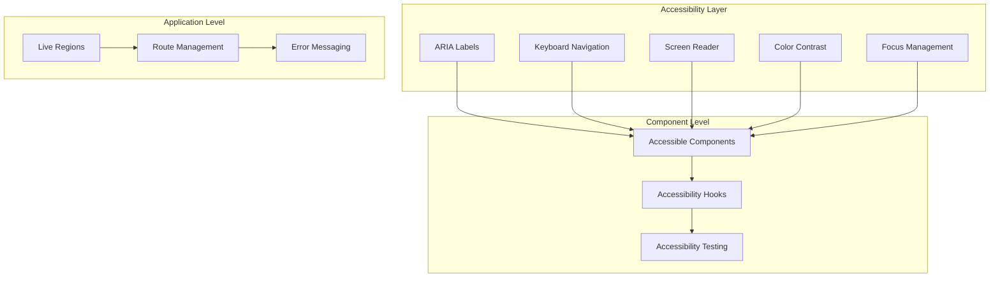
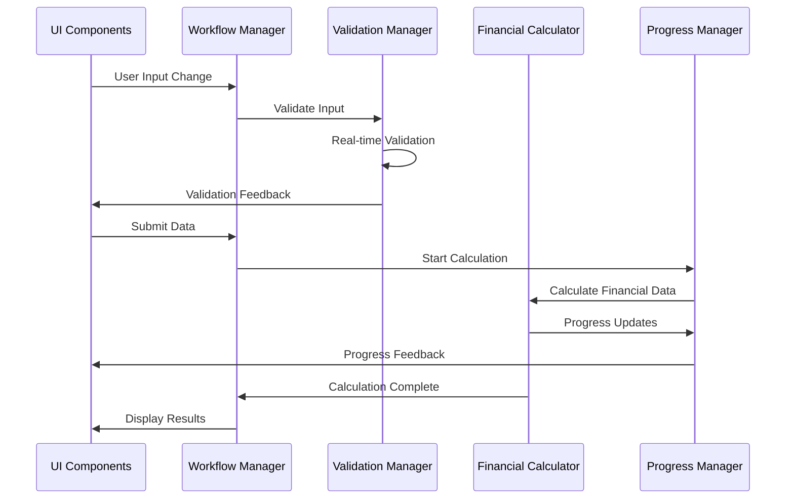

# EnterpriseCashFlow - UX Technical Architecture

## 1. Executive Summary

**Document Purpose:** Technical architecture design for UX improvements implementation  
**Version:** 1.0  
**Target Implementation:** Phase 1 (Q2 2025)  
**Architecture Pattern:** Layered Component Architecture with Event-Driven State Management  

### 1.1 Architectural Goals

- **Modular Design:** Clear component boundaries with single responsibilities
- **Progressive Enhancement:** Backward compatibility with existing financial engine
- **Performance Optimization:** Lazy loading, code splitting, and caching strategies
- **Accessibility First:** WCAG 2.1 AA compliance built into architecture
- **Mobile-First Responsive:** Unified responsive design system

### 1.2 Key Architectural Decisions

- **State Management:** Context-based unified state with custom hooks
- **Component Library:** Atomic design system with reusable components
- **Performance:** React.lazy() + Suspense for code splitting
- **Validation:** Real-time validation with debounced feedback
- **Error Handling:** Centralized error boundary with recovery patterns

## 2. System Architecture Overview

### 2.1 High-Level Architecture Diagram



### 2.2 Component Architecture Layers

#### 2.2.1 Presentation Layer

- **UI Components:** Atomic, molecular, and organism-level components
- **Design System:** Consistent styling, spacing, and interaction patterns
- **Accessibility Layer:** ARIA labels, keyboard navigation, screen reader support

#### 2.2.2 Application Layer

- **State Management:** Centralized application state with React Context
- **Workflow Manager:** Orchestrates user workflows and transitions
- **Validation Manager:** Real-time validation with contextual feedback
- **Progress Manager:** Unified progress tracking across all operations

#### 2.2.3 Business Layer

- **Financial Calculator:** Existing calculation engine (unchanged)
- **AI Services:** Existing AI integration (enhanced with progress tracking)
- **Data Validators:** Enhanced validation with user-friendly messaging

#### 2.2.4 Infrastructure Layer

- **Local Storage:** Persistent user preferences and session data
- **Web Workers:** Background processing for heavy calculations
- **Error Handling:** Centralized error management with recovery options

## 3. Component Architecture Design

### 3.1 Atomic Design System Structure



### 3.2 Component Specifications

#### 3.2.1 Core UI Components

##### Button Component

```typescript
interface ButtonProps {
  variant: 'primary' | 'secondary' | 'danger' | 'ghost';
  size: 'sm' | 'md' | 'lg';
  loading?: boolean;
  disabled?: boolean;
  icon?: ReactNode;
  children: ReactNode;
  onClick?: () => void;
  'aria-label'?: string;
}
```

##### FormField Component

```typescript
interface FormFieldProps {
  label: string;
  required?: boolean;
  error?: string;
  hint?: string;
  children: ReactNode;
  helpText?: string;
  validationState?: 'valid' | 'invalid' | 'pending';
}
```

##### ProgressBar Component

```typescript
interface ProgressBarProps {
  value: number;
  max: number;
  label?: string;
  showPercentage?: boolean;
  variant: 'default' | 'success' | 'warning' | 'error';
  estimatedTime?: string;
}
```

#### 3.2.2 Workflow Components

##### NavigationStepper Component

```typescript
interface NavigationStepperProps {
  steps: Array<{
    id: string;
    title: string;
    description?: string;
    status: 'pending' | 'current' | 'completed' | 'error';
    optional?: boolean;
  }>;
  currentStep: string;
  onStepClick?: (stepId: string) => void;
  allowSkipping?: boolean;
}
```

##### OnboardingWizard Component

```typescript
interface OnboardingWizardProps {
  steps: OnboardingStep[];
  onComplete: () => void;
  onSkip?: () => void;
  userType?: 'beginner' | 'intermediate' | 'advanced';
  showProgress?: boolean;
}
```

### 3.3 Component Boundaries and Responsibilities

#### 3.3.1 Input Components Boundary

- **Responsibility:** Data collection and immediate validation
- **Interface:** Standardized onChange, onBlur, onFocus events
- **Dependencies:** Validation Manager, Design System
- **Data Flow:** User Input → Validation → State Update

#### 3.3.2 Progress Components Boundary

- **Responsibility:** Progress tracking and user feedback
- **Interface:** Progress events, cancellation handlers
- **Dependencies:** Progress Manager, Web Workers
- **Data Flow:** Operation Start → Progress Updates → Completion/Error

#### 3.3.3 Workflow Components Boundary

- **Responsibility:** User journey orchestration
- **Interface:** Step navigation, state persistence
- **Dependencies:** Workflow Manager, Local Storage
- **Data Flow:** Step Transition → State Validation → Navigation

## 4. State Management Architecture

### 4.1 Unified State Structure



### 4.2 State Management Implementation

#### 4.2.1 Context Providers Structure

```typescript
// Main Application Context
interface AppContextType {
  user: UserState;
  workflow: WorkflowState;
  data: DataState;
  progress: ProgressState;
  errors: ErrorState;
  dispatch: (action: AppAction) => void;
}

// User State Context
interface UserState {
  preferences: UserPreferences;
  onboardingStatus: OnboardingStatus;
  accessibilitySettings: AccessibilitySettings;
  theme: 'light' | 'dark' | 'auto';
}

// Workflow State Context
interface WorkflowState {
  currentStep: string;
  completedSteps: string[];
  availableSteps: string[];
  canNavigateBack: boolean;
  canNavigateForward: boolean;
  workflowType: 'manual' | 'excel' | 'pdf';
}
```

#### 4.2.2 Custom Hooks for State Management

```typescript
// Workflow Management Hook
const useWorkflow = () => {
  const { workflow, dispatch } = useAppContext();
  
  const navigateToStep = useCallback((stepId: string) => {
    dispatch({ type: 'NAVIGATE_TO_STEP', payload: stepId });
  }, [dispatch]);
  
  const completeStep = useCallback((stepId: string) => {
    dispatch({ type: 'COMPLETE_STEP', payload: stepId });
  }, [dispatch]);
  
  return { ...workflow, navigateToStep, completeStep };
};

// Progress Management Hook
const useProgress = () => {
  const { progress, dispatch } = useAppContext();
  
  const startOperation = useCallback((operationId: string, estimatedTime?: number) => {
    dispatch({ 
      type: 'START_OPERATION', 
      payload: { operationId, estimatedTime } 
    });
  }, [dispatch]);
  
  const updateProgress = useCallback((operationId: string, progress: number) => {
    dispatch({ 
      type: 'UPDATE_PROGRESS', 
      payload: { operationId, progress } 
    });
  }, [dispatch]);
  
  return { ...progress, startOperation, updateProgress };
};
```

### 4.3 State Persistence Strategy

#### 4.3.1 Local Storage Schema

```typescript
interface PersistedState {
  userPreferences: UserPreferences;
  workflowHistory: WorkflowHistory[];
  savedConfigurations: SavedConfiguration[];
  accessibilitySettings: AccessibilitySettings;
  version: string;
}
```

#### 4.3.2 State Hydration and Dehydration

- **Hydration:** Load persisted state on app initialization
- **Dehydration:** Save critical state changes with debouncing
- **Migration:** Handle state schema changes between versions
- **Cleanup:** Remove expired or invalid persisted data

## 5. Performance Architecture

### 5.1 Code Splitting Strategy



### 5.2 Performance Optimization Strategies

#### 5.2.1 Component-Level Optimizations

- **React.memo:** Prevent unnecessary re-renders
- **useMemo:** Cache expensive calculations
- **useCallback:** Stabilize function references
- **React.lazy:** Dynamic component imports

#### 5.2.2 Data Loading Optimizations

- **Debounced Validation:** Reduce validation frequency
- **Progressive Loading:** Load data in chunks
- **Background Processing:** Use Web Workers for heavy calculations
- **Caching Strategy:** Cache validation results and calculations

#### 5.2.3 Bundle Optimization

- **Tree Shaking:** Remove unused code
- **Code Splitting:** Split by routes and features
- **Preloading:** Preload likely-needed chunks
- **Compression:** Gzip/Brotli compression

### 5.3 Performance Monitoring

#### 5.3.1 Core Web Vitals Tracking

```typescript
interface PerformanceMetrics {
  firstContentfulPaint: number;
  largestContentfulPaint: number;
  firstInputDelay: number;
  cumulativeLayoutShift: number;
  timeToInteractive: number;
}
```

#### 5.3.2 Custom Performance Metrics

- **Workflow Completion Time:** Time from start to finish
- **Validation Response Time:** Time for validation feedback
- **Chart Rendering Time:** Time to render complex visualizations
- **Memory Usage:** Track memory consumption over time

## 6. Accessibility Framework

### 6.1 WCAG 2.1 AA Compliance Architecture



### 6.2 Accessibility Implementation Strategy

#### 6.2.1 Component-Level Accessibility

```typescript
// Accessible Form Field Component
const AccessibleFormField: React.FC<FormFieldProps> = ({
  label,
  error,
  hint,
  required,
  children,
  ...props
}) => {
  const fieldId = useId();
  const errorId = useId();
  const hintId = useId();
  
  return (
    <div className="form-field" role="group">
      <label 
        htmlFor={fieldId}
        className={`form-label ${required ? 'required' : ''}`}
      >
        {label}
        {required && <span aria-label="required">*</span>}
      </label>
      
      {hint && (
        <div id={hintId} className="form-hint">
          {hint}
        </div>
      )}
      
      {React.cloneElement(children, {
        id: fieldId,
        'aria-describedby': [
          hint ? hintId : null,
          error ? errorId : null
        ].filter(Boolean).join(' '),
        'aria-invalid': error ? 'true' : 'false',
        'aria-required': required ? 'true' : 'false'
      })}
      
      {error && (
        <div 
          id={errorId} 
          className="form-error" 
          role="alert"
          aria-live="polite"
        >
          {error}
        </div>
      )}
    </div>
  );
};
```

#### 6.2.2 Keyboard Navigation System

```typescript
// Keyboard Navigation Hook
const useKeyboardNavigation = (
  items: NavigationItem[],
  onSelect: (item: NavigationItem) => void
) => {
  const [focusedIndex, setFocusedIndex] = useState(0);
  
  const handleKeyDown = useCallback((event: KeyboardEvent) => {
    switch (event.key) {
      case 'ArrowDown':
        event.preventDefault();
        setFocusedIndex(prev => 
          prev < items.length - 1 ? prev + 1 : 0
        );
        break;
      case 'ArrowUp':
        event.preventDefault();
        setFocusedIndex(prev => 
          prev > 0 ? prev - 1 : items.length - 1
        );
        break;
      case 'Enter':
      case ' ':
        event.preventDefault();
        onSelect(items[focusedIndex]);
        break;
      case 'Escape':
        event.preventDefault();
        // Handle escape logic
        break;
    }
  }, [items, focusedIndex, onSelect]);
  
  return { focusedIndex, handleKeyDown };
};
```

#### 6.2.3 Screen Reader Support

- **Live Regions:** Announce dynamic content changes
- **ARIA Labels:** Descriptive labels for all interactive elements
- **Semantic HTML:** Use proper HTML elements for structure
- **Skip Links:** Allow users to skip to main content

### 6.3 Accessibility Testing Integration

#### 6.3.1 Automated Testing

```typescript
// Accessibility Test Suite
describe('Accessibility Tests', () => {
  test('should have no accessibility violations', async () => {
    const { container } = render(<App />);
    const results = await axe(container);
    expect(results).toHaveNoViolations();
  });
  
  test('should support keyboard navigation', () => {
    render(<NavigationComponent />);
    const firstItem = screen.getByRole('button', { name: /first item/i });
    
    firstItem.focus();
    fireEvent.keyDown(firstItem, { key: 'ArrowDown' });
    
    const secondItem = screen.getByRole('button', { name: /second item/i });
    expect(secondItem).toHaveFocus();
  });
});
```

## 7. Integration Points

### 7.1 Financial Engine Integration



### 7.2 AI Services Integration

#### 7.2.1 Enhanced AI Progress Tracking

```typescript
// AI Service with Progress Tracking
class EnhancedAIService {
  async analyzeData(
    data: FinancialData,
    onProgress: (progress: ProgressUpdate) => void
  ): Promise<AIAnalysisResult> {
    onProgress({ stage: 'Preparing data', progress: 10 });
    
    const preparedData = await this.prepareData(data);
    onProgress({ stage: 'Sending to AI', progress: 30 });
    
    const response = await this.callAIService(preparedData);
    onProgress({ stage: 'Processing response', progress: 80 });
    
    const result = await this.processResponse(response);
    onProgress({ stage: 'Complete', progress: 100 });
    
    return result;
  }
}
```

#### 7.2.2 AI Error Recovery

```typescript
// AI Error Recovery Strategy
const useAIWithRecovery = () => {
  const [retryCount, setRetryCount] = useState(0);
  const maxRetries = 3;
  
  const analyzeWithRecovery = async (data: FinancialData) => {
    try {
      return await aiService.analyze(data);
    } catch (error) {
      if (retryCount < maxRetries && isRetryableError(error)) {
        setRetryCount(prev => prev + 1);
        await delay(1000 * retryCount); // Exponential backoff
        return analyzeWithRecovery(data);
      }
      throw error;
    }
  };
  
  return { analyzeWithRecovery, retryCount };
};
```

### 7.3 Data Flow Integration

#### 7.3.1 Unified Data Pipeline

```typescript
// Data Processing Pipeline
interface DataPipeline {
  input: (data: RawData) => Promise<ValidatedData>;
  validate: (data: ValidatedData) => ValidationResult;
  calculate: (data: ValidatedData) => Promise<CalculatedData>;
  analyze: (data: CalculatedData) => Promise<AIAnalysis>;
  render: (data: CalculatedData, analysis: AIAnalysis) => RenderData;
}

const createDataPipeline = (): DataPipeline => ({
  input: async (data) => {
    // Input processing with progress tracking
    return processInput(data);
  },
  validate: (data) => {
    // Real-time validation with user feedback
    return validateData(data);
  },
  calculate: async (data) => {
    // Financial calculations with progress updates
    return calculateFinancials(data);
  },
  analyze: async (data) => {
    // AI analysis with progress tracking
    return analyzeWithAI(data);
  },
  render: (data, analysis) => {
    // Prepare data for rendering
    return prepareRenderData(data, analysis);
  }
});
```

## 8. Security and Privacy Architecture

### 8.1 Client-Side Security Framework

#### 8.1.1 Data Protection

```typescript
// Secure Data Storage
class SecureStorage {
  private encryptionKey: string;
  
  constructor() {
    this.encryptionKey = this.generateEncryptionKey();
  }
  
  store(key: string, data: any): void {
    const encrypted = this.encrypt(JSON.stringify(data));
    localStorage.setItem(key, encrypted);
  }
  
  retrieve(key: string): any {
    const encrypted = localStorage.getItem(key);
    if (!encrypted) return null;
    
    try {
      const decrypted = this.decrypt(encrypted);
      return JSON.parse(decrypted);
    } catch {
      return null;
    }
  }
  
  private encrypt(data: string): string {
    // Implement client-side encryption
    return btoa(data); // Simplified for example
  }
  
  private decrypt(data: string): string {
    // Implement client-side decryption
    return atob(data); // Simplified for example
  }
}
```

#### 8.1.2 Input Sanitization

```typescript
// Input Sanitization Service
class InputSanitizer {
  static sanitizeFinancialInput(value: string): number | null {
    // Remove non-numeric characters except decimal point
    const cleaned = value.replace(/[^\d.-]/g, '');
    const parsed = parseFloat(cleaned);
    
    // Validate range and format
    if (isNaN(parsed) || !isFinite(parsed)) {
      return null;
    }
    
    // Prevent extremely large numbers that could cause issues
    if (Math.abs(parsed) > Number.MAX_SAFE_INTEGER) {
      return null;
    }
    
    return parsed;
  }
  
  static sanitizeTextInput(value: string): string {
    // Remove potentially dangerous characters
    return value
      .replace(/<script\b[^<]*(?:(?!<\/script>)<[^<]*)*<\/script>/gi, '')
      .replace(/javascript:/gi, '')
      .trim();
  }
}
```

### 8.2 Privacy-First Design

#### 8.2.1 Data Minimization

- **Local Processing:** Keep financial data client-side when possible
- **Selective AI Processing:** Only send necessary data to AI services
- **Temporary Storage:** Clear sensitive data after processing
- **User Consent:** Explicit consent for AI analysis

#### 8.2.2 Privacy Controls

```typescript
// Privacy Settings Manager
interface PrivacySettings {
  allowAIAnalysis: boolean;
  allowDataPersistence: boolean;
  allowAnalytics: boolean;
  dataRetentionDays: number;
}

const usePrivacySettings = () => {
  const [settings, setSettings] = useState<PrivacySettings>(() => 
    loadPrivacySettings()
  );
  
  const updateSetting = (key: keyof PrivacySettings, value: any) => {
    setSettings(prev => ({ ...prev, [key]: value }));
    savePrivacySettings({ ...settings, [key]: value });
  };
  
  return { settings, updateSetting };
};
```

## 9. Testing Architecture

### 9.1 Testing Strategy

#### 9.1.1 Component Testing

```typescript
// Component Test Example
describe('FormField Component', () => {
  test('should display validation error', () => {
    render(
      <FormField label="Test Field" error="Required field">
        <input />
      </FormField>
    );
    
    expect(screen.getByRole('alert')).toHaveTextContent('Required field');
    expect(screen.getByRole('textbox')).toHaveAttribute('aria-invalid', 'true');
  });
  
  test('should support keyboard navigation', () => {
    render(<FormField label="Test Field"><input /></FormField>);
    
    const input = screen.getByRole('textbox');
    input.focus();
    
    expect(input).toHaveFocus();
    expect(input).toHaveAttribute('aria-describedby');
  });
});
```

#### 9.1.2 Integration Testing

```typescript
// Workflow Integration Test
describe('Data Entry Workflow', () => {
  test('should complete manual entry workflow', async () => {
    render(<App />);
    
    // Select manual entry method
    fireEvent.click(screen.getByText('Manual Entry'));
    
    // Fill in financial data
    const revenueInput = screen.getByLabelText(/revenue/i);
    fireEvent.change(revenueInput, { target: { value: '1000000' } });
    
    // Submit and verify calculation
    fireEvent.click(screen.getByText('Calculate'));
    
    await waitFor(() => {
      expect(screen.getByText(/financial analysis/i)).toBeInTheDocument();
    });
  });
});
```

### 9.2 Performance Testing

#### 9.2.1 Performance Benchmarks

```typescript
// Performance Test Suite
describe('Performance Tests', () => {
  test('should render large dataset within time limit', async () => {
    const startTime = performance.now();
    
    render(<FinancialChart data={largeMockDataset} />);
    
    await waitFor(() => {
      expect(screen.getByRole('img')).toBeInTheDocument();
    });
    
    const endTime = performance.now();
    expect(endTime - startTime).toBeLessThan(1000); // 1 second limit
  });
  
  test('should handle memory efficiently', () => {
    const initialMemory = performance.memory?.usedJSHeapSize || 0;
    
    render(<App />);
    
    // Simulate heavy usage
    for (let i = 0; i < 100; i++) {
      // Trigger re-renders and state changes
    }
    
    const finalMemory = performance.memory?.usedJSHeapSize || 0;
    const memoryIncrease = finalMemory - initialMemory;
    
    expect(memoryIncrease).toBeLessThan(50 * 1024 * 1024); // 50MB limit
  });
});
```

## 10. Deployment and Monitoring

### 10.1 Build and Deployment Strategy

#### 10.1.1 Build Configuration

```typescript
// Webpack Configuration for UX Improvements
const webpackConfig = {
  optimization: {
    splitChunks: {
      chunks: 'all',
      cacheGroups: {
        vendor: {
          test: /[\\/]node_modules[\\/]/,
          name: 'vendors',
          chunks: 'all',
        },
        designSystem: {
          test: /[\\/]src[\\/]components[\\/]ui[\\/]/,
          name: 'design-system',
          chunks: 'all',
        },
        financial: {
          test: /[\\/]src[\\/](hooks|utils)[\\/].*financial/,
          name: 'financial-engine',
          chunks: 'all',
        }
      }
    }
  },
  plugins: [
    new BundleAnalyzerPlugin(),
    new CompressionPlugin(),
  ]
};
```

#### 10.1.2 Progressive Enhancement Strategy

- **Core Functionality:** Ensure basic functionality works without JavaScript
- **Enhanced Features:** Layer on advanced UX features progressively
- **Graceful Degradation:** Fallback options for unsupported features
- **Feature Detection:** Detect and adapt to browser capabilities

### 10.2 Monitoring and Analytics

#### 10.2.1 UX Metrics Tracking

```typescript
// UX Analytics Service
class UXAnalytics {
  trackWorkflowStep(step: string, duration: number) {
    this.sendEvent('workflow_step', {
      step,
      duration,
      timestamp: Date.now()
    });
  }
  
  trackValidationError(field: string, errorType: string) {
    this.sendEvent('validation_error', {
      field,
      errorType,
      timestamp: Date.now()
    });
  }
  
  trackPerformanceMetric(metric: string, value: number) {
    this.sendEvent('performance_metric', {
      metric,
      value,
      timestamp: Date.now()
    });
  }
  
  private sendEvent(eventType: string, data: any) {
    // Send to analytics service (respecting privacy settings)
    if (this.privacySettings.allowAnalytics) {
      // Implementation depends on chosen analytics service
    }
  }
}
```

## 11. Success Metrics and Validation

### 11.1 Technical Performance Metrics

#### 11.1.1 Core Web Vitals

- **First Contentful Paint (FCP):** < 1.5 seconds
- **Largest Contentful Paint (LCP):** < 2.5 seconds
- **First Input Delay (FID):** < 100 milliseconds
- **Cumulative Layout Shift (CLS):** < 0.1
- **Time to Interactive (TTI):** < 3.5 seconds

#### 11.1.2 Application Performance

- **Initial Bundle Size:** < 250KB gzipped
- **Code Splitting Efficiency:** 80% of code lazy-loaded
- **Memory Usage:** < 100MB average session
- **Validation Response Time:** < 200ms for inline validation
- **Chart Rendering Time:** < 1 second for complex visualizations

#### 11.1.3 Accessibility Compliance

- **WCAG 2.1 AA Compliance:** 100% automated test pass rate
- **Keyboard Navigation:** 100% functionality accessible via keyboard
- **Screen Reader Compatibility:** Full compatibility with NVDA, JAWS, VoiceOver
- **Color Contrast Ratio:** Minimum 4.5:1 for all text elements
- **Focus Management:** Clear focus indicators throughout application

### 11.2 User Experience Metrics

#### 11.2.1 Workflow Efficiency

- **Task Completion Time:** 40% reduction from baseline
- **Error Recovery Rate:** > 90% successful recovery
- **Feature Discovery Rate:** > 70% of users discover key features
- **Workflow Abandonment Rate:** < 10% abandonment
- **User Satisfaction Score:** > 4.5/5 average rating

### 11.3 Implementation Roadmap

#### 11.3.1 Phase 1: Foundation (Weeks 1-4)

- **Week 1-2:** Design System and Core Components
- **Week 3-4:** Layout and Navigation

#### 11.3.2 Phase 2: Enhanced Workflows (Weeks 5-8)

- **Week 5-6:** Onboarding and Guidance
- **Week 7-8:** Input Method Enhancement

#### 11.3.3 Phase 3: Validation and Feedback (Weeks 9-12)

- **Week 9-10:** Real-time Validation
- **Week 11-12:** Progress and Status

## 12. Conclusion

This UX Technical Architecture provides a comprehensive foundation for implementing EnterpriseCashFlow UX improvements while maintaining backward compatibility, performance excellence, and accessibility compliance. The modular design enables phased implementation with clear success metrics and risk mitigation strategies.

The architecture is designed for immediate Phase 1 implementation with clear component specifications, defined integration points, and comprehensive testing strategies that will deliver measurable improvements in user experience while maintaining the robust financial calculation capabilities that make EnterpriseCashFlow valuable to its users.