# EnterpriseCashFlow - Phase 2 Composite Components & Layout Systems Architecture

## 1. Executive Summary

**Document Purpose:** Architectural design for Phase 2 composite components and layout systems  
**Version:** 1.0  
**Target Implementation:** Phase 2 (Q3 2025)  
**Architecture Pattern:** Composite Component Architecture with Layout System Integration  

### 1.1 Architectural Goals

- **Composite Components:** Multi-level component compositions for complex UI patterns
- **Layout System:** Responsive grid and container system with systematic spacing
- **Form Compositions:** Multi-step forms with validation workflows and field groups
- **Data Display:** Consistent tables, cards, and panels for financial data visualization
- **Navigation Systems:** Accessible breadcrumbs, tabs, and sidebar navigation
- **Performance Optimization:** Lazy loading, code splitting, and render optimization

### 1.2 Key Architectural Decisions

- **Component Composition:** Compound components with render props and HOC patterns
- **Layout Foundation:** 12-column responsive grid with breakpoint management
- **Design System Integration:** Seamless integration with existing design tokens
- **Accessibility First:** WCAG 2.1 AA compliance built into all composite components
- **Testing Integration:** Components designed for testability with Jest infrastructure

## 2. System Architecture Overview

### 2.1 Phase 2 Component Architecture Diagram

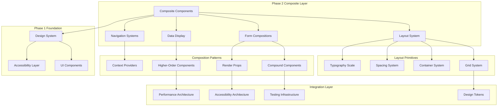

### 2.2 Component Hierarchy and Boundaries

#### 2.2.1 Layout System Boundary
- **Responsibility:** Responsive layout management and spacing consistency
- **Interface:** Grid props, container configurations, spacing utilities
- **Dependencies:** Design tokens, breakpoint management
- **Data Flow:** Layout Props → Grid Calculation → Responsive Rendering

#### 2.2.2 Form Composition Boundary
- **Responsibility:** Multi-step form orchestration and validation workflows
- **Interface:** Form state management, validation schemas, step navigation
- **Dependencies:** Validation manager, progress tracking, accessibility hooks
- **Data Flow:** Form Data → Validation → State Update → UI Feedback

#### 2.2.3 Data Display Boundary
- **Responsibility:** Financial data visualization and table management
- **Interface:** Data formatting, sorting, filtering, pagination
- **Dependencies:** Financial calculators, chart components, accessibility utilities
- **Data Flow:** Raw Data → Processing → Formatting → Visualization

## 3. Layout System Architecture

### 3.1 Responsive Grid System Design

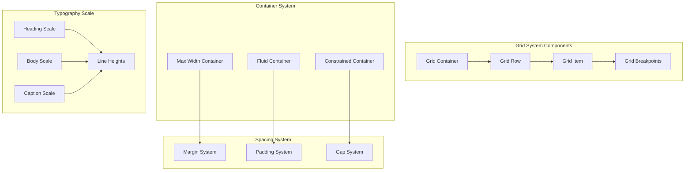

#### 3.1.1 Grid System Specifications

```typescript
interface GridSystemConfig {
  columns: 12;
  breakpoints: {
    xs: '475px';
    sm: '640px';
    md: '768px';
    lg: '1024px';
    xl: '1280px';
    '2xl': '1536px';
  };
  gutters: {
    xs: '1rem';
    sm: '1.5rem';
    md: '2rem';
    lg: '2.5rem';
    xl: '3rem';
  };
  maxWidths: {
    sm: '640px';
    md: '768px';
    lg: '1024px';
    xl: '1280px';
    '2xl': '1536px';
  };
}

interface GridContainerProps {
  fluid?: boolean;
  maxWidth?: keyof GridSystemConfig['maxWidths'];
  padding?: keyof GridSystemConfig['gutters'];
  children: ReactNode;
}

interface GridRowProps {
  gutter?: keyof GridSystemConfig['gutters'];
  align?: 'start' | 'center' | 'end' | 'stretch';
  justify?: 'start' | 'center' | 'end' | 'between' | 'around' | 'evenly';
  children: ReactNode;
}

interface GridItemProps {
  xs?: number | 'auto';
  sm?: number | 'auto';
  md?: number | 'auto';
  lg?: number | 'auto';
  xl?: number | 'auto';
  offset?: {
    xs?: number;
    sm?: number;
    md?: number;
    lg?: number;
    xl?: number;
  };
  order?: {
    xs?: number;
    sm?: number;
    md?: number;
    lg?: number;
    xl?: number;
  };
  children: ReactNode;
}
```

#### 3.1.2 Container System Architecture

```typescript
interface ContainerSystemProps {
  variant: 'fluid' | 'constrained' | 'narrow' | 'wide';
  padding?: 'none' | 'sm' | 'md' | 'lg' | 'xl';
  margin?: 'none' | 'auto' | 'sm' | 'md' | 'lg' | 'xl';
  background?: 'transparent' | 'surface' | 'elevated';
  children: ReactNode;
}

interface SpacingSystemProps {
  m?: SpacingValue;  // margin
  mt?: SpacingValue; // margin-top
  mr?: SpacingValue; // margin-right
  mb?: SpacingValue; // margin-bottom
  ml?: SpacingValue; // margin-left
  mx?: SpacingValue; // margin horizontal
  my?: SpacingValue; // margin vertical
  p?: SpacingValue;  // padding
  pt?: SpacingValue; // padding-top
  pr?: SpacingValue; // padding-right
  pb?: SpacingValue; // padding-bottom
  pl?: SpacingValue; // padding-left
  px?: SpacingValue; // padding horizontal
  py?: SpacingValue; // padding vertical
}

type SpacingValue = keyof typeof designTokens.spacing;
```

### 3.2 Typography Scale Integration

```typescript
interface TypographyScaleConfig {
  headings: {
    h1: {
      fontSize: typeof designTokens.typography.fontSize['4xl'];
      fontWeight: typeof designTokens.typography.fontWeight.bold;
      lineHeight: typeof designTokens.typography.lineHeight.tight;
      letterSpacing: typeof designTokens.typography.letterSpacing.tight;
    };
    h2: {
      fontSize: typeof designTokens.typography.fontSize['3xl'];
      fontWeight: typeof designTokens.typography.fontWeight.semibold;
      lineHeight: typeof designTokens.typography.lineHeight.tight;
    };
    h3: {
      fontSize: typeof designTokens.typography.fontSize['2xl'];
      fontWeight: typeof designTokens.typography.fontWeight.semibold;
      lineHeight: typeof designTokens.typography.lineHeight.snug;
    };
    h4: {
      fontSize: typeof designTokens.typography.fontSize.xl;
      fontWeight: typeof designTokens.typography.fontWeight.medium;
      lineHeight: typeof designTokens.typography.lineHeight.snug;
    };
    h5: {
      fontSize: typeof designTokens.typography.fontSize.lg;
      fontWeight: typeof designTokens.typography.fontWeight.medium;
      lineHeight: typeof designTokens.typography.lineHeight.normal;
    };
    h6: {
      fontSize: typeof designTokens.typography.fontSize.base;
      fontWeight: typeof designTokens.typography.fontWeight.medium;
      lineHeight: typeof designTokens.typography.lineHeight.normal;
    };
  };
  body: {
    large: typeof designTokens.typography.fontSize.lg;
    base: typeof designTokens.typography.fontSize.base;
    small: typeof designTokens.typography.fontSize.sm;
    caption: typeof designTokens.typography.fontSize.xs;
  };
}
```

## 4. Composite Component System Architecture

### 4.1 Component Composition Patterns

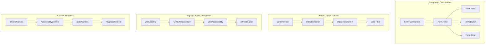

#### 4.1.1 Compound Components Architecture

```typescript
// Form Compound Component System
interface FormCompoundComponent {
  Form: React.FC<FormProps>;
  Field: React.FC<FormFieldProps>;
  Input: React.FC<FormInputProps>;
  Select: React.FC<FormSelectProps>;
  Textarea: React.FC<FormTextareaProps>;
  Checkbox: React.FC<FormCheckboxProps>;
  Radio: React.FC<FormRadioProps>;
  Button: React.FC<FormButtonProps>;
  Error: React.FC<FormErrorProps>;
  Help: React.FC<FormHelpProps>;
  Group: React.FC<FormGroupProps>;
  Section: React.FC<FormSectionProps>;
  Step: React.FC<FormStepProps>;
  Progress: React.FC<FormProgressProps>;
}

interface FormProps {
  onSubmit: (data: FormData) => void | Promise<void>;
  validation?: ValidationSchema;
  initialValues?: Record<string, any>;
  multiStep?: boolean;
  persistState?: boolean;
  children: ReactNode;
}

interface FormFieldProps {
  name: string;
  label: string;
  required?: boolean;
  disabled?: boolean;
  description?: string;
  error?: string;
  children: ReactNode;
}

// Table Compound Component System
interface TableCompoundComponent {
  Table: React.FC<TableProps>;
  Header: React.FC<TableHeaderProps>;
  Body: React.FC<TableBodyProps>;
  Row: React.FC<TableRowProps>;
  Cell: React.FC<TableCellProps>;
  HeaderCell: React.FC<TableHeaderCellProps>;
  Footer: React.FC<TableFooterProps>;
  Pagination: React.FC<TablePaginationProps>;
  Search: React.FC<TableSearchProps>;
  Filter: React.FC<TableFilterProps>;
  Sort: React.FC<TableSortProps>;
}
```

#### 4.1.2 Render Props Pattern Implementation

```typescript
interface DataTableRenderProps<T> {
  data: T[];
  loading: boolean;
  error: Error | null;
  pagination: PaginationState;
  sorting: SortingState;
  filtering: FilteringState;
  selection: SelectionState<T>;
  actions: {
    sort: (column: string, direction: 'asc' | 'desc') => void;
    filter: (filters: FilterCriteria) => void;
    paginate: (page: number, size: number) => void;
    select: (items: T[]) => void;
    refresh: () => void;
  };
}

interface DataTableProps<T> {
  dataSource: DataSource<T>;
  children: (props: DataTableRenderProps<T>) => ReactNode;
  initialState?: Partial<DataTableState>;
  onStateChange?: (state: DataTableState) => void;
}

// Financial Chart Render Props
interface ChartRenderProps {
  data: ChartData;
  dimensions: ChartDimensions;
  scales: ChartScales;
  interactions: ChartInteractions;
  accessibility: ChartAccessibility;
}

interface FinancialChartProps {
  data: FinancialData;
  type: 'line' | 'bar' | 'area' | 'waterfall' | 'composition';
  children: (props: ChartRenderProps) => ReactNode;
  responsive?: boolean;
  accessibility?: AccessibilityConfig;
}
```

### 4.2 Higher-Order Components Architecture

```typescript
// Loading State HOC
interface WithLoadingProps {
  loading?: boolean;
  loadingComponent?: ReactNode;
  loadingText?: string;
  skeleton?: boolean;
}

function withLoading<P extends object>(
  Component: React.ComponentType<P>
): React.FC<P & WithLoadingProps> {
  return ({ loading, loadingComponent, loadingText, skeleton, ...props }) => {
    if (loading) {
      if (skeleton) {
        return <SkeletonLoader />;
      }
      return loadingComponent || <LoadingSpinner text={loadingText} />;
    }
    return <Component {...(props as P)} />;
  };
}

// Error Boundary HOC
interface WithErrorBoundaryProps {
  fallback?: ReactNode;
  onError?: (error: Error, errorInfo: ErrorInfo) => void;
  resetOnPropsChange?: boolean;
}

function withErrorBoundary<P extends object>(
  Component: React.ComponentType<P>
): React.FC<P & WithErrorBoundaryProps> {
  return (props) => (
    <ErrorBoundary
      fallback={props.fallback}
      onError={props.onError}
      resetOnPropsChange={props.resetOnPropsChange}
    >
      <Component {...(props as P)} />
    </ErrorBoundary>
  );
}

// Accessibility Enhancement HOC
interface WithAccessibilityProps {
  ariaLabel?: string;
  ariaDescribedBy?: string;
  role?: string;
  tabIndex?: number;
  focusManagement?: boolean;
  announcements?: boolean;
}

function withAccessibility<P extends object>(
  Component: React.ComponentType<P>
): React.FC<P & WithAccessibilityProps> {
  return ({ focusManagement, announcements, ...props }) => {
    const accessibilityProps = useAccessibilityEnhancement({
      focusManagement,
      announcements,
      ariaLabel: props.ariaLabel,
      ariaDescribedBy: props.ariaDescribedBy,
      role: props.role,
      tabIndex: props.tabIndex
    });

    return <Component {...(props as P)} {...accessibilityProps} />;
  };
}
```

## 5. Form Composition Architecture

### 5.1 Multi-Step Form System

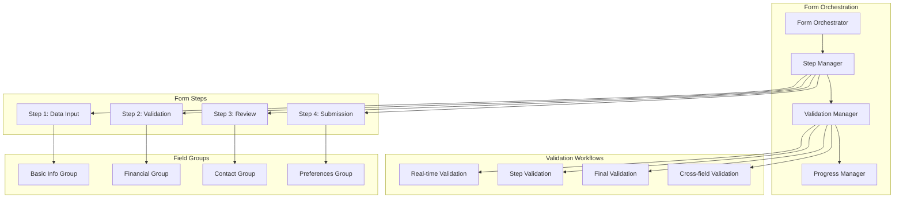

#### 5.1.1 Multi-Step Form Implementation

```typescript
interface MultiStepFormConfig {
  steps: FormStep[];
  validation: ValidationConfig;
  persistence: PersistenceConfig;
  navigation: NavigationConfig;
  accessibility: AccessibilityConfig;
}

interface FormStep {
  id: string;
  title: string;
  description?: string;
  component: React.ComponentType<FormStepProps>;
  validation?: StepValidationSchema;
  optional?: boolean;
  dependencies?: string[];
  estimatedTime?: number;
}

interface FormStepProps {
  data: FormData;
  errors: FormErrors;
  touched: FormTouched;
  isValid: boolean;
  isSubmitting: boolean;
  onFieldChange: (field: string, value: any) => void;
  onFieldBlur: (field: string) => void;
  onNext: () => void;
  onPrevious: () => void;
  onSkip?: () => void;
}

interface ValidationConfig {
  mode: 'onChange' | 'onBlur' | 'onSubmit' | 'all';
  revalidateMode: 'onChange' | 'onBlur' | 'onSubmit';
  debounceMs: number;
  showErrorsOn: 'touched' | 'submitted' | 'immediate';
  crossFieldValidation: boolean;
}

// Multi-Step Form Hook
function useMultiStepForm(config: MultiStepFormConfig) {
  const [currentStep, setCurrentStep] = useState(0);
  const [formData, setFormData] = useState({});
  const [errors, setErrors] = useState({});
  const [touched, setTouched] = useState({});
  const [isSubmitting, setIsSubmitting] = useState(false);

  const goToStep = useCallback((stepIndex: number) => {
    if (stepIndex >= 0 && stepIndex < config.steps.length) {
      setCurrentStep(stepIndex);
    }
  }, [config.steps.length]);

  const goToNext = useCallback(async () => {
    const currentStepConfig = config.steps[currentStep];
    const isStepValid = await validateStep(currentStepConfig, formData);
    
    if (isStepValid) {
      setCurrentStep(prev => Math.min(prev + 1, config.steps.length - 1));
    }
  }, [currentStep, config.steps, formData]);

  const goToPrevious = useCallback(() => {
    setCurrentStep(prev => Math.max(prev - 1, 0));
  }, []);

  const submitForm = useCallback(async () => {
    setIsSubmitting(true);
    try {
      const isFormValid = await validateAllSteps(config.steps, formData);
      if (isFormValid) {
        await config.onSubmit(formData);
      }
    } finally {
      setIsSubmitting(false);
    }
  }, [config, formData]);

  return {
    currentStep,
    totalSteps: config.steps.length,
    formData,
    errors,
    touched,
    isSubmitting,
    goToStep,
    goToNext,
    goToPrevious,
    submitForm,
    updateField: setFormData,
    setFieldTouched: setTouched
  };
}
```

#### 5.1.2 Field Group Architecture

```typescript
interface FieldGroupConfig {
  id: string;
  title: string;
  description?: string;
  fields: FieldConfig[];
  layout: 'vertical' | 'horizontal' | 'grid';
  columns?: number;
  spacing?: SpacingValue;
  conditional?: ConditionalConfig;
}

interface FieldConfig {
  name: string;
  type: FieldType;
  label: string;
  placeholder?: string;
  required?: boolean;
  disabled?: boolean;
  readonly?: boolean;
  validation?: FieldValidation;
  options?: OptionConfig[];
  dependencies?: string[];
  formatting?: FieldFormatting;
  accessibility?: FieldAccessibility;
}

type FieldType = 
  | 'text' 
  | 'email' 
  | 'password' 
  | 'number' 
  | 'currency' 
  | 'percentage' 
  | 'date' 
  | 'select' 
  | 'multiselect' 
  | 'checkbox' 
  | 'radio' 
  | 'textarea' 
  | 'file' 
  | 'range';

interface ConditionalConfig {
  dependsOn: string;
  condition: (value: any) => boolean;
  action: 'show' | 'hide' | 'enable' | 'disable' | 'require';
}

// Field Group Component
const FieldGroup: React.FC<FieldGroupProps> = ({
  config,
  data,
  errors,
  touched,
  onChange,
  onBlur
}) => {
  const visibleFields = useMemo(() => {
    return config.fields.filter(field => {
      if (!field.dependencies) return true;
      return field.dependencies.every(dep => {
        const value = data[dep];
        return value !== undefined && value !== null && value !== '';
      });
    });
  }, [config.fields, data]);

  return (
    <div className={`field-group field-group--${config.layout}`}>
      <div className="field-group__header">
        <h3 className="field-group__title">{config.title}</h3>
        {config.description && (
          <p className="field-group__description">{config.description}</p>
        )}
      </div>
      
      <div 
        className="field-group__fields"
        style={{
          display: config.layout === 'grid' ? 'grid' : 'flex',
          gridTemplateColumns: config.layout === 'grid' 
            ? `repeat(${config.columns || 2}, 1fr)` 
            : undefined,
          flexDirection: config.layout === 'vertical' ? 'column' : 'row',
          gap: designTokens.spacing[config.spacing || 4]
        }}
      >
        {visibleFields.map(field => (
          <FormField
            key={field.name}
            config={field}
            value={data[field.name]}
            error={errors[field.name]}
            touched={touched[field.name]}
            onChange={(value) => onChange(field.name, value)}
            onBlur={() => onBlur(field.name)}
          />
        ))}
      </div>
    </div>
  );
};
```

## 6. Data Display Architecture

### 6.1 Financial Data Table System

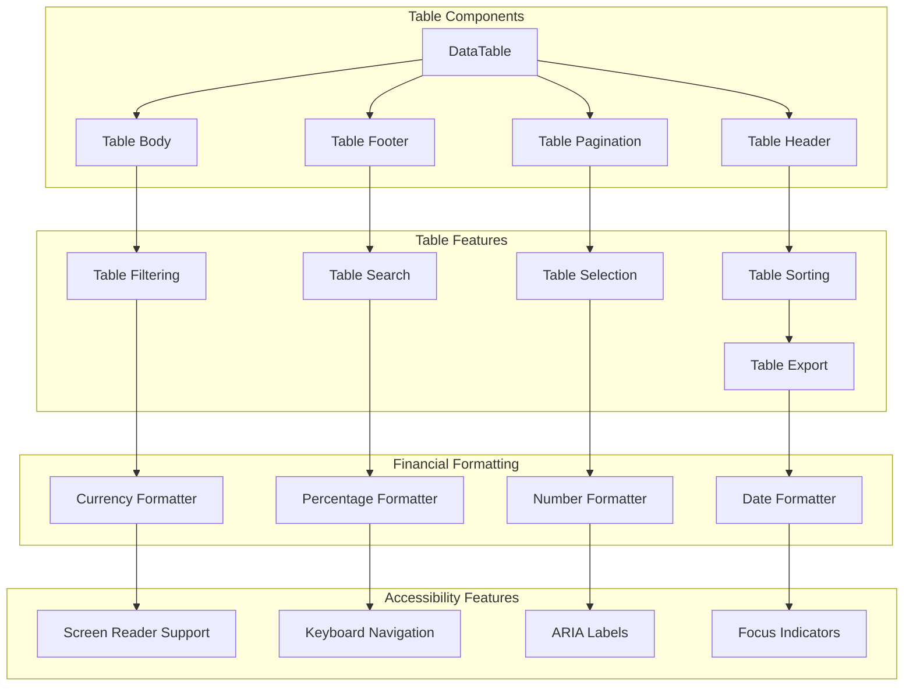

#### 6.1.1 Financial Data Table Implementation

```typescript
interface FinancialDataTableProps<T extends FinancialRecord> {
  data: T[];
  columns: FinancialColumnConfig<T>[];
  loading?: boolean;
  error?: Error;
  pagination?: PaginationConfig;
  sorting?: SortingConfig;
  filtering?: FilteringConfig;
  selection?: SelectionConfig<T>;
  export?: ExportConfig;
  accessibility?: TableAccessibilityConfig;
  onRowClick?: (row: T) => void;
  onSelectionChange?: (selected: T[]) => void;
}

interface FinancialColumnConfig<T> {
  key: keyof T;
  title: string;
  dataType: 'currency' | 'percentage' | 'number' | 'date' | 'text';
  width?: string | number;
  minWidth?: string | number;
  sortable?: boolean;
  filterable?: boolean;
  resizable?: boolean;
  sticky?: 'left' | 'right';
  formatter?: (value: any, row: T) => ReactNode;
  accessor?: (row: T) => any;
  aggregation?: 'sum' | 'average' | 'count' | 'min' | 'max';
  alignment?: 'left' | 'center' | 'right';
  headerAlignment?: 'left' | 'center' | 'right';
}

interface FinancialRecord {
  id: string | number;
  [key: string]: any;
}

// Financial Data Table Component
const FinancialDataTable = <T extends FinancialRecord>({
  data,
  columns,
  loading,
  error,
  pagination,
  sorting,
  filtering,
  selection,
  export: exportConfig,
  accessibility,
  onRowClick,
  onSelectionChange
}: FinancialDataTableProps<T>) => {
  const {
    sortedData,
    filteredData,
    paginatedData,
    sortState,
    filterState,
    selectionState,
    actions
  } = useFinancialDataTable({
    data,
    pagination,
    sorting,
    filtering,
    selection
  });

  if (loading) {
    return <TableSkeleton columns={columns.length} rows={10} />;
  }

  if (error) {
    return <TableError error={error} onRetry={actions.refresh} />;
  }

  return (
    <div className="financial-data-table">
      {(filtering || exportConfig) && (
        <div className="financial-data-table__toolbar">
          {filtering && (
            <TableFilters
              columns={columns}
              filters={filterState}
              onFiltersChange={actions.setFilters}
            />
          )}
          {exportConfig && (
            <TableExport
              data={filteredData}
              columns={columns}
              config={exportConfig}
            />
          )}
        </div>
      )}

      <div className="financial-data-table__container">
        <table
          className="financial-data-table__table"
          role="table"
          aria-label={accessibility?.tableLabel}
          aria-describedby={accessibility?.tableDescription}
        >
          <TableHeader
            columns={columns}
            sortState={sortState}
            onSort={actions.sort}
            selection={selection}
            selectionState={selectionState}
            onSelectAll={actions.selectAll}
          />
          
          <TableBody
            data={paginatedData}
            columns={columns}
            selection={selection}
            selectionState={selectionState}
            onRowClick={onRowClick}
            onRowSelect={actions.selectRow}
          />
          
          {columns.some(col => col.aggregation) && (
            <TableFooter
              data={filteredData}
              columns={columns}
            />
          )}
        </table>
      </div>

      {pagination && (
        <TablePagination
          total={filteredData.length}
          pageSize={pagination.pageSize}
          currentPage={pagination.currentPage}
          onPageChange={actions.setPage}
          onPageSizeChange={actions.setPageSize}
        />
      )}
    </div>
  );
};
```

#### 6.1.2 Card and Panel System

```typescript
interface CardSystemProps {
  variant: 'default' | 'elevated' | 'outlined' | 'filled';
  size: 'sm' | 'md' | 'lg' | 'xl';
  padding?: SpacingValue;
  radius?: 'none' | 'sm' | 'md' | 'lg' | 'xl';
  shadow?: 'none' | 'sm' | 'md' | 'lg' | 'xl';
  interactive?: boolean;
  loading?: boolean;
  error?: boolean;
  children: ReactNode;
}

interface PanelSystemProps extends CardSystemProps {
  title?: string;
  subtitle?: string;
  actions?: ReactNode;
  collapsible?: boolean;
  defaultCollapsed?: boolean;
  headerBorder?: boolean;
  footerBorder?: boolean;
  footer?: ReactNode;
}

// Financial Metric Card
interface FinancialMetricCardProps {
  title: string;
  value: number;
  currency?: string;
  change?: {
    value: number;
    period: string;
    type: 'absolute' | 'percentage';
  };
  trend?: 'up' | 'down' | 'neutral';
  format: 'currency' | 'percentage' | 'number';
  size?: 'sm' | 'md' | 'lg';
  loading?: boolean;
  error?: string;
}

const FinancialMetricCard: React.FC<FinancialMetricCardProps> = ({
  title,
  value,
  currency = 'USD',
  change,
  trend,
  format,
  size = 'md',
  loading,
  error
}) => {
  const formattedValue = useMemo(()
=> {
    switch (format) {
      case 'currency':
        return new Intl.NumberFormat('en-US', {
          style: 'currency',
          currency: currency
        }).format(value);
      case 'percentage':
        return new Intl.NumberFormat('en-US', {
          style: 'percent',
          minimumFractionDigits: 2
        }).format(value / 100);
      case 'number':
        return new Intl.NumberFormat('en-US').format(value);
      default:
        return value.toString();
    }
  }, [value, currency, format]);

  const changeColor = useMemo(() => {
    if (!change || trend === 'neutral') return designTokens.colors.neutral[500];
    return trend === 'up' 
      ? designTokens.colors.financial.positive 
      : designTokens.colors.financial.negative;
  }, [change, trend]);

  if (loading) {
    return <MetricCardSkeleton size={size} />;
  }

  if (error) {
    return <MetricCardError error={error} />;
  }

  return (
    <Card variant="elevated" size={size} className="financial-metric-card">
      <div className="financial-metric-card__header">
        <h3 className="financial-metric-card__title">{title}</h3>
      </div>
      
      <div className="financial-metric-card__value">
        <span className="financial-metric-card__amount">
          {formattedValue}
        </span>
      </div>
      
      {change && (
        <div className="financial-metric-card__change">
          <span 
            className="financial-metric-card__change-value"
            style={{ color: changeColor }}
          >
            {change.type === 'percentage' ? `${change.value}%` : formattedValue}
          </span>
          <span className="financial-metric-card__change-period">
            vs {change.period}
          </span>
        </div>
      )}
    </Card>
  );
};
```

## 7. Navigation Systems Architecture

### 7.1 Navigation Component Hierarchy

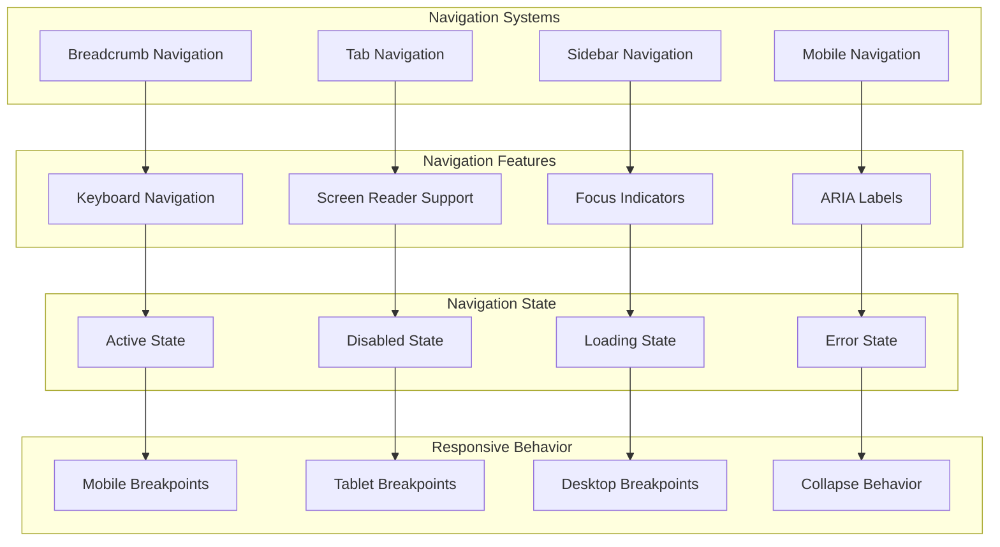

#### 7.1.1 Breadcrumb Navigation System

```typescript
interface BreadcrumbItem {
  id: string;
  label: string;
  href?: string;
  icon?: ReactNode;
  disabled?: boolean;
  current?: boolean;
}

interface BreadcrumbNavigationProps {
  items: BreadcrumbItem[];
  separator?: ReactNode;
  maxItems?: number;
  showHome?: boolean;
  homeIcon?: ReactNode;
  onItemClick?: (item: BreadcrumbItem) => void;
  accessibility?: {
    ariaLabel?: string;
    currentPageLabel?: string;
  };
}

const BreadcrumbNavigation: React.FC<BreadcrumbNavigationProps> = ({
  items,
  separator = '/',
  maxItems = 5,
  showHome = true,
  homeIcon,
  onItemClick,
  accessibility
}) => {
  const visibleItems = useMemo(() => {
    if (items.length <= maxItems) return items;
    
    const firstItem = items[0];
    const lastItems = items.slice(-2);
    const ellipsisItem = { id: 'ellipsis', label: '...', disabled: true };
    
    return [firstItem, ellipsisItem, ...lastItems];
  }, [items, maxItems]);

  return (
    <nav 
      aria-label={accessibility?.ariaLabel || 'Breadcrumb navigation'}
      className="breadcrumb-navigation"
    >
      <ol className="breadcrumb-navigation__list">
        {showHome && (
          <li className="breadcrumb-navigation__item">
            <Link
              to="/"
              className="breadcrumb-navigation__link breadcrumb-navigation__link--home"
              aria-label="Home"
            >
              {homeIcon || <HomeIcon />}
            </Link>
          </li>
        )}
        
        {visibleItems.map((item, index) => (
          <li key={item.id} className="breadcrumb-navigation__item">
            {index > 0 && (
              <span className="breadcrumb-navigation__separator" aria-hidden="true">
                {separator}
              </span>
            )}
            
            {item.current ? (
              <span 
                className="breadcrumb-navigation__current"
                aria-current="page"
                aria-label={`${accessibility?.currentPageLabel || 'Current page'}: ${item.label}`}
              >
                {item.icon && <span className="breadcrumb-navigation__icon">{item.icon}</span>}
                {item.label}
              </span>
            ) : (
              <Link
                to={item.href || '#'}
                className={`breadcrumb-navigation__link ${item.disabled ? 'breadcrumb-navigation__link--disabled' : ''}`}
                onClick={(e) => {
                  if (item.disabled) {
                    e.preventDefault();
                    return;
                  }
                  onItemClick?.(item);
                }}
                aria-disabled={item.disabled}
              >
                {item.icon && <span className="breadcrumb-navigation__icon">{item.icon}</span>}
                {item.label}
              </Link>
            )}
          </li>
        ))}
      </ol>
    </nav>
  );
};
```

#### 7.1.2 Tab Navigation System

```typescript
interface TabItem {
  id: string;
  label: string;
  content: ReactNode;
  icon?: ReactNode;
  disabled?: boolean;
  badge?: string | number;
  closable?: boolean;
}

interface TabNavigationProps {
  tabs: TabItem[];
  activeTab: string;
  onTabChange: (tabId: string) => void;
  onTabClose?: (tabId: string) => void;
  variant: 'default' | 'pills' | 'underline' | 'cards';
  size: 'sm' | 'md' | 'lg';
  orientation: 'horizontal' | 'vertical';
  scrollable?: boolean;
  addable?: boolean;
  onAddTab?: () => void;
  accessibility?: {
    ariaLabel?: string;
    tabListLabel?: string;
  };
}

const TabNavigation: React.FC<TabNavigationProps> = ({
  tabs,
  activeTab,
  onTabChange,
  onTabClose,
  variant = 'default',
  size = 'md',
  orientation = 'horizontal',
  scrollable = false,
  addable = false,
  onAddTab,
  accessibility
}) => {
  const [focusedTab, setFocusedTab] = useState<string | null>(null);
  const tabRefs = useRef<Map<string, HTMLButtonElement>>(new Map());

  const handleKeyDown = useCallback((event: KeyboardEvent, tabId: string) => {
    const currentIndex = tabs.findIndex(tab => tab.id === tabId);
    let nextIndex = currentIndex;

    switch (event.key) {
      case 'ArrowLeft':
      case 'ArrowUp':
        event.preventDefault();
        nextIndex = currentIndex > 0 ? currentIndex - 1 : tabs.length - 1;
        break;
      case 'ArrowRight':
      case 'ArrowDown':
        event.preventDefault();
        nextIndex = currentIndex < tabs.length - 1 ? currentIndex + 1 : 0;
        break;
      case 'Home':
        event.preventDefault();
        nextIndex = 0;
        break;
      case 'End':
        event.preventDefault();
        nextIndex = tabs.length - 1;
        break;
      case 'Enter':
      case ' ':
        event.preventDefault();
        onTabChange(tabId);
        return;
    }

    const nextTab = tabs[nextIndex];
    if (nextTab && !nextTab.disabled) {
      setFocusedTab(nextTab.id);
      tabRefs.current.get(nextTab.id)?.focus();
    }
  }, [tabs, onTabChange]);

  return (
    <div 
      className={`tab-navigation tab-navigation--${variant} tab-navigation--${size} tab-navigation--${orientation}`}
      aria-label={accessibility?.ariaLabel}
    >
      <div 
        className={`tab-navigation__list ${scrollable ? 'tab-navigation__list--scrollable' : ''}`}
        role="tablist"
        aria-label={accessibility?.tabListLabel || 'Tabs'}
        aria-orientation={orientation}
      >
        {tabs.map((tab) => (
          <button
            key={tab.id}
            ref={(el) => {
              if (el) {
                tabRefs.current.set(tab.id, el);
              } else {
                tabRefs.current.delete(tab.id);
              }
            }}
            className={`tab-navigation__tab ${activeTab === tab.id ? 'tab-navigation__tab--active' : ''} ${tab.disabled ? 'tab-navigation__tab--disabled' : ''}`}
            role="tab"
            aria-selected={activeTab === tab.id}
            aria-controls={`tabpanel-${tab.id}`}
            aria-disabled={tab.disabled}
            tabIndex={activeTab === tab.id ? 0 : -1}
            onClick={() => !tab.disabled && onTabChange(tab.id)}
            onKeyDown={(e) => handleKeyDown(e, tab.id)}
            onFocus={() => setFocusedTab(tab.id)}
            onBlur={() => setFocusedTab(null)}
          >
            {tab.icon && (
              <span className="tab-navigation__icon">{tab.icon}</span>
            )}
            
            <span className="tab-navigation__label">{tab.label}</span>
            
            {tab.badge && (
              <span className="tab-navigation__badge">{tab.badge}</span>
            )}
            
            {tab.closable && onTabClose && (
              <button
                className="tab-navigation__close"
                onClick={(e) => {
                  e.stopPropagation();
                  onTabClose(tab.id);
                }}
                aria-label={`Close ${tab.label} tab`}
              >
                <CloseIcon />
              </button>
            )}
          </button>
        ))}
        
        {addable && onAddTab && (
          <button
            className="tab-navigation__add"
            onClick={onAddTab}
            aria-label="Add new tab"
          >
            <PlusIcon />
          </button>
        )}
      </div>
      
      <div className="tab-navigation__panels">
        {tabs.map((tab) => (
          <div
            key={tab.id}
            id={`tabpanel-${tab.id}`}
            className="tab-navigation__panel"
            role="tabpanel"
            aria-labelledby={`tab-${tab.id}`}
            hidden={activeTab !== tab.id}
            tabIndex={0}
          >
            {activeTab === tab.id && tab.content}
          </div>
        ))}
      </div>
    </div>
  );
};
```

#### 7.1.3 Sidebar Navigation System

```typescript
interface SidebarNavigationItem {
  id: string;
  label: string;
  href?: string;
  icon?: ReactNode;
  badge?: string | number;
  children?: SidebarNavigationItem[];
  expanded?: boolean;
  active?: boolean;
  disabled?: boolean;
}

interface SidebarNavigationProps {
  items: SidebarNavigationItem[];
  collapsed?: boolean;
  onToggleCollapse?: () => void;
  onItemClick?: (item: SidebarNavigationItem) => void;
  onItemExpand?: (itemId: string, expanded: boolean) => void;
  variant: 'default' | 'minimal' | 'floating';
  width?: string;
  collapsedWidth?: string;
  position: 'left' | 'right';
  overlay?: boolean;
  accessibility?: {
    ariaLabel?: string;
    toggleLabel?: string;
  };
}

const SidebarNavigation: React.FC<SidebarNavigationProps> = ({
  items,
  collapsed = false,
  onToggleCollapse,
  onItemClick,
  onItemExpand,
  variant = 'default',
  width = '280px',
  collapsedWidth = '64px',
  position = 'left',
  overlay = false,
  accessibility
}) => {
  const [expandedItems, setExpandedItems] = useState<Set<string>>(new Set());

  const handleItemExpand = useCallback((itemId: string) => {
    const newExpanded = new Set(expandedItems);
    const isExpanded = newExpanded.has(itemId);
    
    if (isExpanded) {
      newExpanded.delete(itemId);
    } else {
      newExpanded.add(itemId);
    }
    
    setExpandedItems(newExpanded);
    onItemExpand?.(itemId, !isExpanded);
  }, [expandedItems, onItemExpand]);

  const renderNavigationItem = useCallback((item: SidebarNavigationItem, level = 0) => {
    const hasChildren = item.children && item.children.length > 0;
    const isExpanded = expandedItems.has(item.id);

    return (
      <li key={item.id} className="sidebar-navigation__item">
        <div
          className={`sidebar-navigation__link ${item.active ? 'sidebar-navigation__link--active' : ''} ${item.disabled ? 'sidebar-navigation__link--disabled' : ''}`}
          style={{ paddingLeft: `${level * 16 + 16}px` }}
        >
          {item.icon && !collapsed && (
            <span className="sidebar-navigation__icon">{item.icon}</span>
          )}
          
          {item.href ? (
            <Link
              to={item.href}
              className="sidebar-navigation__text"
              onClick={() => !item.disabled && onItemClick?.(item)}
              aria-disabled={item.disabled}
            >
              {item.label}
            </Link>
          ) : (
            <button
              className="sidebar-navigation__text"
              onClick={() => !item.disabled && onItemClick?.(item)}
              disabled={item.disabled}
            >
              {item.label}
            </button>
          )}
          
          {item.badge && !collapsed && (
            <span className="sidebar-navigation__badge">{item.badge}</span>
          )}
          
          {hasChildren && !collapsed && (
            <button
              className={`sidebar-navigation__expand ${isExpanded ? 'sidebar-navigation__expand--expanded' : ''}`}
              onClick={() => handleItemExpand(item.id)}
              aria-label={`${isExpanded ? 'Collapse' : 'Expand'} ${item.label}`}
              aria-expanded={isExpanded}
            >
              <ChevronIcon />
            </button>
          )}
        </div>
        
        {hasChildren && !collapsed && isExpanded && (
          <ul className="sidebar-navigation__submenu">
            {item.children!.map(child => renderNavigationItem(child, level + 1))}
          </ul>
        )}
      </li>
    );
  }, [collapsed, expandedItems, handleItemExpand, onItemClick]);

  return (
    <>
      {overlay && !collapsed && (
        <div 
          className="sidebar-navigation__overlay"
          onClick={onToggleCollapse}
          aria-hidden="true"
        />
      )}
      
      <aside
        className={`sidebar-navigation sidebar-navigation--${variant} sidebar-navigation--${position} ${collapsed ? 'sidebar-navigation--collapsed' : ''}`}
        style={{
          width: collapsed ? collapsedWidth : width
        }}
        aria-label={accessibility?.ariaLabel || 'Main navigation'}
      >
        <div className="sidebar-navigation__header">
          {onToggleCollapse && (
            <button
              className="sidebar-navigation__toggle"
              onClick={onToggleCollapse}
              aria-label={accessibility?.toggleLabel || (collapsed ? 'Expand sidebar' : 'Collapse sidebar')}
              aria-expanded={!collapsed}
            >
              <MenuIcon />
            </button>
          )}
        </div>
        
        <nav className="sidebar-navigation__content">
          <ul className="sidebar-navigation__list">
            {items.map(item => renderNavigationItem(item))}
          </ul>
        </nav>
      </aside>
    </>
  );
};
```

## 8. Performance Architecture

### 8.1 Component Performance Optimization

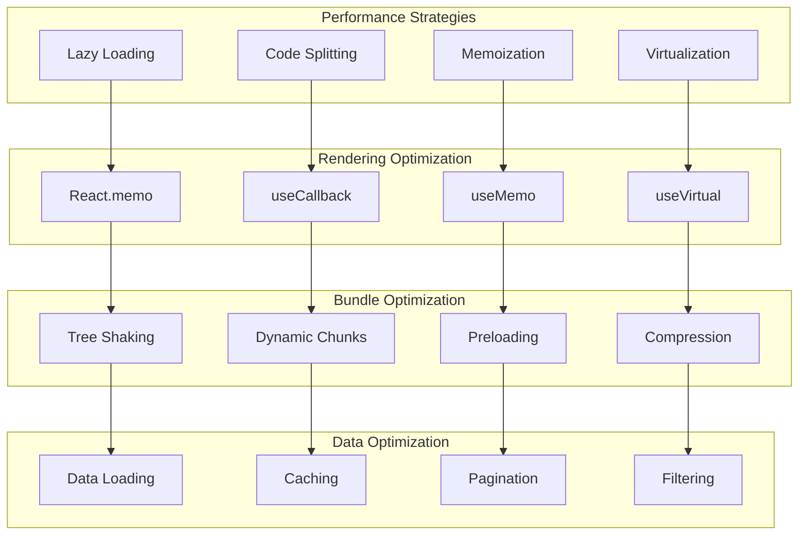

#### 8.1.1 Lazy Loading Implementation

```typescript
// Lazy loading for composite components
const LazyDataTable = lazy(() => import('./DataTable/FinancialDataTable'));
const LazyChartPanel = lazy(() => import('./Charts/ChartPanel'));
const LazyFormWizard = lazy(() => import('./Forms/FormWizard'));

// Lazy loading with error boundaries
interface LazyComponentWrapperProps {
  children: ReactNode;
  fallback?: ReactNode;
  errorFallback?: ReactNode;
}

const LazyComponentWrapper: React.FC<LazyComponentWrapperProps> = ({
  children,
  fallback = <ComponentSkeleton />,
  errorFallback = <ComponentError />
}) => (
  <ErrorBoundary fallback={errorFallback}>
    <Suspense fallback={fallback}>
      {children}
    </Suspense>
  </ErrorBoundary>
);

// Progressive loading hook
function useProgressiveLoading<T>(
  loadFn: () => Promise<T>,
  dependencies: any[] = []
) {
  const [state, setState] = useState<{
    data: T | null;
    loading: boolean;
    error: Error | null;
  }>({
    data: null,
    loading: false,
    error: null
  });

  const load = useCallback(async () => {
    setState(prev => ({ ...prev, loading: true, error: null }));
    
    try {
      const data = await loadFn();
      setState({ data, loading: false, error: null });
    } catch (error) {
      setState(prev => ({ 
        ...prev, 
        loading: false, 
        error: error instanceof Error ? error : new Error('Unknown error') 
      }));
    }
  }, dependencies);

  useEffect(() => {
    load();
  }, [load]);

  return { ...state, reload: load };
}
```

#### 8.1.2 Virtualization for Large Data Sets

```typescript
interface VirtualizedTableProps<T> {
  data: T[];
  columns: ColumnConfig<T>[];
  rowHeight: number;
  containerHeight: number;
  overscan?: number;
  onRowClick?: (row: T, index: number) => void;
}

function VirtualizedTable<T extends Record<string, any>>({
  data,
  columns,
  rowHeight,
  containerHeight,
  overscan = 5,
  onRowClick
}: VirtualizedTableProps<T>) {
  const parentRef = useRef<HTMLDivElement>(null);
  
  const rowVirtualizer = useVirtual({
    size: data.length,
    parentRef,
    estimateSize: useCallback(() => rowHeight, [rowHeight]),
    overscan
  });

  return (
    <div
      ref={parentRef}
      className="virtualized-table"
      style={{ height: containerHeight, overflow: 'auto' }}
    >
      <div
        style={{
          height: rowVirtualizer.totalSize,
          width: '100%',
          position: 'relative'
        }}
      >
        {rowVirtualizer.virtualItems.map(virtualRow => {
          const row = data[virtualRow.index];
          
          return (
            <div
              key={virtualRow.index}
              className="virtualized-table__row"
              style={{
                position: 'absolute',
                top: 0,
                left: 0,
                width: '100%',
                height: rowHeight,
                transform: `translateY(${virtualRow.start}px)`
              }}
              onClick={() => onRowClick?.(row, virtualRow.index)}
            >
              {columns.map(column => (
                <div
                  key={column.key as string}
                  className="virtualized-table__cell"
                  style={{ width: column.width }}
                >
                  {column.formatter 
                    ? column.formatter(row[column.key], row)
                    : row[column.key]
                  }
                </div>
              ))}
            </div>
          );
        })}
      </div>
    </div>
  );
}
```

#### 8.1.3 Memoization Strategies

```typescript
// Memoized financial calculations
const useMemoizedFinancialCalculations = (data: FinancialData) => {
  return useMemo(() => {
    const calculations = {
      totalRevenue: data.revenue.reduce((sum, item) => sum + item.amount, 0),
      totalExpenses: data.expenses.reduce((sum, item) => sum + item.amount, 0),
      netIncome: 0,
      margins: {
        gross: 0,
        operating: 0,
        net: 0
      },
      ratios: {
        currentRatio: 0,
        quickRatio: 0,
        debtToEquity: 0
      }
    };

    calculations.netIncome = calculations.totalRevenue - calculations.totalExpenses;
    calculations.margins.gross = calculations.totalRevenue > 0 
      ? (calculations.netIncome / calculations.totalRevenue) * 100 
      : 0;

    return calculations;
  }, [data]);
};

// Memoized component with performance optimization
const MemoizedFinancialCard = memo<FinancialMetricCardProps>(({
  title,
  value,
  currency,
  change,
  trend,
  format,
  size,
  loading,
  error
}) => {
  // Component implementation
  return (
    <Card>
      {/* Card content */}
    </Card>
  );
}, (prevProps, nextProps) => {
  // Custom comparison function for better performance
  return (
    prevProps.value === nextProps.value &&
    prevProps.currency === nextProps.currency &&
    prevProps.loading === nextProps.loading &&
    prevProps.error === nextProps.error &&
    JSON.stringify(prevProps.change) === JSON.stringify(nextProps.change)
  );
});

// Optimized callback memoization
const useOptimizedCallbacks = (onDataChange: (data: any) => void) => {
  const stableOnDataChange = useCallback(onDataChange, []);
  
  const handleFieldChange = useCallback((field: string, value: any) => {
    stableOnDataChange({ [field]: value });
  }, [stableOnDataChange]);

  const handleBulkChange = useCallback((changes: Record<string, any>) => {
    stableOnDataChange(changes);
  }, [stableOnDataChange]);

  return { handleFieldChange, handleBulkChange };
};
```

## 9. Accessibility Framework

### 9.1 WCAG 2.1 AA Compliance Architecture

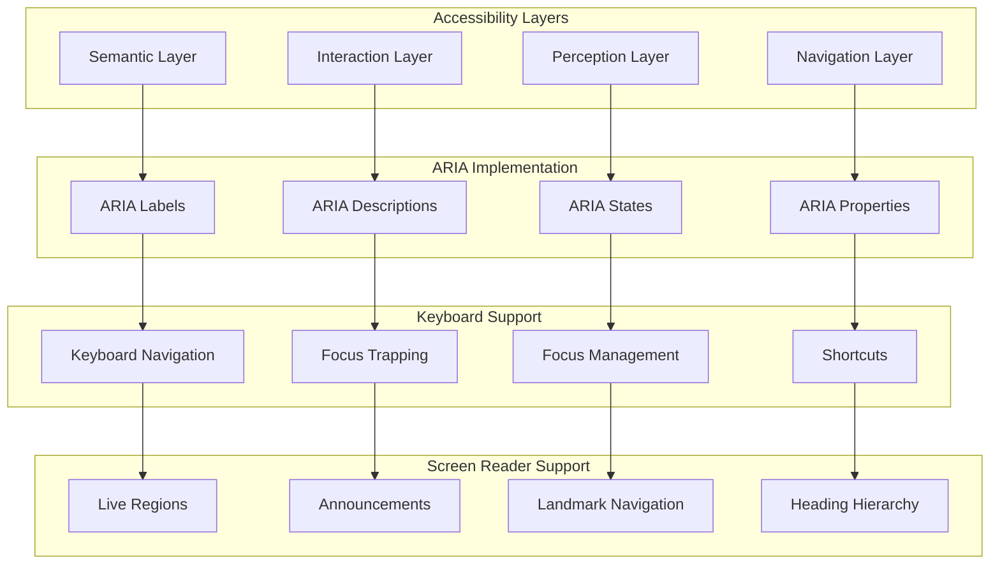

#### 9.1.1 Accessibility Hook Implementation

```typescript
interface AccessibilityConfig {
  announcements?: boolean;
  focusManagement?: boolean;
  keyboardNavigation?: boolean;
  screenReaderOptimization?: boolean;
  highContrast?: boolean;
  reducedMotion?: boolean;
}

function useAccessibility(config: AccessibilityConfig = {}) {
  const [announcements, setAnnouncements] = useState<string[]>([]);
  const [focusedElement, setFocusedElement] = useState<HTMLElement | null>(null);
  
  // Announcement management
  const announce = useCallback((message: string, priority: 'polite' | 'assertive' = 'polite') => {
    if (!config.announcements) return;
    
    setAnnouncements(prev => [...prev, message]);
    
    // Create live region for screen readers
    const liveRegion = document.createElement('div');
    liveRegion.setAttribute('aria-live', priority);
    liveRegion.setAttribute('aria-atomic', 'true');
    liveRegion.className = 'sr-only';
    liveRegion.textContent = message;
    
    document.body.appendChild(liveRegion);
    
    // Clean up after announcement
    setTimeout(() => {
      document.body.removeChild(liveRegion);
      setAnnouncements(prev => prev.filter(a => a !== message));
    }, 1000);
  }, [config.announcements]);

  // Focus management
  const manageFocus = useCallback((element: HTMLElement | null) => {
    if (!config.focusManagement || !element) return;
    
    setFocusedElement(element);
    element.focus();
    
    // Ensure focus is visible
    element.scrollIntoView({ 
      behavior: 'smooth', 
      block: 'nearest' 
    });
  }, [config.focusManagement]);

  // Keyboard navigation helper
  const handleKeyboardNavigation = useCallback((
    event: KeyboardEvent,
    handlers: Record<string, () => void>
  ) => {
    if (!config.keyboardNavigation) return;
    
    const handler = handlers[event.key];
    if (handler) {
      event.preventDefault();
      handler();
    }
  }, [config.keyboardNavigation]);

  // Screen reader optimization
  const optimizeForScreenReader = useCallback((element: HTMLElement) => {
    if (!config.screenReaderOptimization) return;
    
    // Add appropriate ARIA attributes
    if (!element.getAttribute('role')) {
      element.setAttribute('role', 'region');
    }
    
    // Ensure proper labeling
    if (!element.getAttribute('aria-label') && !element.getAttribute('aria-labelledby')) {
      const heading = element.querySelector('h1, h2, h3, h4, h5, h6');
      if (heading) {
        const id = heading.id || `heading-${Math.random().toString(36).substr(2, 9)}`;
        heading.id = id;
        element.setAttribute('aria-labelledby', id);
      }
    }
  }, [config.screenReaderOptimization]);

  return {
    announce,
    manageFocus,
    handleKeyboardNavigation,
    optimizeForScreenReader,
    announcements,
    focusedElement
  };
}
```

#### 9.1.2 Focus Management System

```typescript
interface FocusManagerConfig {
  trapFocus?: boolean;
  restoreFocus?: boolean;
  initialFocus?: string | HTMLElement;
  skipLinks?: boolean;
}

function useFocusManager(config: FocusManagerConfig = {}) {
  const containerRef = useRef<HTMLElement>(null);
  const previousFocusRef = useRef<HTMLElement | null>(null);
  const [focusableElements, setFocusableElements] = useState<HTMLElement[]>([]);

  // Get all focusable elements
  const getFocusableElements = useCallback((container: HTMLElement) => {
    const focusableSelectors = [
      'button:not([disabled])',
      'input:not([disabled])',
      'select:not([disabled])',
      'textarea:not([disabled])',
      'a[href]',
      '[tabindex]:not([tabindex="-1"])',
      '[contenteditable="true"]'
    ].join(', ');

    return Array.from(container.querySelectorAll(focusableSelectors)) as HTMLElement[];
  }, []);

  // Focus trap implementation
  const trapFocus = useCallback((event: KeyboardEvent) => {
    if (!config.trapFocus || !containerRef.current) return;

    const elements = getFocusableElements(containerRef.current);
    const firstElement = elements[0];
    const lastElement = elements[elements.length - 1];

    if (event.key === 'Tab') {
      if (event.shiftKey) {
        if (document.activeElement === firstElement) {
          event.preventDefault();
          lastElement?.focus();
        }
      } else {
        if (document.activeElement === lastElement) {
          event.preventDefault();
          firstElement?.focus();
        }
      }
    }
  }, [config.trapFocus, getFocusableElements]);

  // Initialize focus management
  useEffect(()
=> {
    if (!containerRef.current) return;

    // Store previous focus for restoration
    if (config.restoreFocus) {
      previousFocusRef.current = document.activeElement as HTMLElement;
    }

    // Set up focus trap
    if (config.trapFocus) {
      document.addEventListener('keydown', trapFocus);
    }

    // Set initial focus
    if (config.initialFocus) {
      const initialElement = typeof config.initialFocus === 'string'
        ? containerRef.current.querySelector(config.initialFocus)
        : config.initialFocus;
      
      if (initialElement) {
        (initialElement as HTMLElement).focus();
      }
    }

    // Update focusable elements
    const elements = getFocusableElements(containerRef.current);
    setFocusableElements(elements);

    return () => {
      if (config.trapFocus) {
        document.removeEventListener('keydown', trapFocus);
      }
      
      if (config.restoreFocus && previousFocusRef.current) {
        previousFocusRef.current.focus();
      }
    };
  }, [config, trapFocus, getFocusableElements]);

  return {
    containerRef,
    focusableElements,
    trapFocus,
    restoreFocus: () => {
      if (previousFocusRef.current) {
        previousFocusRef.current.focus();
      }
    }
  };
}
```

## 10. Testing Integration Architecture

### 10.1 Component Testing Strategy

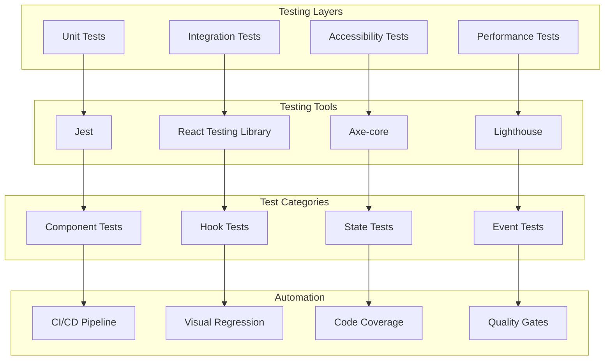

#### 10.1.1 Composite Component Testing Framework

```typescript
// Test utilities for composite components
interface CompositeTestConfig {
  component: React.ComponentType<any>;
  props: Record<string, any>;
  accessibility?: boolean;
  performance?: boolean;
  interactions?: boolean;
  responsive?: boolean;
}

function createCompositeTest(config: CompositeTestConfig) {
  describe(`${config.component.name} Composite Component`, () => {
    // Basic rendering test
    test('renders without crashing', () => {
      render(<config.component {...config.props} />);
    });

    // Accessibility tests
    if (config.accessibility) {
      test('meets accessibility standards', async () => {
        const { container } = render(<config.component {...config.props} />);
        const results = await axe(container);
        expect(results).toHaveNoViolations();
      });

      test('supports keyboard navigation', () => {
        render(<config.component {...config.props} />);
        
        // Test tab navigation
        const firstFocusable = screen.getAllByRole('button')[0];
        firstFocusable.focus();
        
        fireEvent.keyDown(firstFocusable, { key: 'Tab' });
        expect(document.activeElement).not.toBe(firstFocusable);
      });

      test('provides proper ARIA attributes', () => {
        render(<config.component {...config.props} />);
        
        // Check for required ARIA attributes
        const component = screen.getByRole('region');
        expect(component).toHaveAttribute('aria-label');
      });
    }

    // Performance tests
    if (config.performance) {
      test('renders within performance budget', async () => {
        const startTime = performance.now();
        render(<config.component {...config.props} />);
        const endTime = performance.now();
        
        expect(endTime - startTime).toBeLessThan(100); // 100ms budget
      });

      test('handles large datasets efficiently', () => {
        const largeDataset = Array.from({ length: 1000 }, (_, i) => ({
          id: i,
          value: `Item ${i}`
        }));

        const { rerender } = render(
          <config.component {...config.props} data={largeDataset} />
        );

        // Test re-render performance
        const startTime = performance.now();
        rerender(<config.component {...config.props} data={largeDataset} />);
        const endTime = performance.now();
        
        expect(endTime - startTime).toBeLessThan(50); // 50ms budget for re-renders
      });
    }

    // Interaction tests
    if (config.interactions) {
      test('handles user interactions correctly', async () => {
        const mockHandler = jest.fn();
        render(
          <config.component 
            {...config.props} 
            onInteraction={mockHandler} 
          />
        );

        const interactiveElement = screen.getByRole('button');
        await userEvent.click(interactiveElement);
        
        expect(mockHandler).toHaveBeenCalledTimes(1);
      });

      test('manages state correctly', () => {
        const { rerender } = render(<config.component {...config.props} />);
        
        // Test state changes
        const stateElement = screen.getByTestId('state-indicator');
        expect(stateElement).toHaveTextContent('initial');
        
        // Trigger state change
        fireEvent.click(screen.getByRole('button'));
        expect(stateElement).toHaveTextContent('updated');
      });
    }

    // Responsive tests
    if (config.responsive) {
      test('adapts to different screen sizes', () => {
        // Test mobile viewport
        Object.defineProperty(window, 'innerWidth', {
          writable: true,
          configurable: true,
          value: 375,
        });
        
        const { container } = render(<config.component {...config.props} />);
        expect(container.firstChild).toHaveClass('mobile-layout');
        
        // Test desktop viewport
        Object.defineProperty(window, 'innerWidth', {
          writable: true,
          configurable: true,
          value: 1024,
        });
        
        fireEvent(window, new Event('resize'));
        expect(container.firstChild).toHaveClass('desktop-layout');
      });
    }
  });
}

// Form composition testing utilities
function testFormComposition(FormComponent: React.ComponentType<any>) {
  describe('Form Composition', () => {
    test('validates fields correctly', async () => {
      const mockSubmit = jest.fn();
      render(<FormComponent onSubmit={mockSubmit} />);
      
      // Submit without filling required fields
      fireEvent.click(screen.getByRole('button', { name: /submit/i }));
      
      await waitFor(() => {
        expect(screen.getByText(/required/i)).toBeInTheDocument();
      });
      
      expect(mockSubmit).not.toHaveBeenCalled();
    });

    test('handles multi-step navigation', async () => {
      render(<FormComponent multiStep />);
      
      // Check initial step
      expect(screen.getByText('Step 1')).toBeInTheDocument();
      
      // Navigate to next step
      fireEvent.click(screen.getByRole('button', { name: /next/i }));
      
      await waitFor(() => {
        expect(screen.getByText('Step 2')).toBeInTheDocument();
      });
    });

    test('persists form state', () => {
      const { unmount } = render(<FormComponent persistState />);
      
      // Fill form data
      fireEvent.change(screen.getByLabelText(/name/i), {
        target: { value: 'John Doe' }
      });
      
      unmount();
      
      // Re-render and check if data persists
      render(<FormComponent persistState />);
      expect(screen.getByDisplayValue('John Doe')).toBeInTheDocument();
    });
  });
}

// Data table testing utilities
function testDataTable(TableComponent: React.ComponentType<any>) {
  describe('Data Table', () => {
    const mockData = [
      { id: 1, name: 'John', amount: 1000 },
      { id: 2, name: 'Jane', amount: 2000 }
    ];

    test('displays data correctly', () => {
      render(<TableComponent data={mockData} />);
      
      expect(screen.getByText('John')).toBeInTheDocument();
      expect(screen.getByText('Jane')).toBeInTheDocument();
    });

    test('handles sorting', async () => {
      render(<TableComponent data={mockData} sortable />);
      
      const nameHeader = screen.getByRole('columnheader', { name: /name/i });
      fireEvent.click(nameHeader);
      
      await waitFor(() => {
        const rows = screen.getAllByRole('row');
        expect(rows[1]).toHaveTextContent('Jane');
        expect(rows[2]).toHaveTextContent('John');
      });
    });

    test('handles filtering', async () => {
      render(<TableComponent data={mockData} filterable />);
      
      const filterInput = screen.getByPlaceholderText(/filter/i);
      fireEvent.change(filterInput, { target: { value: 'John' } });
      
      await waitFor(() => {
        expect(screen.getByText('John')).toBeInTheDocument();
        expect(screen.queryByText('Jane')).not.toBeInTheDocument();
      });
    });

    test('handles pagination', () => {
      const largeData = Array.from({ length: 50 }, (_, i) => ({
        id: i,
        name: `User ${i}`,
        amount: i * 100
      }));

      render(<TableComponent data={largeData} pageSize={10} />);
      
      // Check first page
      expect(screen.getByText('User 0')).toBeInTheDocument();
      expect(screen.queryByText('User 10')).not.toBeInTheDocument();
      
      // Navigate to next page
      fireEvent.click(screen.getByRole('button', { name: /next/i }));
      expect(screen.getByText('User 10')).toBeInTheDocument();
    });
  });
}
```

#### 10.1.2 Accessibility Testing Integration

```typescript
// Custom accessibility matchers
expect.extend({
  toHaveAccessibleName(received: HTMLElement, expectedName: string) {
    const accessibleName = computeAccessibleName(received);
    const pass = accessibleName === expectedName;
    
    return {
      message: () =>
        `expected element to have accessible name "${expectedName}" but got "${accessibleName}"`,
      pass,
    };
  },

  toBeAccessibleToScreenReader(received: HTMLElement) {
    const isVisible = received.offsetParent !== null;
    const hasAriaHidden = received.getAttribute('aria-hidden') === 'true';
    const hasTabIndex = received.getAttribute('tabindex') === '-1';
    
    const pass = isVisible && !hasAriaHidden && !hasTabIndex;
    
    return {
      message: () =>
        `expected element to be accessible to screen readers`,
      pass,
    };
  },

  toHaveProperFocusManagement(received: HTMLElement) {
    const focusableElements = received.querySelectorAll(
      'button, [href], input, select, textarea, [tabindex]:not([tabindex="-1"])'
    );
    
    let pass = true;
    let message = '';
    
    focusableElements.forEach((element) => {
      const tabIndex = element.getAttribute('tabindex');
      if (tabIndex && parseInt(tabIndex) > 0) {
        pass = false;
        message = 'found positive tabindex values, which can cause focus order issues';
      }
    });
    
    return { message: () => message, pass };
  }
});

// Accessibility test suite
function createAccessibilityTestSuite(component: React.ComponentType<any>) {
  describe('Accessibility Compliance', () => {
    test('meets WCAG 2.1 AA standards', async () => {
      const { container } = render(React.createElement(component));
      const results = await axe(container, {
        rules: {
          'color-contrast': { enabled: true },
          'keyboard-navigation': { enabled: true },
          'focus-management': { enabled: true },
          'aria-labels': { enabled: true }
        }
      });
      
      expect(results).toHaveNoViolations();
    });

    test('supports keyboard navigation', () => {
      render(React.createElement(component));
      
      const focusableElements = screen.getAllByRole('button');
      if (focusableElements.length > 0) {
        focusableElements[0].focus();
        expect(document.activeElement).toBe(focusableElements[0]);
        
        // Test tab navigation
        fireEvent.keyDown(document.activeElement!, { key: 'Tab' });
        expect(document.activeElement).not.toBe(focusableElements[0]);
      }
    });

    test('provides proper semantic structure', () => {
      const { container } = render(React.createElement(component));
      
      // Check for proper heading hierarchy
      const headings = container.querySelectorAll('h1, h2, h3, h4, h5, h6');
      let previousLevel = 0;
      
      headings.forEach((heading) => {
        const level = parseInt(heading.tagName.charAt(1));
        expect(level).toBeLessThanOrEqual(previousLevel + 1);
        previousLevel = level;
      });
    });

    test('handles focus management correctly', () => {
      const { container } = render(React.createElement(component));
      expect(container.firstChild).toHaveProperFocusManagement();
    });
  });
}
```

## 11. Security Architecture

### 11.1 Component Security Framework

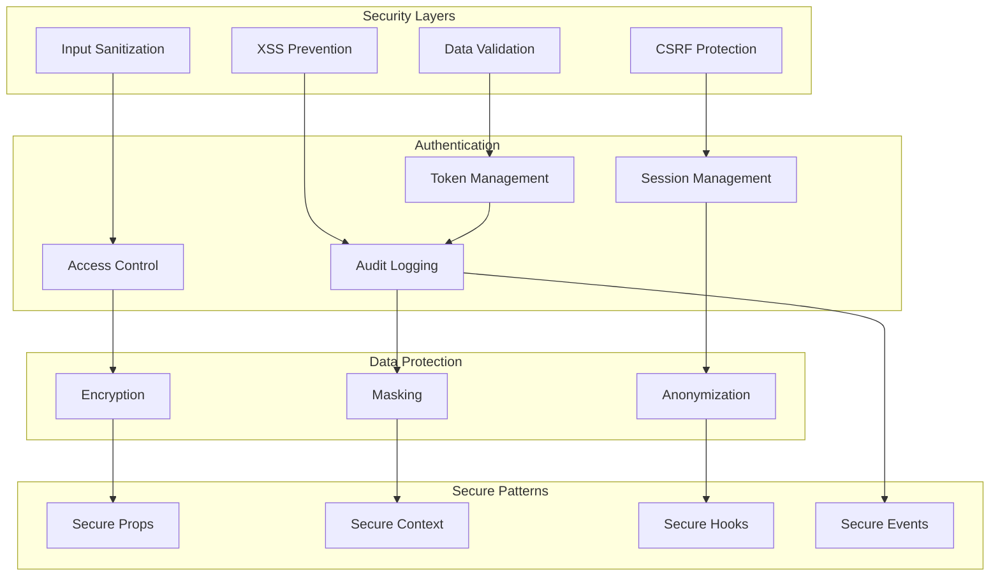

#### 11.1.1 Input Sanitization and Validation

```typescript
// Secure input validation utilities
interface ValidationRule {
  type: 'required' | 'email' | 'url' | 'number' | 'currency' | 'custom';
  message: string;
  validator?: (value: any) => boolean;
  sanitizer?: (value: any) => any;
}

interface SecureInputProps {
  value: string;
  onChange: (value: string) => void;
  validation: ValidationRule[];
  sanitization?: 'html' | 'sql' | 'xss' | 'all';
  maxLength?: number;
  allowedCharacters?: RegExp;
}

const SecureInput: React.FC<SecureInputProps> = ({
  value,
  onChange,
  validation,
  sanitization = 'xss',
  maxLength,
  allowedCharacters
}) => {
  const sanitizeInput = useCallback((input: string) => {
    let sanitized = input;
    
    // Length validation
    if (maxLength && sanitized.length > maxLength) {
      sanitized = sanitized.substring(0, maxLength);
    }
    
    // Character filtering
    if (allowedCharacters) {
      sanitized = sanitized.replace(allowedCharacters, '');
    }
    
    // Sanitization based on type
    switch (sanitization) {
      case 'html':
        sanitized = sanitized
          .replace(/</g, '&lt;')
          .replace(/>/g, '&gt;')
          .replace(/"/g, '&quot;')
          .replace(/'/g, '&#x27;');
        break;
      case 'sql':
        sanitized = sanitized.replace(/['";\\]/g, '');
        break;
      case 'xss':
        sanitized = DOMPurify.sanitize(sanitized, { 
          ALLOWED_TAGS: [],
          ALLOWED_ATTR: []
        });
        break;
      case 'all':
        sanitized = DOMPurify.sanitize(sanitized, { 
          ALLOWED_TAGS: [],
          ALLOWED_ATTR: []
        });
        sanitized = sanitized.replace(/['";\\<>]/g, '');
        break;
    }
    
    return sanitized;
  }, [sanitization, maxLength, allowedCharacters]);

  const validateInput = useCallback((input: string) => {
    const errors: string[] = [];
    
    validation.forEach(rule => {
      switch (rule.type) {
        case 'required':
          if (!input.trim()) {
            errors.push(rule.message);
          }
          break;
        case 'email':
          const emailRegex = /^[^\s@]+@[^\s@]+\.[^\s@]+$/;
          if (!emailRegex.test(input)) {
            errors.push(rule.message);
          }
          break;
        case 'url':
          try {
            new URL(input);
          } catch {
            errors.push(rule.message);
          }
          break;
        case 'number':
          if (isNaN(Number(input))) {
            errors.push(rule.message);
          }
          break;
        case 'currency':
          const currencyRegex = /^\d+(\.\d{1,2})?$/;
          if (!currencyRegex.test(input)) {
            errors.push(rule.message);
          }
          break;
        case 'custom':
          if (rule.validator && !rule.validator(input)) {
            errors.push(rule.message);
          }
          break;
      }
    });
    
    return errors;
  }, [validation]);

  const handleChange = useCallback((event: React.ChangeEvent<HTMLInputElement>) => {
    const rawValue = event.target.value;
    const sanitizedValue = sanitizeInput(rawValue);
    const errors = validateInput(sanitizedValue);
    
    // Only update if validation passes
    if (errors.length === 0) {
      onChange(sanitizedValue);
    }
  }, [sanitizeInput, validateInput, onChange]);

  return (
    <input
      type="text"
      value={value}
      onChange={handleChange}
      className="secure-input"
    />
  );
};

// Financial data masking utilities
interface MaskingConfig {
  type: 'partial' | 'full' | 'conditional';
  pattern?: string;
  condition?: (value: any, user: any) => boolean;
}

function useMaskedValue(value: string, config: MaskingConfig, userPermissions: any) {
  return useMemo(() => {
    if (config.type === 'full') {
      return '*'.repeat(value.length);
    }
    
    if (config.type === 'conditional' && config.condition) {
      if (!config.condition(value, userPermissions)) {
        return '*'.repeat(value.length);
      }
    }
    
    if (config.type === 'partial' && config.pattern) {
      // Apply partial masking pattern
      return value.replace(new RegExp(config.pattern), (match) => 
        '*'.repeat(match.length)
      );
    }
    
    return value;
  }, [value, config, userPermissions]);
}
```

#### 11.1.2 Secure Context and State Management

```typescript
// Secure context provider with encryption
interface SecureContextConfig {
  encryptionKey?: string;
  sessionTimeout?: number;
  auditLogging?: boolean;
  accessControl?: boolean;
}

interface SecureContextValue {
  data: Record<string, any>;
  setData: (key: string, value: any) => void;
  getData: (key: string) => any;
  clearData: () => void;
  hasPermission: (permission: string) => boolean;
}

const SecureContext = createContext<SecureContextValue | null>(null);

export const SecureContextProvider: React.FC<{
  children: ReactNode;
  config: SecureContextConfig;
  userPermissions: string[];
}> = ({ children, config, userPermissions }) => {
  const [encryptedData, setEncryptedData] = useState<Record<string, string>>({});
  const [sessionExpiry, setSessionExpiry] = useState<number>(
    Date.now() + (config.sessionTimeout || 30 * 60 * 1000) // 30 minutes default
  );

  // Encryption utilities
  const encrypt = useCallback((data: any): string => {
    if (!config.encryptionKey) return JSON.stringify(data);
    
    // Simple encryption for demo - use proper encryption in production
    const jsonString = JSON.stringify(data);
    return btoa(jsonString);
  }, [config.encryptionKey]);

  const decrypt = useCallback((encryptedData: string): any => {
    if (!config.encryptionKey) return JSON.parse(encryptedData);
    
    try {
      const jsonString = atob(encryptedData);
      return JSON.parse(jsonString);
    } catch {
      return null;
    }
  }, [config.encryptionKey]);

  // Audit logging
  const auditLog = useCallback((action: string, data: any) => {
    if (!config.auditLogging) return;
    
    const logEntry = {
      timestamp: new Date().toISOString(),
      action,
      data: typeof data === 'object' ? JSON.stringify(data) : data,
      user: 'current-user-id', // Get from auth context
      sessionId: 'current-session-id'
    };
    
    // Send to audit service
    console.log('Audit Log:', logEntry);
  }, [config.auditLogging]);

  // Session management
  useEffect(() => {
    const checkSession = () => {
      if (Date.now() > sessionExpiry) {
        setEncryptedData({});
        auditLog('session_expired', { expiry: sessionExpiry });
      }
    };

    const interval = setInterval(checkSession, 60000); // Check every minute
    return () => clearInterval(interval);
  }, [sessionExpiry, auditLog]);

  const setData = useCallback((key: string, value: any) => {
    const encrypted = encrypt(value);
    setEncryptedData(prev => ({ ...prev, [key]: encrypted }));
    auditLog('data_set', { key, valueType: typeof value });
    
    // Reset session expiry on activity
    setSessionExpiry(Date.now() + (config.sessionTimeout || 30 * 60 * 1000));
  }, [encrypt, auditLog, config.sessionTimeout]);

  const getData = useCallback((key: string) => {
    const encrypted = encryptedData[key];
    if (!encrypted) return null;
    
    const decrypted = decrypt(encrypted);
    auditLog('data_get', { key });
    
    return decrypted;
  }, [encryptedData, decrypt, auditLog]);

  const clearData = useCallback(() => {
    setEncryptedData({});
    auditLog('data_cleared', {});
  }, [auditLog]);

  const hasPermission = useCallback((permission: string) => {
    if (!config.accessControl) return true;
    return userPermissions.includes(permission);
  }, [config.accessControl, userPermissions]);

  const contextValue: SecureContextValue = {
    data: encryptedData,
    setData,
    getData,
    clearData,
    hasPermission
  };

  return (
    <SecureContext.Provider value={contextValue}>
      {children}
    </SecureContext.Provider>
  );
};

export const useSecureContext = () => {
  const context = useContext(SecureContext);
  if (!context) {
    throw new Error('useSecureContext must be used within SecureContextProvider');
  }
  return context;
};
```

## 12. Implementation Roadmap

### 12.1 Phase 2 Implementation Timeline

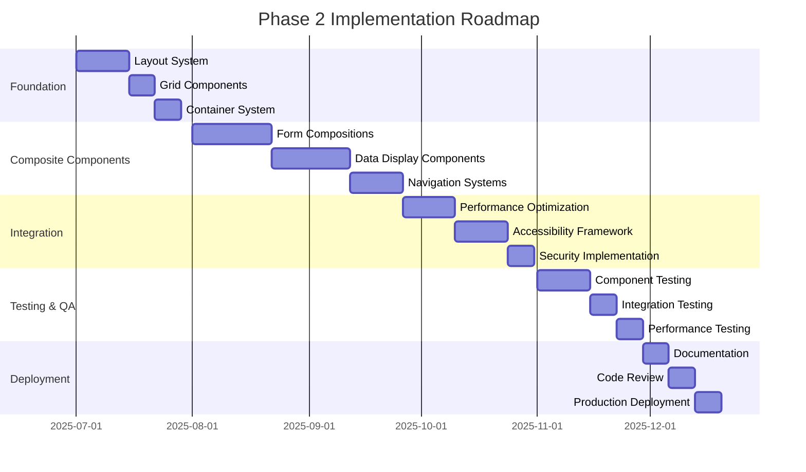

#### 12.1.1 Implementation Phases

**Phase 2.1: Foundation (Weeks 1-4)**
- Layout System Implementation
  - 12-column responsive grid
  - Container system with max-width constraints
  - Spacing utilities and systematic margin/padding
  - Typography scale integration

**Phase 2.2: Composite Components (Weeks 5-10)**
- Form Composition System
  - Multi-step form wizard
  - Field groups and validation workflows
  - Real-time validation with debounced feedback
- Data Display Components
  - Financial data tables with sorting/filtering
  - Card and panel systems
  - Metric cards with trend indicators
- Navigation Systems
  - Breadcrumb navigation
  - Tab navigation with keyboard support
  - Sidebar navigation with responsive behavior

**Phase 2.3: Integration & Optimization (Weeks 11-14)**
- Performance Architecture
  - Lazy loading implementation
  - Virtualization for large datasets
  - Memoization strategies
- Accessibility Framework
  - WCAG 2.1 AA compliance
  - Focus management system
  - Screen reader optimization
- Security Implementation
  - Input sanitization and validation
  - Secure context management
  - Audit logging

**Phase 2.4: Testing & Quality Assurance (Weeks 15-17)**
- Component Testing
  - Unit tests for all composite components
  - Integration tests for component interactions
  - Accessibility testing with axe-core
- Performance Testing
  - Render performance benchmarks
  - Memory usage optimization
  - Bundle size analysis

**Phase 2.5: Documentation & Deployment (Weeks 18-20)**
- Documentation
  - Component API documentation
  - Usage examples and best practices
  - Migration guide from Phase 1
- Code Review & Deployment
  - Peer review process
  - Quality gate validation
  - Production deployment

#### 12.1.2 Success Metrics

**Performance Metrics**
- Component render time < 100ms
- Bundle size increase < 20%
- Memory usage optimization
- Core Web Vitals compliance

**Accessibility Metrics**
- WCAG 2.1 AA compliance: 100%
- Keyboard navigation support: 100%
- Screen reader compatibility: 100%
- Focus management: Automated testing

**Quality Metrics**
- Test coverage: > 90%
- Component reusability: > 80%
- Documentation coverage: 100%
- Performance regression: 0%

## 13. Conclusion

The Phase 2 Composite Components and Layout Systems architecture provides a comprehensive foundation for building complex, accessible, and performant user interfaces in the EnterpriseCashFlow application. The modular design ensures:

### 13.1 Key Architectural Benefits

- **Scalability**: Component composition patterns enable complex UI construction from simple building blocks
- **Maintainability**: Clear separation of concerns and well-defined interfaces reduce coupling
- **Accessibility**: Built-in WCAG 2.1 AA compliance ensures inclusive user experiences
- **Performance**: Optimization strategies including lazy loading and virtualization support large datasets
- **Security**: Comprehensive input validation and secure state management protect sensitive financial data
- **Testability**: Structured testing framework ensures reliability and quality

### 13.2 Integration with Existing Architecture

The Phase 2 architecture seamlessly integrates with the existing Phase 1 foundation:
- Builds upon established design tokens and component patterns
- Maintains backward compatibility with existing components
- Extends the atomic design system with molecular and organism-level compositions
- Enhances the accessibility and performance frameworks

### 13.3 Future Extensibility

The modular architecture supports future enhancements:
- Additional composite component patterns
- Enhanced data visualization capabilities
- Advanced form workflows and validation
- Extended accessibility features
- Performance optimizations for larger datasets

This architecture document serves as the blueprint for implementing robust, scalable, and user-friendly composite components that will enhance the EnterpriseCashFlow application's capabilities while maintaining the highest standards of quality, accessibility, and performance.